#### Curated by Bryan Guner

## The idea behind big O notation

**Big O notation is the language we use for talking about how long an
algorithm takes to run**. It's how we compare the efficiency of
different approaches to a problem.

With big O notation we express the runtime in terms of

### how quickly it grows relative to the input, as the input gets arbitrarily large\_.

1.  **how quickly the runtime grows**—

It's hard to pin down the _exact runtime_ of an algorithm.

- It depends on the speed of the processor,
- what else the computer is running, etc.

So instead of talking about the runtime directly, we use big O notation to talk about _how quickly the runtime grows_.

2.  **relative to the input**—If we were measuring our runtime directly,

we could express our speed in seconds. Since we're measuring _how quickly our runtime grows_, we need to express our speed in terms of...something else. With Big O notation, we use the size of the input, which we call "n." So we can say things like the runtime grows "on the order of the size of the input" () or "on the order of the square of the size of the input" ().

3.  **as the input gets arbitrarily large**—

Our algorithm may have steps that seem expensive when n is small but are eclipsed eventually by other steps as n gets huge. For big O analysis, we care most about the stuff that grows fastest as the input grows, because everything else is quickly eclipsed as n gets very large. (If you know what an asymptote is, you might see why "big O analysis" is sometimes called "asymptotic analysis.")hy "big O analysis" is sometimes called

    "asymptotic analysis.")

---

---

# Data Structures Reference

---

## Array

Stores things in order. Has quick lookups by index.
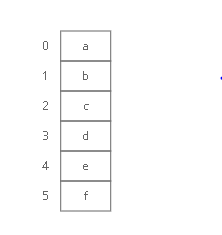
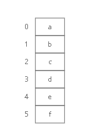

## Linked List

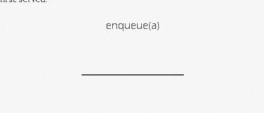

Also stores things in order. Faster insertions and deletions than
arrays, but slower lookups (you have to "walk down" the whole list).

!

## Queue

Like the line outside a busy restaurant. "First come, first served."

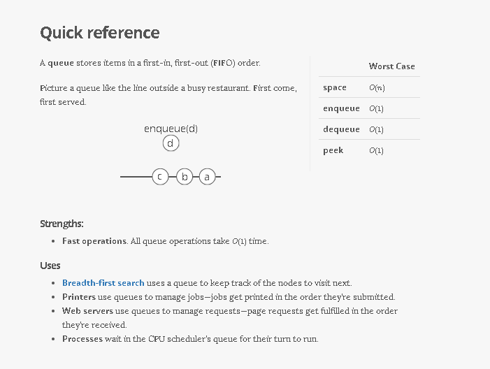

## Stack

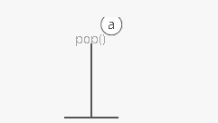
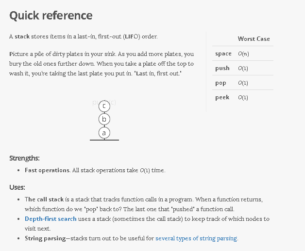
Like a stack of dirty plates in the sink. The first one you take off the
top is the last one you put down.

## Tree

Good for storing hierarchies. Each node can have "child" nodes.
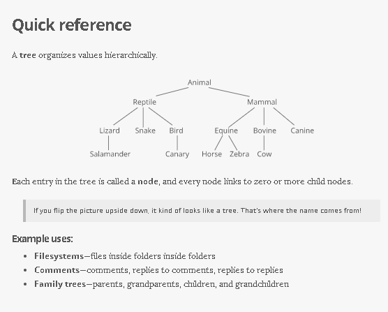
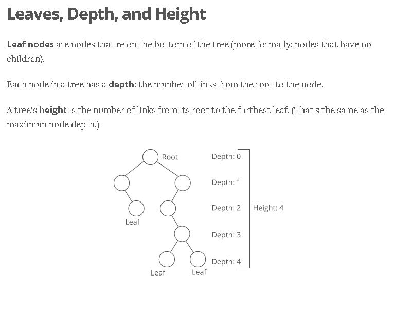
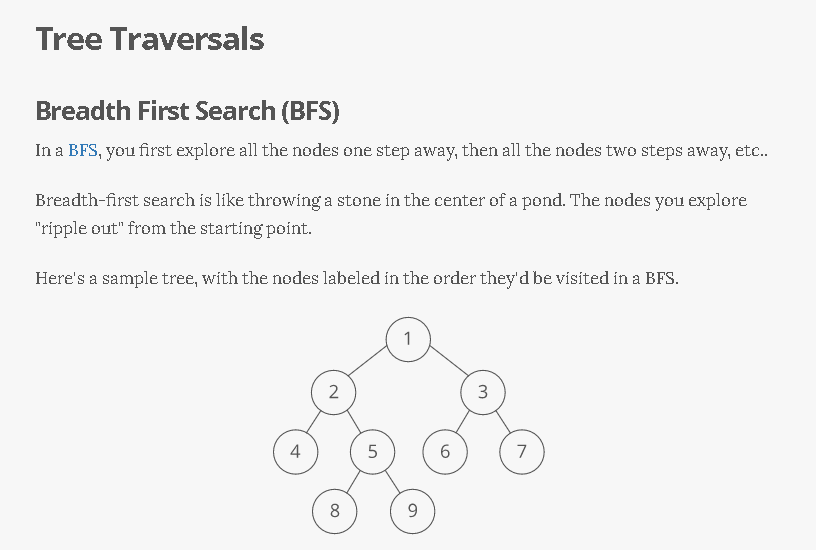
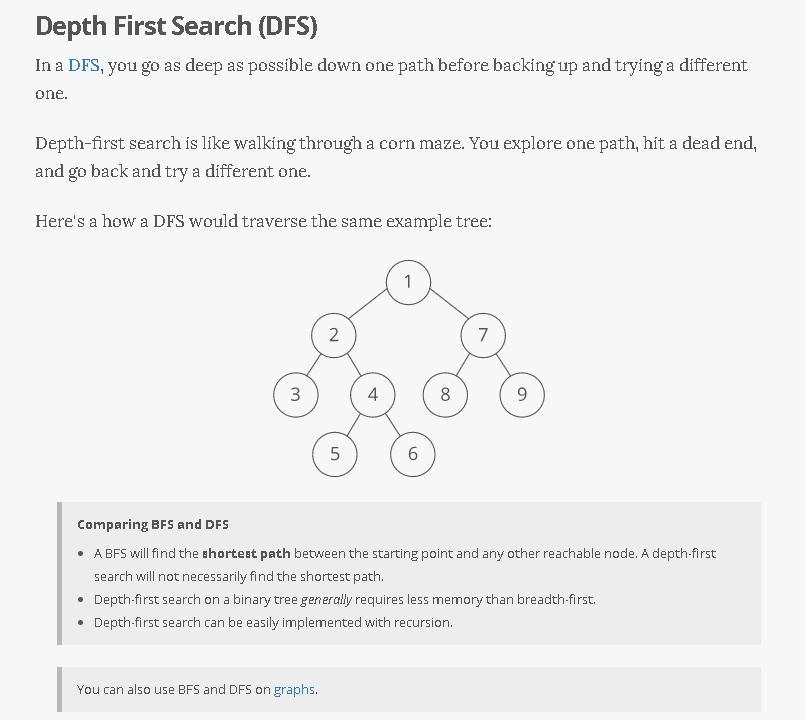
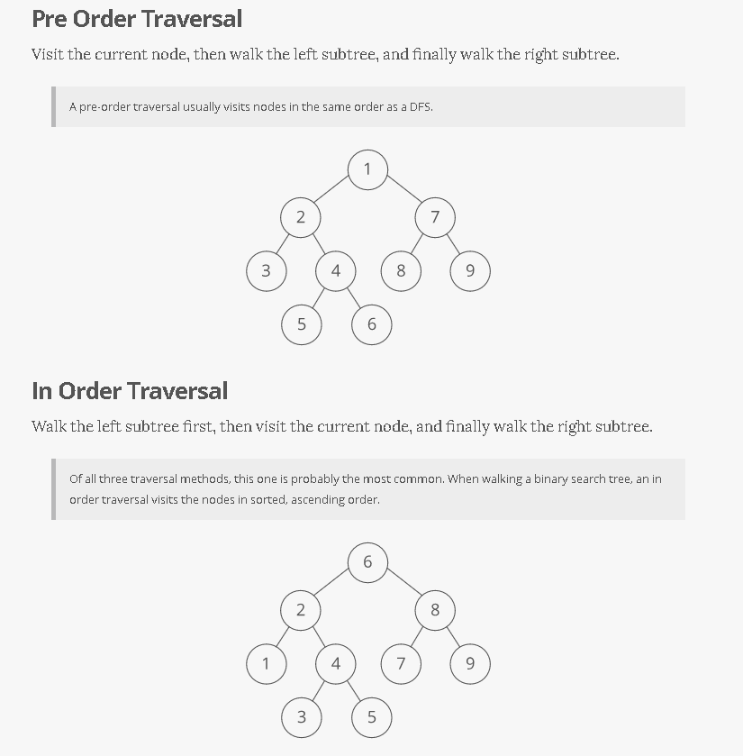
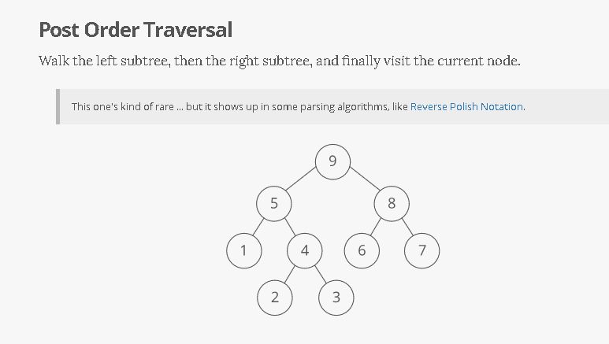

## Binary Search Tree

Everything in the left subtree is smaller than the current node,
everything in the right subtree is larger. lookups, but only if the tree
is balanced!
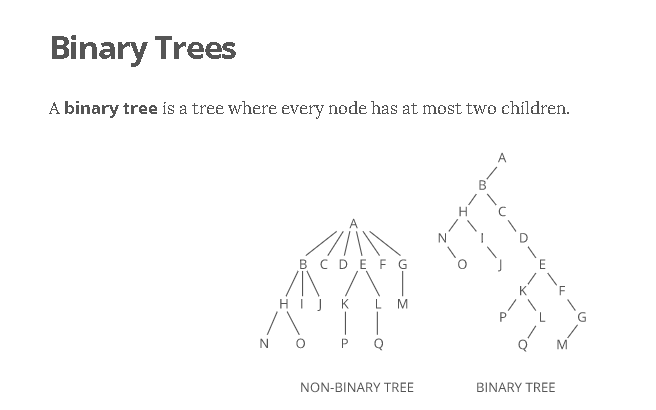

## Binary Search Tree

## Graph

Good for storing networks, geography, social relationships, etc.
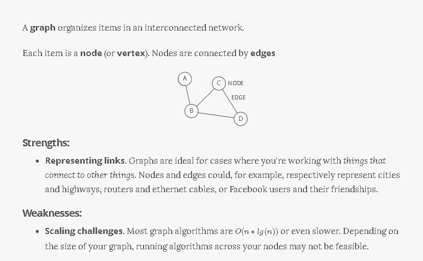
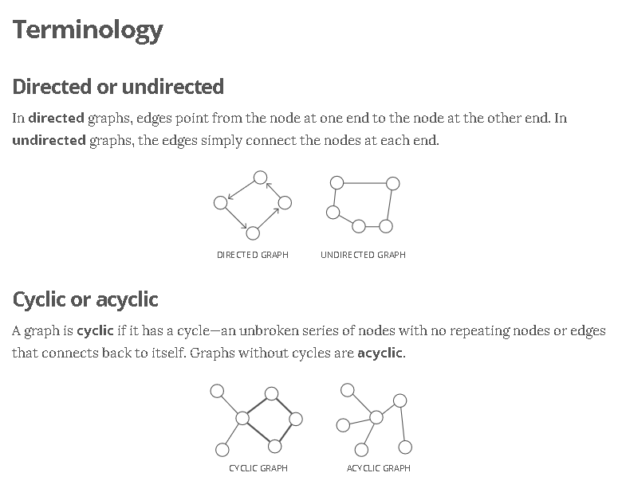
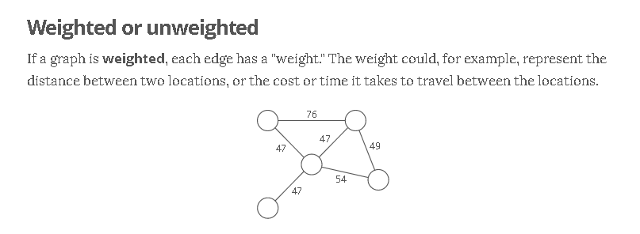

## Heap

A binary tree where the smallest value is always at the top. Use it to implement a priority queue.

![A binary heap is a binary tree where the nodes are organized to so that the smallest value is always at the top.]

### Adjacency list

A list where the index represents the node and the value at that index is a list of the node's neighbors:

graph = [ [1], [0, 2, 3], [1, 3], [1, 2], ]

Since node 3 has edges to nodes 1 and 2, graph[3] has the adjacency list [1, 2].

We could also use [a dictionary](https://www.interviewcake.com/concept/hash-map) where the keys represent the node and the values are the lists of neighbors.

graph = { 0: [1], 1: [0, 2, 3], 2: [1, 3], 3: [1, 2], }

This would be useful if the nodes were represented by strings, objects, or otherwise didn't map cleanly to list indices.

### Adjacency matrix

A matrix of 0s and 1s indicating whether node x connects to node y (0 means no, 1 means yes).

graph = [ [0, 1, 0, 0], [1, 0, 1, 1], [0, 1, 0, 1], [0, 1, 1, 0], ]

Since node 3 has edges to nodes 1 and 2, graph[3][1] and graph[3][2] have value 1.

a = LinkedListNode(5) b = LinkedListNode(1) c = LinkedListNode(9) a.next = b b.next = c

---

---

---

---

## Arrays

Ok, so we know how to store individual numbers. Let's talk about storing _several numbers_.

That's right, things are starting to _heat up_.

Suppose we wanted to keep a count of how many bottles of kombucha we drink every day.

Let's store each day's kombucha count in an 8-bit, fixed-width, unsigned integer. That should be plenty—we're not likely to get through more than 256 (2\^8) bottles in a _single day_, right?

And let's store the kombucha counts right next to each other in RAM, starting at memory address 0:

Bam. That's an **array**. RAM is _basically_ an array already.

Just like with RAM, the elements of an array are numbered. We call that number the **index** of the array element (plural: indices). In _this_ example, each array element's index is the same as its address in RAM.

But that's not usually true. Suppose another program like Spotify had already stored some information at memory address 2:

We'd have to start our array below it, for example at memory address 3. So index 0 in our array would be at memory address 3, and index 1 would be at memory address 4, etc.:

Suppose we wanted to get the kombucha count at index 4 in our array. How do we figure out what _address in memory_ to go to? Simple math:

Take the array's starting address (3), add the index we're looking for (4), and that's the address of the item we're looking for. 3 + 4 = 7. In general, for getting the nth item in our array:

\\text{address of nth item in array} = \\text{address of array start} + n

This works out nicely because the size of the addressed memory slots and the size of each kombucha count are _both_ 1 byte. So a slot in our array corresponds to a slot in RAM.

But that's not always the case. In fact, it's _usually not_ the case. We _usually_ use _64-bit_ integers.

So how do we build an array of _64-bit_ (8 byte) integers on top of our _8-bit_ (1 byte) memory slots?

We simply give each array index _8_ address slots instead of 1:

So we can still use simple math to grab the start of the nth item in our array—just gotta throw in some multiplication:

\\text{address of nth item in array} = \\text{address of array start} + (n \* \\text{size of each item in bytes})

Don't worry—adding this multiplication doesn't really slow us down. Remember: addition, subtraction, multiplication, and division of fixed-width integers takes time. So _all_ the math we're using here to get the address of the nth item in the array takes time.

And remember how we said the memory controller has a _direct connection_ to each slot in RAM? That means we can read the stuff at any given memory address in time.

**Together, this means looking up the contents of a given array index is time.** This fast lookup capability is the most important property of arrays.

But the formula we used to get the address of the nth item in our array only works _if_:

1.  **Each item in the array is the _same size_** (takes up the same

number of bytes).

2.  **The array is _uninterrupted_ (contiguous) in memory**. There can't

be any gaps in the array...like to "skip over" a memory slot Spotify was already using.

These things make our formula for finding the nth item _work_ because they make our array _predictable_. We can _predict_ exactly where in memory the nth element of our array will be.

But they also constrain what kinds of things we can put in an array. Every item has to be the same size. And if our array is going to store a _lot_ of stuff, we'll need a _bunch_ of uninterrupted free space in RAM. Which gets hard when most of our RAM is already occupied by other programs (like Spotify).

That's the tradeoff. Arrays have fast lookups ( time), but each item in the array needs to be the same size, and you need a big block of uninterrupted free memory to store the array.

---

---

---

---

## Pointers

Remember how we said every item in an array had to be the same size? Let's dig into that a little more.

Suppose we wanted to store a bunch of ideas for baby names. Because we've got some _really_ cute ones.

Each name is a string. Which is really an array. And now we want to store _those arrays_ in an array. _Whoa_.

Now, what if our baby names have different lengths? That'd violate our rule that all the items in an array need to be the same size!

We could put our baby names in arbitrarily large arrays (say, 13 characters each), and just use a special character to mark the end of the string within each array...

"Wigglesworth" is a cute baby name, right?

But look at all that wasted space after "Bill". And what if we wanted to store a string that was _more_ than 13 characters? We'd be out of luck.

There's a better way. Instead of storing the strings right inside our array, let's just put the strings wherever we can fit them in memory. Then we'll have each element in our array hold the _address in memory_ of its corresponding string. Each address is an integer, so really our outer array is just an array of integers. We can call each of these integers a **pointer**, since it points to another spot in memory.

The pointers are marked with a \* at the beginning.

Pretty clever, right? This fixes _both_ the disadvantages of arrays:

1.  The items don't have to be the same length—each string can be as

long or as short as we want.

2.  We don't need enough uninterrupted free memory to store all our

strings next to each other—we can place each of them separately, wherever there's space in RAM.

We fixed it! No more tradeoffs. Right?

Nope. Now we have a _new_ tradeoff:

Remember how the memory controller sends the contents of _nearby_ memory addresses to the processor with each read? And the processor caches them? So reading sequential addresses in RAM is _faster_ because we can get most of those reads right from the cache?

Our original array was very **cache-friendly**, because everything was sequential. So reading from the 0th index, then the 1st index, then the 2nd, etc. got an extra speedup from the processor cache.

**But the pointers in this array make it _not_ cache-friendly**, because the baby names are scattered randomly around RAM. So reading from the 0th index, then the 1st index, etc. doesn't get that extra speedup from the cache.

That's the tradeoff. This pointer-based array requires less uninterrupted memory and can accommodate elements that aren't all the same size, _but_ it's _slower_ because it's not cache-friendly.

This slowdown isn't reflected in the big O time cost. Lookups in this pointer-based array are _still_ time.

---

---

---

---

## Linked lists

Our word processor is definitely going to need fast appends—appending to the document is like the _main thing_ you do with a word processor.

Can we build a data structure that can store a string, has fast appends, _and_ doesn't require you to say how long the string will be ahead of time?

Let's focus first on not having to know the length of our string ahead of time. Remember how we used _pointers_ to get around length issues with our array of baby names?

What if we pushed that idea even further?

What if each _character_ in our string were a _two-index array_ with:

1.  the character itself 2. a pointer to the next character

We would call each of these two-item arrays a **node** and we'd call this series of nodes a **linked list**.

Here's how we'd actually implement it in memory:

Notice how we're free to store our nodes wherever we can find two open slots in memory. They don't have to be next to each other. They don't even have to be _in order_:

"But that's not cache-friendly, " you may be thinking. Good point! We'll get to that.

The first node of a linked list is called the **head**, and the last node is usually called the **tail**.

Confusingly, some people prefer to use "tail" to refer to _everything after the head_ of a linked list. In an interview it's fine to use either definition. Briefly say which definition you're using, just to be clear.

It's important to have a pointer variable referencing the head of the list—otherwise we'd be unable to find our way back to the start of the list!

We'll also sometimes keep a pointer to the tail. That comes in handy when we want to add something new to the end of the linked list. In fact, let's try that out:

Suppose we had the string "LOG" stored in a linked list:

Suppose we wanted to add an "S" to the end, to make it "LOGS". How would we do that?

Easy. We just put it in a new node:

And tweak some pointers:

​1. Grab the last letter, which is "G". Our tail pointer lets us do this in time.

​2. Point the last letter's next to the letter we're appending ("S").

​3. Update the tail pointer to point to our _new_ last letter, "S".

That's time.

Why is it time? Because the runtime doesn't get bigger if the string gets bigger. No matter how many characters are in our string, we still just have to tweak a couple pointers for any append.

Now, what if instead of a linked list, our string had been a _dynamic array_? We might not have any room at the end, forcing us to do one of those doubling operations to make space:

So with a dynamic array, our append would have a _worst-case_ time cost of .

**Linked lists have worst-case -time appends, which is better than the worst-case time of dynamic arrays.**

That _worst-case_ part is important. The _average case_ runtime for appends to linked lists and dynamic arrays is the same: .

Now, what if we wanted to *pre*pend something to our string? Let's say we wanted to put a "B" at the beginning.

For our linked list, it's just as easy as appending. Create the node:

And tweak some pointers:

1.  Point "B"'s next to "L". 2. Point the head to "B".

Bam. time again.

But if our string were a _dynamic array_...

And we wanted to add in that "B":

Eep. We have to _make room_ for the "B"!

We have to move _each character_ one space down:

_Now_ we can drop the "B" in there:

What's our time cost here?

It's all in the step where we made room for the first letter. We had to move _all n_ characters in our string. One at a time. That's time.

**So linked lists have faster *pre*pends ( time) than dynamic arrays ( time).**

No "worst case" caveat this time—prepends for dynamic arrays are _always_ time. And prepends for linked lists are _always_ time.

These quick appends and prepends for linked lists come from the fact that linked list nodes can go anywhere in memory. They don't have to sit right next to each other the way items in an array do.

So if linked lists are so great, why do we usually store strings in an array? **Because [arrays have -time lookups](#constant-time-array-lookups).** And those constant-time lookups _come from_ the fact that all the array elements are lined up next to each other in memory.

Lookups with a linked list are more of a process, because we have no way of knowing where the ith node is in memory. So we have to walk through the linked list node by node, counting as we go, until we hit the ith item.

def get_ith_item_in_linked_list(head, i): if i \< 0: raise ValueError("i can't be negative: %d" % i) current_node = head current_position = 0 while current_node: if current_position == i: \# Found it! return current_node \# Move on to the next node current_node = current_node.next current_position += 1 raise ValueError('List has fewer than i + 1 (%d) nodes' % (i + 1))

That's i + 1 steps down our linked list to get to the ith node (we made our function zero-based to match indices in arrays). **So linked lists have -time lookups.** Much slower than the -time lookups for arrays and dynamic arrays.

Not only that—**walking down a linked list is _not_ cache-friendly.** Because the next node could be _anywhere_ in memory, we don't get any benefit from the processor cache. This means lookups in a linked list are even slower.

So the tradeoff with linked lists is they have faster prepends and faster appends than dynamic arrays, _but_ they have slower lookups.

---

---

---

---

## Doubly Linked Lists

In a basic linked list, each item stores a single pointer to the next element.

In a **doubly linked list**, items have pointers to the next _and the previous_ nodes.

Doubly linked lists allow us to traverse our list _backwards_. In a _singly_ linked list, if you just had a pointer to a node in the _middle_ of a list, there would be _no way_ to know what nodes came before it. Not a problem in a doubly linked list.

## Not cache-friendly

Most computers have [caching systems that make reading from sequential addresses in memory faster than reading from scattered addresses](https://www.interviewcake.com/article/data-structures-coding-interview#ram).

[Array](https://www.interviewcake.com/concept/array) items are always located right next to each other in computer memory, but linked list nodes can be scattered all over.

So iterating through a linked list is usually quite a bit slower than iterating through the items in an array, even though they're both theoretically time.

---

---

---

---

## Hash tables

Quick lookups are often really important. For that reason, we tend to use arrays (-time lookups) much more often than linked lists (-time lookups).

For example, suppose we wanted to count how many times each ASCII character appears in [Romeo and Juliet](https://raw.githubusercontent.com/GITenberg/The-Tragedy-of-Romeo-and-Juliet_1112/master/1112.txt). How would we store those counts?

We can use arrays in a clever way here. Remember—characters are just numbers. In ASCII (a common character encoding) 'A' is 65, 'B' is 66, etc.

So we can use the character('s number value) as the _index_ in our array, and store the _count_ for that character _at that index_ in the array:

With this array, we can look up (and edit) the count for any character in constant time. Because we can access any index in our array in constant time.

Something interesting is happening here—this array isn't just a list of values. This array is storing _two_ things: characters and counts. The characters are _implied_ by the indices.

**So we can think of an array as a _table_ with _two columns_...except you don't really get to pick the values in one column (the indices)—they're always 0, 1, 2, 3, etc.**

But what if we wanted to put _any_ value in that column and still get quick lookups?

Suppose we wanted to count the number of times each _word_ appears in Romeo and Juliet. Can we adapt our array?

Translating a _character_ into an array index was easy. But we'll have to do something more clever to translate a _word_ (a string) into an array index...

Here's one way we could do it:

Grab the number value for each character and add those up.

The result is 429. But what if we only have _30_ slots in our array? We'll use a common trick for forcing a number into a specific range: the modulus operator (%). Modding our sum by 30 ensures we get a whole number that's less than 30 (and at least 0):

429 \\: \\% \\: 30 = 9

Bam. That'll get us from a word (or any string) to an array index.

This data structure is called a **hash table** or **hash map**. In our hash table, the _counts_ are the **values** and the _words_ ("lies, " etc.) are the **keys** (analogous to the _indices_ in an array). The process we used to translate a key into an array index is called a **hashing function**.

The hashing functions used in modern systems get pretty complicated—the one we used here is a simplified example.

Note that our quick lookups are only in one direction—we can quickly get the value for a given key, but the only way to get the key for a given value is to walk through all the values and keys.

Same thing with arrays—we can quickly look up the value at a given index, but the only way to figure out the index for a given value is to walk through the whole array.

One problem—what if two keys hash to the same index in our array? Look at "lies" and "foes":

They both sum up to 429! So of course they'll have the same answer when we mod by 30:

429 \\: \\% \\: 30 = 9

So our hashing function gives us the same answer for "lies" and "foes." This is called a **hash collision**. There are a few different strategies for dealing with them.

Here's a common one: instead of storing the actual values in our array, let's have each array slot hold a _pointer_ to a _linked list_ holding the counts for all the words that hash to that index:

One problem—how do we know which count is for "lies" and which is for "foes"? To fix this, we'll store the _word_ as well as the count in each linked list node:

"But wait!" you may be thinking, "Now lookups in our hash table take time in the worst case, since we have to walk down a linked list." That's true! You could even say that in the worst case _every_ key creates a hash collision, so our whole hash table _degrades to a linked list_.

In industry though, we usually wave our hands and say **collisions are rare enough that on _average_ lookups in a hash table are time**. And there are fancy algorithms that keep the number of collisions low and keep the lengths of our linked lists nice and short.

But that's sort of the tradeoff with hash tables. You get fast lookups by key...except _some_ lookups could be slow. And of course, you only get those fast lookups in one direction—looking up the _key_ for a given _value_ still takes time

# Breadth-First Search (BFS) and Breadth-First Traversal

**Breadth-first search** (BFS) is a method for exploring a tree or graph. In a BFS, you first explore all the nodes one step away, then all the nodes two steps away, etc.

Breadth-first search is like throwing a stone in the center of a pond. The nodes you explore "ripple out" from the starting point.

Here's a how a BFS would traverse this tree, starting with the root:

We'd visit all the immediate children (all the nodes that're one step away from our starting node):

Then we'd move on to all _those_ nodes' children (all the nodes that're _two steps_ away from our starting node):

And so on:

Until we reach the end.

Breadth-first search is often compared with **depth-first search**.

Advantages:

- A BFS will find the **shortest path** between the starting point and

any other reachable node. A depth-first search will not necessarily find the shortest path.

Disadvantages

- A BFS on a binary tree _generally_ requires more memory than a DFS.

# Binary Search Tree

A **binary tree** is a **tree** where <==(_**every node has two or fewer children**_)==>.
The children are usually called **_left_** and _**right**_.

class BinaryTreeNode(object):

This lets us build a structure like this:

That particular example is special because every level of the tree is completely full. There are no "gaps." We call this kind of tree "**perfect**."

Binary trees have a few interesting properties when they're perfect:

**Property 1: the number of total nodes on each "level" doubles as we move down the tree.**

**Property 2: the number of nodes on the last level is equal to the sum of the number of nodes on all other levels (plus 1).** In other words, about _half_ of our nodes are on the last level.

<==(_**Let's call the number of nodes n, **_)==>

<==(**\_**and the height of the tree h. **\_**)==>

**h can also be thought of as the "number of levels."**

If we had h, how could we calculate n?

Let's just add up the number of nodes on each level!

If we zero-index the levels, the number of nodes on the xth level is exactly 2\^x.

1.  Level 0: 2\^0 nodes,
2.  2.  Level 1: 2\^1 nodes,
3.  3.  Level 2: 2\^2 nodes,
4.  4.  Level 3: 2\^3 nodes,
5.  5.  _etc_

So our total number of nodes is:

**n = 2\^0 + 2\^1 + 2\^2 + 2\^3 + ... + 2\^{h-1}**

Why only up to 2\^{h-1}?

Notice that we **started counting our levels at 0.**

- So if we have h levels in total,
- the last level is actually the "h-1"-th level.
- That means the number of nodes on the last level is 2\^{h-1}.

But we can simplify.

**Property 2 tells us that the number of nodes on the last level is (1 more than) half of the total number of nodes**,

**so we can just take the number of nodes on the last level, multiply it by 2, and subtract 1 to get the number of nodes overall**.

- We know the number of nodes on the last level is 2\^{h-1},

- So:

**n = 2\^{h-1} \* 2 - 1
n = 2\^{h-1} \* 2\^1 - 1
n = 2\^{h-1+1}- 1
n = 2\^{h} - 1**

So that's how we can go from h to n. What about the other direction?

We need to bring the h down from the exponent.

That's what logs are for!

First, some quick review.

<==(log\_{10} (100) )==>

simply means,

**"What power must you raise 10 to in order to get 100?"**.

Which is 2,

because .

<==(10\^2 = 100 )==>

# Graph Data Structure: Directed, Acyclic, etc

Graph ===== 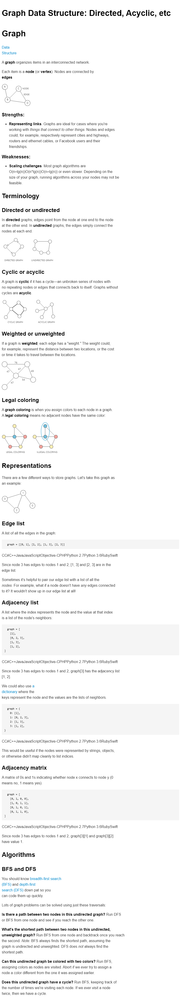

## Binary numbers

Let's put those bits to use. Let's store some stuff. Starting with numbers.

The number system we usually use (the one you probably learned in elementary school) is called **base 10**, because each digit has _ten_ possible values (1, 2, 3, 4, 5, 6, 7, 8, 9, and 0).

But computers don't have digits with ten possible values. They have _bits_ with _two_ possible values. So they use **base 2** numbers.

Base 10 is also called **decimal**. Base 2 is also called **binary**.

To understand binary, let's take a closer look at how decimal numbers work. Take the number "101" in decimal:

Notice we have two "1"s here, but they don't _mean_ the same thing. The leftmost "1" _means_ 100, and the rightmost "1" _means_ 1. That's because the leftmost "1" is in the hundreds place, while the rightmost "1" is in the ones place. And the "0" between them is in the tens place.

**So this "101" in base 10 is telling us we have "1 hundred, 0 tens, and 1 one."**

Notice how the _places_ in base 10 (ones place, tens place, hundreds place, etc.) are _sequential powers of 10_:

- 10\^0=1 _ 10\^1=10 _ 10\^2=100 _ 10\^3=1000 _ etc.

**The places in _binary_ (base 2) are sequential powers of _2_:**

- 2\^0=1 _ 2\^1=2 _ 2\^2=4 _ 2\^3=8 _ etc.

So let's take that same "101" but this time let's read it as a _binary_ number:

Reading this from right to left: we have a 1 in the ones place, a 0 in the twos place, and a 1 in the fours place. So our total is 4 + 0 + 1 which is 5.

Here's how we'd count up to 12 in binary:
