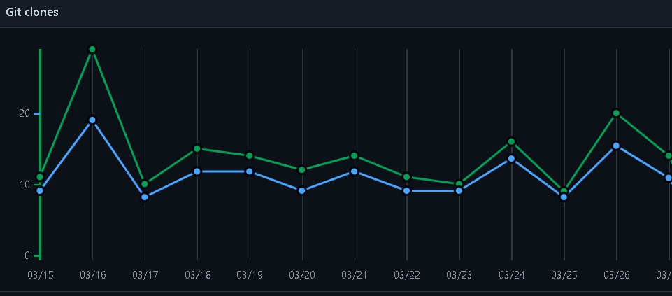

<!-- HEADER -->
<div align="center">

# ➤ [Live Site](https://ds-algo-official.netlify.app/)

[Readme](https://github.com/bgoonz/DS-ALGO-OFFICIAL/blob/master/README.md)

hi

[readme part 2](https://github.com/bgoonz/DS-ALGO-OFFICIAL/blob/master/readme-p2.md)

[readme part 3](https://github.com/bgoonz/DS-ALGO-OFFICIAL/blob/master/readme-p3.md)

[readme part 4](https://github.com/bgoonz/DS-ALGO-OFFICIAL/blob/master/readme-p4.md)

  <!-- SHIELDS -->
  <!-- For how-to notes on shield badges, see docs: https://shields.io/ -->


 </div>


[](https://app.netlify.com/sites/trusting-dijkstra-4d3b17/deploys)

[Deployment](https://ds-algo-official.netlify.app/)

[github-pages](https://bgoonz.github.io/DS-ALGO-OFFICIAL/)

[vercel](https://ds-algo-official-hm2a9mlnr-bgoonz.vercel.app/)

[Navigation](https://pensive-meitner-1ea8c4.netlify.app/directory.html)

[npm](https://www.npmjs.com/package/ds-algo-study)

[](#the-idea-behind-big-o-notation)

# ➤ Author:Bryan Guner

[](#the-idea-behind-big-o-notation)

# Clones: 185 to date



[](#the-idea-behind-big-o-notation)

## ➤ The idea behind big O notation

**Big O notation is the language we use for talking about how long an
algorithm takes to run**. It's how we compare the efficiency of
different approaches to a problem.

With big O notation we express the runtime in terms of

### how quickly it grows relative to the input, as the input gets arbitrarily large\_.

1.  **how quickly the runtime grows**—

It's hard to pin down the _exact runtime_ of an algorithm.

- It depends on the speed of the processor,
- what else the computer is running, etc.

So instead of talking about the runtime directly, we use big O notation to talk about _how quickly the runtime grows_.

2.  **relative to the input**—If we were measuring our runtime directly,

we could express our speed in seconds. Since we're measuring _how quickly our runtime grows_, we need to express our speed in terms of...something else. With Big O notation, we use the size of the input, which we call "n." So we can say things like the runtime grows "on the order of the size of the input" () or "on the order of the square of the size of the input" ().

3.  **as the input gets arbitrarily large**—

Our algorithm may have steps that seem expensive when n is small but are eclipsed eventually by other steps as n gets huge. For big O analysis, we care most about the stuff that grows fastest as the input grows, because everything else is quickly eclipsed as n gets very large. (If you know what an asymptote is, you might see why "big O analysis" is sometimes called "asymptotic analysis.")hy "big O analysis" is sometimes called

    "asymptotic analysis.")

---

---

---

---

---

[](#data-structures-reference)

# ➤ Data Structures Reference

---

[](#array)

## ➤ Array

Stores things in order. Has quick lookups by index.


[](#linked-list)

## ➤ Linked List


Also stores things in order. Faster insertions and deletions than
arrays, but slower lookups (you have to "walk down" the whole list).

!

[](#queue)

## ➤ Queue

Like the line outside a busy restaurant. "First come, first served."
[](linked-list.png)


[](#stack)

## ➤ Stack


Like a stack of dirty plates in the sink. The first one you take off the
top is the last one you put down.

[](#tree)

## ➤ Tree

Good for storing hierarchies. Each node can have "child" nodes.


[](#binary-search-tree)

## ➤ Binary Search Tree

Everything in the left subtree is smaller than the current node,
everything in the right subtree is larger. lookups, but only if the tree
is balanced!


[](#binary-search-tree)

## ➤ Binary Search Tree

[](#graph)

## ➤ Graph

Good for storing networks, geography, social relationships, etc.


[](#heap-)

## ➤ Heap

A binary tree where the smallest value is always at the top. Use it to implement a priority queue.

![A binary heap is a binary tree where the nodes are organized to so that the smallest value is always at the top.]

### Adjacency list

A list where the index represents the node and the value at that index is a list of the node's neighbors:

graph = [ [1], [0, 2, 3], [1, 3], [1, 2], ]

Since node 3 has edges to nodes 1 and 2, graph[3] has the adjacency list [1, 2].

We could also use [a dictionary](https://www.interviewcake.com/concept/hash-map) where the keys represent the node and the values are the lists of neighbors.

graph = { 0: [1], 1: [0, 2, 3], 2: [1, 3], 3: [1, 2], }

This would be useful if the nodes were represented by strings, objects, or otherwise didn't map cleanly to list indices.

### Adjacency matrix

A matrix of 0s and 1s indicating whether node x connects to node y (0 means no, 1 means yes).

graph = [ [0, 1, 0, 0], [1, 0, 1, 1], [0, 1, 0, 1], [0, 1, 1, 0], ]

Since node 3 has edges to nodes 1 and 2, graph[3][1] and graph[3][2] have value 1.

a = LinkedListNode(5) b = LinkedListNode(1) c = LinkedListNode(9) a.next = b b.next = c

---

[](#arrays-)

## ➤ Arrays

Ok, so we know how to store individual numbers. Let's talk about storing _several numbers_.

That's right, things are starting to _heat up_.

Suppose we wanted to keep a count of how many bottles of kombucha we drink every day.

Let's store each day's kombucha count in an 8-bit, fixed-width, unsigned integer. That should be plenty—we're not likely to get through more than 256 (2\^8) bottles in a _single day_, right?

And let's store the kombucha counts right next to each other in RAM, starting at memory address 0:


Bam. That's an **array**. RAM is _basically_ an array already.

Just like with RAM, the elements of an array are numbered. We call that number the **index** of the array element (plural: indices). In _this_ example, each array element's index is the same as its address in RAM.

But that's not usually true. Suppose another program like Spotify had already stored some information at memory address 2:


We'd have to start our array below it, for example at memory address 3. So index 0 in our array would be at memory address 3, and index 1 would be at memory address 4, etc.:


Suppose we wanted to get the kombucha count at index 4 in our array. How do we figure out what _address in memory_ to go to? Simple math:

Take the array's starting address (3), add the index we're looking for (4), and that's the address of the item we're looking for. 3 + 4 = 7. In general, for getting the nth item in our array:

\\text{address of nth item in array} = \\text{address of array start} + n

This works out nicely because the size of the addressed memory slots and the size of each kombucha count are _both_ 1 byte. So a slot in our array corresponds to a slot in RAM.

But that's not always the case. In fact, it's _usually not_ the case. We _usually_ use _64-bit_ integers.

So how do we build an array of _64-bit_ (8 byte) integers on top of our _8-bit_ (1 byte) memory slots?

We simply give each array index _8_ address slots instead of 1:


So we can still use simple math to grab the start of the nth item in our array—just gotta throw in some multiplication:

\\text{address of nth item in array} = \\text{address of array start} + (n \* \\text{size of each item in bytes})

Don't worry—adding this multiplication doesn't really slow us down. Remember: addition, subtraction, multiplication, and division of fixed-width integers takes time. So _all_ the math we're using here to get the address of the nth item in the array takes time.

And remember how we said the memory controller has a _direct connection_ to each slot in RAM? That means we can read the stuff at any given memory address in time.


**Together, this means looking up the contents of a given array index is time.** This fast lookup capability is the most important property of arrays.

But the formula we used to get the address of the nth item in our array only works _if_:

1.  **Each item in the array is the _same size_** (takes up the same

number of bytes).

2.  **The array is _uninterrupted_ (contiguous) in memory**. There can't

be any gaps in the array...like to "skip over" a memory slot Spotify was already using.

These things make our formula for finding the nth item _work_ because they make our array _predictable_. We can _predict_ exactly where in memory the nth element of our array will be.

But they also constrain what kinds of things we can put in an array. Every item has to be the same size. And if our array is going to store a _lot_ of stuff, we'll need a _bunch_ of uninterrupted free space in RAM. Which gets hard when most of our RAM is already occupied by other programs (like Spotify).

That's the tradeoff. Arrays have fast lookups ( time), but each item in the array needs to be the same size, and you need a big block of uninterrupted free memory to store the array.

---

---

---

## Pointers

Remember how we said every item in an array had to be the same size? Let's dig into that a little more.

Suppose we wanted to store a bunch of ideas for baby names. Because we've got some _really_ cute ones.

Each name is a string. Which is really an array. And now we want to store _those arrays_ in an array. _Whoa_.

Now, what if our baby names have different lengths? That'd violate our rule that all the items in an array need to be the same size!

We could put our baby names in arbitrarily large arrays (say, 13 characters each), and just use a special character to mark the end of the string within each array...


"Wigglesworth" is a cute baby name, right?

But look at all that wasted space after "Bill". And what if we wanted to store a string that was _more_ than 13 characters? We'd be out of luck.

There's a better way. Instead of storing the strings right inside our array, let's just put the strings wherever we can fit them in memory. Then we'll have each element in our array hold the _address in memory_ of its corresponding string. Each address is an integer, so really our outer array is just an array of integers. We can call each of these integers a **pointer**, since it points to another spot in memory.


The pointers are marked with a \* at the beginning.

Pretty clever, right? This fixes _both_ the disadvantages of arrays:

1.  The items don't have to be the same length—each string can be as

long or as short as we want.

2.  We don't need enough uninterrupted free memory to store all our

strings next to each other—we can place each of them separately, wherever there's space in RAM.

We fixed it! No more tradeoffs. Right?

Nope. Now we have a _new_ tradeoff:

Remember how the memory controller sends the contents of _nearby_ memory addresses to the processor with each read? And the processor caches them? So reading sequential addresses in RAM is _faster_ because we can get most of those reads right from the cache?


Our original array was very **cache-friendly**, because everything was sequential. So reading from the 0th index, then the 1st index, then the 2nd, etc. got an extra speedup from the processor cache.

**But the pointers in this array make it _not_ cache-friendly**, because the baby names are scattered randomly around RAM. So reading from the 0th index, then the 1st index, etc. doesn't get that extra speedup from the cache.

That's the tradeoff. This pointer-based array requires less uninterrupted memory and can accommodate elements that aren't all the same size, _but_ it's _slower_ because it's not cache-friendly.

This slowdown isn't reflected in the big O time cost. Lookups in this pointer-based array are _still_ time.

---

---

---

[](#linked-lists-)

## ➤ Linked lists

Our word processor is definitely going to need fast appends—appending to the document is like the _main thing_ you do with a word processor.

Can we build a data structure that can store a string, has fast appends, _and_ doesn't require you to say how long the string will be ahead of time?

Let's focus first on not having to know the length of our string ahead of time. Remember how we used _pointers_ to get around length issues with our array of baby names?

What if we pushed that idea even further?

What if each _character_ in our string were a _two-index array_ with:

1.  the character itself 2. a pointer to the next character


We would call each of these two-item arrays a **node** and we'd call this series of nodes a **linked list**.

Here's how we'd actually implement it in memory:


Notice how we're free to store our nodes wherever we can find two open slots in memory. They don't have to be next to each other. They don't even have to be _in order_:


"But that's not cache-friendly, " you may be thinking. Good point! We'll get to that.

The first node of a linked list is called the **head**, and the last node is usually called the **tail**.

Confusingly, some people prefer to use "tail" to refer to _everything after the head_ of a linked list. In an interview it's fine to use either definition. Briefly say which definition you're using, just to be clear.

It's important to have a pointer variable referencing the head of the list—otherwise we'd be unable to find our way back to the start of the list!

We'll also sometimes keep a pointer to the tail. That comes in handy when we want to add something new to the end of the linked list. In fact, let's try that out:

Suppose we had the string "LOG" stored in a linked list:


Suppose we wanted to add an "S" to the end, to make it "LOGS". How would we do that?

Easy. We just put it in a new node:


And tweak some pointers:

​1. Grab the last letter, which is "G". Our tail pointer lets us do this in time.


​2. Point the last letter's next to the letter we're appending ("S").


​3. Update the tail pointer to point to our _new_ last letter, "S".


That's time.

Why is it time? Because the runtime doesn't get bigger if the string gets bigger. No matter how many characters are in our string, we still just have to tweak a couple pointers for any append.

Now, what if instead of a linked list, our string had been a _dynamic array_? We might not have any room at the end, forcing us to do one of those doubling operations to make space:


So with a dynamic array, our append would have a _worst-case_ time cost of .

**Linked lists have worst-case -time appends, which is better than the worst-case time of dynamic arrays.**

That _worst-case_ part is important. The _average case_ runtime for appends to linked lists and dynamic arrays is the same: .

Now, what if we wanted to *pre*pend something to our string? Let's say we wanted to put a "B" at the beginning.

For our linked list, it's just as easy as appending. Create the node:


And tweak some pointers:

1.  Point "B"'s next to "L". 2. Point the head to "B".


Bam. time again.

But if our string were a _dynamic array_...


And we wanted to add in that "B":


Eep. We have to _make room_ for the "B"!

We have to move _each character_ one space down:


_Now_ we can drop the "B" in there:


What's our time cost here?

It's all in the step where we made room for the first letter. We had to move _all n_ characters in our string. One at a time. That's time.

**So linked lists have faster *pre*pends ( time) than dynamic arrays ( time).**

No "worst case" caveat this time—prepends for dynamic arrays are _always_ time. And prepends for linked lists are _always_ time.

These quick appends and prepends for linked lists come from the fact that linked list nodes can go anywhere in memory. They don't have to sit right next to each other the way items in an array do.

So if linked lists are so great, why do we usually store strings in an array? **Because [arrays have -time lookups](#constant-time-array-lookups).** And those constant-time lookups _come from_ the fact that all the array elements are lined up next to each other in memory.

Lookups with a linked list are more of a process, because we have no way of knowing where the ith node is in memory. So we have to walk through the linked list node by node, counting as we go, until we hit the ith item.

def get_ith_item_in_linked_list(head, i): if i \< 0: raise ValueError("i can't be negative: %d" % i) current_node = head current_position = 0 while current_node: if current_position == i: \# Found it! return current_node \# Move on to the next node current_node = current_node.next current_position += 1 raise ValueError('List has fewer than i + 1 (%d) nodes' % (i + 1))

That's i + 1 steps down our linked list to get to the ith node (we made our function zero-based to match indices in arrays). **So linked lists have -time lookups.** Much slower than the -time lookups for arrays and dynamic arrays.

Not only that—**walking down a linked list is _not_ cache-friendly.** Because the next node could be _anywhere_ in memory, we don't get any benefit from the processor cache. This means lookups in a linked list are even slower.

So the tradeoff with linked lists is they have faster prepends and faster appends than dynamic arrays, _but_ they have slower lookups.

---

---

---

## Doubly Linked Lists

In a basic linked list, each item stores a single pointer to the next element.

In a **doubly linked list**, items have pointers to the next _and the previous_ nodes.


Doubly linked lists allow us to traverse our list _backwards_. In a _singly_ linked list, if you just had a pointer to a node in the _middle_ of a list, there would be _no way_ to know what nodes came before it. Not a problem in a doubly linked list.

[](#not-cache-friendly-)

## ➤ Not cache-friendly

Most computers have [caching systems that make reading from sequential addresses in memory faster than reading from scattered addresses](https://www.interviewcake.com/article/data-structures-coding-interview#ram).

[Array](https://www.interviewcake.com/concept/array) items are always located right next to each other in computer memory, but linked list nodes can be scattered all over.

So iterating through a linked list is usually quite a bit slower than iterating through the items in an array, even though they're both theoretically time.

---

---

---

## Hash tables

Quick lookups are often really important. For that reason, we tend to use arrays (-time lookups) much more often than linked lists (-time lookups).

For example, suppose we wanted to count how many times each ASCII character appears in [Romeo and Juliet](https://raw.githubusercontent.com/GITenberg/The-Tragedy-of-Romeo-and-Juliet_1112/master/1112.txt). How would we store those counts?

We can use arrays in a clever way here. Remember—characters are just numbers. In ASCII (a common character encoding) 'A' is 65, 'B' is 66, etc.

So we can use the character('s number value) as the _index_ in our array, and store the _count_ for that character _at that index_ in the array:


With this array, we can look up (and edit) the count for any character in constant time. Because we can access any index in our array in constant time.

Something interesting is happening here—this array isn't just a list of values. This array is storing _two_ things: characters and counts. The characters are _implied_ by the indices.

**So we can think of an array as a _table_ with _two columns_...except you don't really get to pick the values in one column (the indices)—they're always 0, 1, 2, 3, etc.**

But what if we wanted to put _any_ value in that column and still get quick lookups?

Suppose we wanted to count the number of times each _word_ appears in Romeo and Juliet. Can we adapt our array?

Translating a _character_ into an array index was easy. But we'll have to do something more clever to translate a _word_ (a string) into an array index...


Here's one way we could do it:

Grab the number value for each character and add those up.


The result is 429. But what if we only have _30_ slots in our array? We'll use a common trick for forcing a number into a specific range: the modulus operator (%). Modding our sum by 30 ensures we get a whole number that's less than 30 (and at least 0):

429 \\: \\% \\: 30 = 9

Bam. That'll get us from a word (or any string) to an array index.

This data structure is called a **hash table** or **hash map**. In our hash table, the _counts_ are the **values** and the _words_ ("lies, " etc.) are the **keys** (analogous to the _indices_ in an array). The process we used to translate a key into an array index is called a **hashing function**.


The hashing functions used in modern systems get pretty complicated—the one we used here is a simplified example.

Note that our quick lookups are only in one direction—we can quickly get the value for a given key, but the only way to get the key for a given value is to walk through all the values and keys.

Same thing with arrays—we can quickly look up the value at a given index, but the only way to figure out the index for a given value is to walk through the whole array.

One problem—what if two keys hash to the same index in our array? Look at "lies" and "foes":


They both sum up to 429! So of course they'll have the same answer when we mod by 30:

429 \\: \\% \\: 30 = 9

So our hashing function gives us the same answer for "lies" and "foes." This is called a **hash collision**. There are a few different strategies for dealing with them.

Here's a common one: instead of storing the actual values in our array, let's have each array slot hold a _pointer_ to a _linked list_ holding the counts for all the words that hash to that index:


One problem—how do we know which count is for "lies" and which is for "foes"? To fix this, we'll store the _word_ as well as the count in each linked list node:


"But wait!" you may be thinking, "Now lookups in our hash table take time in the worst case, since we have to walk down a linked list." That's true! You could even say that in the worst case _every_ key creates a hash collision, so our whole hash table _degrades to a linked list_.

In industry though, we usually wave our hands and say **collisions are rare enough that on _average_ lookups in a hash table are time**. And there are fancy algorithms that keep the number of collisions low and keep the lengths of our linked lists nice and short.

But that's sort of the tradeoff with hash tables. You get fast lookups by key...except _some_ lookups could be slow. And of course, you only get those fast lookups in one direction—looking up the _key_ for a given _value_ still takes time. ------ --- <==(------------------------------------------------------------------------------------------------------)==> --- ------

[](#breadth-first-search-bfs-and-breadth-first-traversal-)

# ➤ Breadth-First Search (BFS) and Breadth-First Traversal

**Breadth-first search** (BFS) is a method for exploring a tree or graph. In a BFS, you first explore all the nodes one step away, then all the nodes two steps away, etc.

Breadth-first search is like throwing a stone in the center of a pond. The nodes you explore "ripple out" from the starting point.

Here's a how a BFS would traverse this tree, starting with the root:


We'd visit all the immediate children (all the nodes that're one step away from our starting node):


Then we'd move on to all _those_ nodes' children (all the nodes that're _two steps_ away from our starting node):


And so on:


Until we reach the end.

Breadth-first search is often compared with **depth-first search**.

Advantages:

- A BFS will find the **shortest path** between the starting point and

any other reachable node. A depth-first search will not necessarily find the shortest path.

Disadvantages

- A BFS on a binary tree _generally_ requires more memory than a DFS.


[](#binary-search-tree-)

# ➤ Binary Search Tree

A **binary tree** is a **tree** where <==(_**every node has two or fewer children**_)==>.
The children are usually called **_left_** and _**right**_.

class BinaryTreeNode(object):

This lets us build a structure like this:


That particular example is special because every level of the tree is completely full. There are no "gaps." We call this kind of tree "**perfect**."

Binary trees have a few interesting properties when they're perfect:

**Property 1: the number of total nodes on each "level" doubles as we move down the tree.**


**Property 2: the number of nodes on the last level is equal to the sum of the number of nodes on all other levels (plus 1).** In other words, about _half_ of our nodes are on the last level.

<==(_**Let's call the number of nodes n, **_)==>

<==(**\_**and the height of the tree h. **\_**)==>

**h can also be thought of as the "number of levels."**

If we had h, how could we calculate n?

Let's just add up the number of nodes on each level!

If we zero-index the levels, the number of nodes on the xth level is exactly 2\^x.

1.  Level 0: 2\^0 nodes,
2.  2.  Level 1: 2\^1 nodes,
3.  3.  Level 2: 2\^2 nodes,
4.  4.  Level 3: 2\^3 nodes,
5.  5.  _etc_

So our total number of nodes is:

**n = 2\^0 + 2\^1 + 2\^2 + 2\^3 + ... + 2\^{h-1}**

Why only up to 2\^{h-1}?

Notice that we **started counting our levels at 0.**

- So if we have h levels in total,
- the last level is actually the "h-1"-th level.
- That means the number of nodes on the last level is 2\^{h-1}.

But we can simplify.

**Property 2 tells us that the number of nodes on the last level is (1 more than) half of the total number of nodes**,

**so we can just take the number of nodes on the last level, multiply it by 2, and subtract 1 to get the number of nodes overall**.

- We know the number of nodes on the last level is 2\^{h-1},

- So:

**n = 2\^{h-1} \* 2 - 1
n = 2\^{h-1} \* 2\^1 - 1
n = 2\^{h-1+1}- 1
n = 2\^{h} - 1**

So that's how we can go from h to n. What about the other direction?

We need to bring the h down from the exponent.

That's what logs are for!

First, some quick review.

<==(log\_{10} (100) )==>

simply means,

**"What power must you raise 10 to in order to get 100?"**.

Which is 2,

because .

<==(10\^2 = 100 )==>

[](#graph-data-structure-directed-acyclic-etc-)

# ➤ Graph Data Structure: Directed, Acyclic, etc

Graph ===== 

[](#binary-numbers-)

## ➤ Binary numbers

Let's put those bits to use. Let's store some stuff. Starting with numbers.

The number system we usually use (the one you probably learned in elementary school) is called **base 10**, because each digit has _ten_ possible values (1, 2, 3, 4, 5, 6, 7, 8, 9, and 0).

But computers don't have digits with ten possible values. They have _bits_ with _two_ possible values. So they use **base 2** numbers.

Base 10 is also called **decimal**. Base 2 is also called **binary**.

To understand binary, let's take a closer look at how decimal numbers work. Take the number "101" in decimal:


Notice we have two "1"s here, but they don't _mean_ the same thing. The leftmost "1" _means_ 100, and the rightmost "1" _means_ 1. That's because the leftmost "1" is in the hundreds place, while the rightmost "1" is in the ones place. And the "0" between them is in the tens place.


**So this "101" in base 10 is telling us we have "1 hundred, 0 tens, and 1 one."**


Notice how the _places_ in base 10 (ones place, tens place, hundreds place, etc.) are _sequential powers of 10_:

- 10\^0=1 _ 10\^1=10 _ 10\^2=100 _ 10\^3=1000 _ etc.

**The places in _binary_ (base 2) are sequential powers of _2_:**

- 2\^0=1 _ 2\^1=2 _ 2\^2=4 _ 2\^3=8 _ etc.

So let's take that same "101" but this time let's read it as a _binary_ number:


Reading this from right to left: we have a 1 in the ones place, a 0 in the twos place, and a 1 in the fours place. So our total is 4 + 0 + 1 which is 5.


[](#leetcode-patterns)

# ➤ Leetcode Patterns

[](#background)

## ➤ Background

This repo is intended for any individual wanting to improve their problem
solving skills for software engineering interviews.

Problems are grouped under their respective subtopic, in order to focus on
repeatedly applying common patterns rather than randomly tackling questions.

All questions are available on [leetcode.com] with some requiring [leetcode premium].

[](#preface)

## ➤ Preface

It is highly recommended to read chapters 1, 2, 3, 4, 8, and 10 of [Cracking The Coding Interview]
to familiarize yourself with the following data structures and their operations:

- Arrays
- Maps
- Linked Lists
- Queues
- Heaps
- Stacks
- Trees
- Graphs

In addition, you should have a good grasp on common algorithms such as:

- Breadth-first search
- Depth-first search
- Binary search
- Recursion

[](#notes)

## ➤ Notes

[](#tips-to-consider)

## ➤ Tips to Consider

```
If input array is sorted then
    - Binary search
    - Two pointers

If asked for all permutations/subsets then
    - Backtracking

If given a tree then
    - DFS
    - BFS

If given a graph then
    - DFS
    - BFS

If given a linked list then
    - Two pointers

If recursion is banned then
    - Stack

If asked for maximum/minumum subarray/subset/options then
    - Dynamic programming

If asked for top/least K items then
    - Heap

If asked for common strings then
    - Map
    - Trie

Else
    - Map/Set for O(1) time & O(n) space
    - Sort input for O(nlogn) time and O(1) space
```

[](#suggestions)

## ➤ Suggestions

Think a question should/shouldn't be included? Wish there was another feature?

[](#repo-directory-structure)

# ➤ REPO Directory Structure

```
.
├── CONTAINER
│   ├── DS-n-Algos
│   │   ├── 0-TESTING-RESOURCES
│   │   │   ├── main-data
│   │   │   │   ├── 01-Person-Data.txt
│   │   │   │   ├── cities.txt
│   │   │   │   ├── city-state-country.txt
│   │   │   │   ├── common-surnames.txt
│   │   │   │   ├── dates.txt
│   │   │   │   ├── html-colors.txt
│   │   │   │   ├── numbers1-100.txt
│   │   │   │   ├── output.txt
│   │   │   │   ├── right.html
│   │   │   │   ├── street-names.txt
│   │   │   │   ├── test-data.md
│   │   │   │   ├── testdata.js
│   │   │   │   └── zip-codes.txt
│   │   │   ├── right.html
│   │   │   ├── text-2-js
│   │   │   │   ├── right.html
│   │   │   │   ├── streetNames.txt
│   │   │   │   ├── txtFile2Arr.js
│   │   │   │   └── zip-codes.txt
│   │   │   └── useful.js
│   │   ├── ALGO
│   │   │   ├── Dynamic-Programming
│   │   │   │   ├── primes.js
│   │   │   │  
│   │   │   ├── LEETCODE
│   │   │   │   ├── 2-sum.js
│   │   │   │   ├── E027_remove_element.js
│   │   │   │   ├── Max_Average_Subarray-2.js
│   │   │   │   ├── Max_Average_Subarray.js
│   │   │   │   ├── RangeSumQuery.js
│   │   │   │   ├── Remove_Nth_Node_From_End_of_LinkedList.js
│   │   │   │   ├── add-digits.js
│   │   │   │   ├── integer_to_roman.js
│   │   │   │   ├── isSuperUgly.js
│   │   │   │   ├── isUgly-Find-nth-Ugly.js
│   │   │   │   ├── isUgly.js
│   │   │   │   ├── license-Key-Formatting.js
│   │   │   │   ├── longest-Common-Prefix.js
│   │   │   │   ├── longest_substring_without_repeating_char.js
│   │   │   │   ├── majority_element.js
│   │   │   │   ├── max-contiguous-subarray-general-Solution.js
│   │   │   │   ├── max-sum-subarray.js
│   │   │   │   ├── merge-sorted-array.js
│   │   │   │   ├── merge-two-sorted-linked-lists.js
│   │   │   │   ├── palindrome-number.js
│   │   │   │   ├── remove-duplicates-from-sorted-array.js
│   │   │   │   ├── reverse_integer.js
│   │   │   │   ├── right.html
│   │   │   │   ├── roman_to_integer.js
│   │   │   │   ├── self-dividing-number.js
│   │   │   │   ├── shortest-distance-to-a-character.js
│   │   │   │   ├── string-to-integer-atoi-1.js
│   │   │   │   ├── string-to-integer-atoi-2.js
│   │   │   │   ├── valid-parentheses.js
│   │   │   │   └── zigzag-conversion.js
│   │   │   ├── UNSORTED
│   │   │   │   ├── Arguments In An Array.js
│   │   │   │   ├── ArrayToList.js
│   │   │   │   ├── CheckBoolean.js
│   │   │   │   ├── CheckMutations.js
│   │   │   │   ├── Confirm-The-Ending.js
│   │   │   │   ├── CopyMachine.js
│   │   │   │   ├── CountCharInAString.js
│   │   │   │   ├── DNA Pairing.js
│   │   │   │   ├── Factorial.js
│   │   │   │   ├── Falsy Bouncer.js
│   │   │   │   ├── FilteredArray.js
│   │   │   │   ├── FindIntersection.js
│   │   │   │   ├── FindThEending.js
│   │   │   │   ├── FizzBuzz.js
│   │   │   │   ├── Frequency Counter Anagram.js
│   │   │   │   ├── Frequency Counter Pattern.js
│   │   │   │   ├── GroupAnagrams.js
│   │   │   │   ├── Hash Table Data-Structure
│   │   │   │   ├── LargestNumsInArrays.js
│   │   │   │   ├── ListToArray.js
│   │   │   │   ├── LongestWordInAString.js
│   │   │   │   ├── Missing Letters.js
│   │   │   │   ├── PalindromeChecker.js
│   │   │   │   ├── Pig Latin.js
│   │   │   │   ├── Range.js
│   │   │   │   ├── RangeWithAStep.js
│   │   │   │   ├── Recursion-countdown.js
│   │   │   │   ├── Recursion-factorial.js
│   │   │   │   ├── Recursion-fibonacciseries.js
│   │   │   │   ├── RepeatString.js
│   │   │   │   ├── RestrictUsername.js
│   │   │   │   ├── ReverseString.js
│   │   │   │   ├── Search and Replace.js
│   │   │   │   ├── Slice()&Splice().js
│   │   │   │   ├── Sortarray.js
│   │   │   │   ├── Spinal Tap Case.js
│   │   │   │   ├── Sum-multiples-of 3 and 5.js
│   │   │   │   ├── Sum-of-series.js
│   │   │   │   ├── SumRange.js
│   │   │   │   ├── Symmetric Difference-in Arrays.js
│   │   │   │   ├── TitleCase.js
│   │   │   │   ├── Truncate-String.js
│   │   │   │   ├── arrayTo2Darray.js
│   │   │   │   ├── numberToRoman.js
│   │   │   │  
│   │   │   ├── anagrams
│   │   │   │   ├── index.js
│   │   │   │   ├── right.html
│   │   │   │   └── test.js
│   │   │   ├── binary_search_project
│   │   │   │   ├── lib
│   │   │   │   ├── right.html
│   │   │   │   └── test
│   │   │   ├── callbacks-solution
│   │   │   │   ├── package-lock.json
│   │   │   │   ├── package.json
│   │   │   │   ├── problems
│   │   │   │   ├── right.html
│   │   │   │   └── test
│   │   │   ├── coin-change
│   │   │   │   ├── MINchange
│   │   │   │   ├── coinchange-memoized
│   │   │   │   ├── coinchange.js
│   │   │   │   ├── coinchange.md
│   │   │   │   ├── itterative-4-fun
│   │   │   │   ├── right.html
│   │   │   │   └── set-Denominations.js
│   │   │   ├── computational-complexity
│   │   │   │   ├── O(1).js
│   │   │   │   ├── O(2^n).js
│   │   │   │   ├── O(log(n)).js
│   │   │   │   ├── O(n!).js
│   │   │   │   ├── O(n).js
│   │   │   │   ├── O(n^2).js
│   │   │   │   ├── O(nlog(n)).js
│   │   │   │  
│   │   │   ├── dice-roll
│   │   │   │   ├── dice.js
│   │   │   │  
│   │   │   ├── egg-drop
│   │   │   │   ├── egg-drop.js
│   │   │   │  
│   │   │   ├── factorial
│   │   │   │   ├── factorial.js
│   │   │   │  
│   │   │   ├── fib
│   │   │   │   ├── index.js
│   │   │   │   ├── right.html
│   │   │   │   └── test.js
│   │   │   ├── fibonacci
│   │   │   │   ├── fibonacci-memo.js
│   │   │   │   ├── fibonacci-tab.js
│   │   │   │  
│   │   │   ├── fizzbuzz
│   │   │   │   ├── index.js
│   │   │   │   ├── right.html
│   │   │   │   └── test.js
│   │   │   ├── fromlast
│   │   │   │   ├── index.js
│   │   │   │   ├── linkedlist.js
│   │   │   │   ├── right.html
│   │   │   │   └── test.js
│   │   │   ├── memoization_project
│   │   │   │   ├── lib
│   │   │   │   ├── right.html
│   │   │   │   └── test
│   │   │   ├── palindrome
│   │   │   │   ├── index.js
│   │   │   │   ├── right.html
│   │   │   │   └── test.js
│   │   │   ├── radix_sort_project
│   │   │   │   ├── lib
│   │   │   │   ├── package-lock.json
│   │   │   │   ├── package.json
│   │   │   │   ├── right.html
│   │   │   │   └── test
│   │   │   ├── right.html
│   │   │   ├── steps
│   │   │   │   ├── index.js
│   │   │   │   ├── right.html
│   │   │   │   └── test.js
│   │   │   ├── tabulation_project
│   │   │   │   ├── lib
│   │   │   │   ├── right.html
│   │   │   │   └── test
│   │   │   └── vowels
│   │   │       ├── index.js
│   │   │       ├── right.html
│   │   │       └── test.js
│   │   ├── Arrays
│   │   │   ├── 53-max-subArr
│   │   │   │   ├── 53max-sub-arr.js
│   │   │   │  
│   │   │   ├── All Unique
│   │   │   │   ├── all-unique.java
│   │   │   │   ├── all-unique.js
│   │   │   │   ├── allUnique-set.js
│   │   │   │   ├── allunique-allTypes-O(n^2).js
│   │   │   │   ├── right.html
│   │   │   │   ├── stupid-oneliner.js
│   │   │   │   └── test
│   │   │   ├── Array
│   │   │   │   ├── QuickSelect.js
│   │   │   │  
│   │   │   ├── Array-Flatten
│   │   │   │   ├── arrflat.js
│   │   │   │  
│   │   │   ├── Intersection
│   │   │   │   ├── intersection.js
│   │   │   │   ├── intersection.md
│   │   │   │  
│   │   │   ├── Transpose-2-d-array
│   │   │   │   ├── right.html
│   │   │   │   └── t2dArray.js
│   │   │   ├── all
│   │   │   │   ├── Array.prototype.every().html
│   │   │   │   ├── Array.prototype.every().md
│   │   │   │   ├── all.html
│   │   │   │   ├── all.js
│   │   │   │   ├── all.md
│   │   │   │   ├── boolean-constructor.html
│   │   │   │   ├── boolean-constructor.md
│   │   │   │  
│   │   │   ├── append-arr
│   │   │   │   ├── arrAppend.js
│   │   │   │  
│   │   │   ├── append.js
│   │   │   ├── array-helpers
│   │   │   │   ├── array-sum.js
│   │   │   │   ├── flatten-arrays.js
│   │   │   │   ├── right.html
│   │   │   │   ├── sum-of-arr-sums.js
│   │   │   │   └── swap.js
│   │   │   ├── array-of-cumulative-partial-sums
│   │   │   │   ├── partial-sum-arr.js
│   │   │   │   ├── right.html
│   │   │   │   └── using-recursion.js
│   │   │   ├── array-of-nums-in-range
│   │   │   │   ├── arrayf1toN.js
│   │   │   │  
│   │   │   ├── atleast
│   │   │   │   ├── atLeast.js
│   │   │   │  
│   │   │   ├── average
│   │   │   │   ├── average.js
│   │   │   │  
│   │   │   ├── basic-examples
│   │   │   │   ├── problems
│   │   │   │  
│   │   │   ├── chunk
│   │   │   │   ├── index.js
│   │   │   │   ├── right.html
│   │   │   │   └── test.js
│   │   │   ├── collect.js
│   │   │   ├── combine.js
│   │   │   ├── deep-map
│   │   │   │   ├── deep-map.js
│   │   │   │  
│   │   │   ├── difference-between-arrays
│   │   │   │   ├── array-diff.js
│   │   │   │  
│   │   │   ├── flatten
│   │   │   │   ├── flatten1.html
│   │   │   │   ├── flatten1.js
│   │   │   │   ├── flatten1.md
│   │   │   │   ├── flatten2.html
│   │   │   │   ├── flatten2.js
│   │   │   │   ├── flatten2.md
│   │   │   │   ├── flatten3.js
│   │   │   │  
│   │   │   ├── python
│   │   │   │   ├── right.html
│   │   │   │   ├── sum-arr-dir
│   │   │   │   └── sum-avg
│   │   │   ├── resize-array
│   │   │   │   ├── recursive-ND-arr-resize.js
│   │   │   │  
│   │   │   ├── right.html
│   │   │   └── stringify-arr
│   │   │       ├── right.html
│   │   │       └── stringifyArr.js
│   │   ├── Binary-Trees
│   │   │   ├── 105-construct-b-tree
│   │   │   │   ├── 105-Construct Binary Tree from Preorder and Inorder Traversal.js
│   │   │   │   ├── 105-redo.js
│   │   │   │   ├── 105-with comments.html
│   │   │   │   ├── 105-with comments.md
│   │   │   │  
│   │   │   ├── binary-tree-reading.html
│   │   │   ├── binary-tree-reading.md
│   │   │   ├── leetcode110-balanced-bin-tree
│   │   │   │   ├── Balanced Binary Tree - LeetCode.html
│   │   │   │   ├── Balanced Binary Tree - LeetCode.md
│   │   │   │   ├── leet_code_110.js
│   │   │   │  
│   │   │   ├── levelwidth
│   │   │   │   ├── index.js
│   │   │   │   ├── node.js
│   │   │   │   ├── right.html
│   │   │   │   └── test.js
│   │   │   ├── right.html
│   │   │   └── tree_order_project
│   │   │       ├── lib
│   │   │       ├── package-lock.json
│   │   │       ├── package.json
│   │   │       ├── right.html
│   │   │       └── test
│   │   ├── Dynamic-Programming
│   │   │   ├── dynamic-time-warping
│   │   │   │   ├── Dynamic Time Warping.md
│   │   │   │   ├── doc
│   │   │   │   ├── index.js
│   │   │   │   ├── lib
│   │   │   │   ├── ms
│   │   │   │   ├── node_modules
│   │   │   │   ├── package-lock.json
│   │   │   │   ├── package.json
│   │   │   │   ├── right.html
│   │   │   │   └── tests
│   │   │   ├── popular-problems
│   │   │   │   ├── ClimbingStairs.js
│   │   │   │   ├── CoinChange.js
│   │   │   │   ├── EditDistance.js
│   │   │   │   ├── FibonacciNumber.js
│   │   │   │   ├── KadaneAlgo.js
│   │   │   │   ├── LevenshteinDistance.js
│   │   │   │   ├── LongestCommonSubsequence.js
│   │   │   │   ├── LongestIncreasingSubsequence.js
│   │   │   │   ├── LongestPalindromicSubsequence.js
│   │   │   │   ├── LongestValidParentheses.js
│   │   │   │   ├── MaxNonAdjacentSum.js
│   │   │   │   ├── MinimumCostPath.js
│   │   │   │   ├── NumberOfSubsetEqualToGivenSum.js
│   │   │   │   ├── SieveOfEratosthenes.js
│   │   │   │   ├── SudokuSolver.js
│   │   │   │   ├── TrappingRainWater.js
│   │   │   │   ├── ZeroOneKnapsack.js
│   │   │   │  
│   │   │   ├── right.html
│   │   │   └── tabulation_project
│   │   │       ├── lib
│   │   │       ├── package-lock.json
│   │   │       ├── package.json
│   │   │       ├── right.html
│   │   │       └── test
│   │   ├── Fifo-Lifo
│   │   │   ├── QUEUE_S
│   │   │   │  
│   │   │   ├── Queue
│   │   │   │   ├── Queue.js
│   │   │   │   ├── QueueUsing2Stacks.js
│   │   │   │   ├── index.js
│   │   │   │   ├── qfroms
│   │   │   │   ├── queue_project
│   │   │   │   ├── right.html
│   │   │   │   └── test.js
│   │   │   ├── STACK_S
│   │   │   │   ├── Stack
│   │   │   │   ├── right.html
│   │   │   │   ├── simple-queue.js
│   │   │   │   ├── simple-stack.js
│   │   │   │   ├── stack-array.js
│   │   │   │   ├── stack.js
│   │   │   │   ├── stack_project
│   │   │   │   └── stack_queue_interview_problems
│   │   │   ├── deque.js
│   │   │   ├── queue-compact.js
│   │   │   ├── queue-compact_es6.js
│   │   │   ├── queue.js
│   │   │   ├── right.html
│   │   │   └── weave
│   │   │       ├── index.js
│   │   │       ├── queue.js
│   │   │       ├── right.html
│   │   │       └── test.js
│   │   ├── File-System
│   │   │   ├── file-name-from-path
│   │   │   │   ├── nameFromPath.js
│   │   │   │  
│   │   │   ├── file-utilities
│   │   │   │   ├── cp.js
│   │   │   │   ├── file-name-from-path.js
│   │   │   │   ├── head.js
│   │   │   │   ├── package-lock.json
│   │   │   │   ├── package.json
│   │   │   │   ├── right.html
│   │   │   │   ├── rm.js
│   │   │   │   ├── short.txt
│   │   │   │   ├── touch.js
│   │   │   │   ├── utils-group.js
│   │   │   │   └── wc.js
│   │   │   ├── guessing-game
│   │   │   │   ├── guessing-game.js
│   │   │   │  
│   │   │   ├── is-valid-file-name
│   │   │   │   ├── right.html
│   │   │   │   └── vaid-filename.js
│   │   │   ├── recursive-read-folder
│   │   │   │   ├── rec-read-dir.js
│   │   │   │  
│   │   │  
│   │   ├── Graphs
│   │   │   ├── Graph
│   │   │   │   ├── ConnectedComponents.js
│   │   │   │   ├── Density.js
│   │   │   │   ├── DepthFirstSearchIterative.js
│   │   │   │   ├── DepthFirstSearchRecursive.js
│   │   │   │   ├── Dijkstra.js
│   │   │   │   ├── DijkstraSmallestPath.js
│   │   │   │   ├── KruskalMST.js
│   │   │   │   ├── NodeNeighbors.js
│   │   │   │   ├── NumberOfIslands.js
│   │   │   │   ├── PrimMST.js
│   │   │   │   ├── basic
│   │   │   │  
│   │   │   ├── advanced
│   │   │   │   ├── Graph.js
│   │   │   │  
│   │   │   ├── bonus-graph-project
│   │   │   │   ├── lib
│   │   │   │   ├── package-lock.json
│   │   │   │   ├── package.json
│   │   │   │   ├── right.html
│   │   │   │   └── test
│   │   │   ├── directedGraph.js
│   │   │   ├── full-implementation.js
│   │   │   ├── graph_project
│   │   │   │   ├── lib
│   │   │   │   ├── package-lock.json
│   │   │   │   ├── package.json
│   │   │   │   ├── right.html
│   │   │   │   └── test
│   │   │   ├── graphs-intro-solution
│   │   │   │   ├── package-lock.json
│   │   │   │   ├── package.json
│   │   │   │   ├── problems
│   │   │   │   ├── right.html
│   │   │   │   └── test
│   │   │   ├── graphs-solution
│   │   │   │   ├── package-lock.json
│   │   │   │   ├── package.json
│   │   │   │   ├── problems
│   │   │   │   ├── right.html
│   │   │   │   └── test
│   │   │   ├── graphs.html
│   │   │   ├── graphs.md
│   │   │  
│   │   ├── Hash-Table
│   │   │   ├── advanced
│   │   │   │   ├── hash-tab.js
│   │   │   │  
│   │   │  
│   │   ├── Heap
│   │   │   ├── MaxHeap.js
│   │   │   ├── MinPriorityQueue.js
│   │   │  
│   │   ├── Lists
│   │   │   ├── Linked-List
│   │   │   │   ├── CycleDetection.js
│   │   │   │   ├── DoublyLinkedList.js
│   │   │   │   ├── RotateListRight.js
│   │   │   │   ├── SingleCircularLinkedList.js.js
│   │   │   │   ├── SinglyLinkList.js
│   │   │   │  
│   │   │   ├── advanced
│   │   │   │   ├── advancedll.js
│   │   │   │   ├── linked-list-test.js
│   │   │   │  
│   │   │   ├── advanced-linked-list.js
│   │   │   ├── circular
│   │   │   │   ├── index.js
│   │   │   │   ├── linkedlist.js
│   │   │   │   ├── right.html
│   │   │   │   └── test.js
│   │   │   ├── linked_list_interview_problems
│   │   │   │   ├── lib
│   │   │   │   ├── package-lock.json
│   │   │   │   ├── package.json
│   │   │   │   ├── right.html
│   │   │   │   └── test
│   │   │   ├── linked_list_project
│   │   │   │   ├── lib
│   │   │   │   ├── right.html
│   │   │   │   └── test
│   │   │   ├── linkedlist
│   │   │   │   ├── directions.html
│   │   │   │   ├── index.js
│   │   │   │   ├── right.html
│   │   │   │   └── test.js
│   │   │   ├── midpoint
│   │   │   │   ├── index.js
│   │   │   │   ├── linkedlist.js
│   │   │   │   ├── right.html
│   │   │   │   └── test.js
│   │   │   ├── right.html
│   │   │   └── simple-singly-linked-list.js
│   │   ├── Misc
│   │   │   ├── console.table
│   │   │   │   ├── consoleTable.js
│   │   │   │  
│   │   │   ├── data-structures-html-spec-runner
│   │   │   │   ├── lib
│   │   │   │   ├── right.html
│   │   │   │   ├── sprint-one
│   │   │   │   └── sprint-two
│   │   │   ├── heaps_project
│   │   │   │   ├── lib
│   │   │   │   ├── package-lock.json
│   │   │   │   ├── package.json
│   │   │   │   ├── right.html
│   │   │   │   └── test
│   │   │   ├── is-reserved-wordJS
│   │   │   │   ├── isreservedES6.js
│   │   │   │  
│   │   │   ├── playground.js
│   │   │   ├── problem-set-1.js
│   │   │   ├── right.html
│   │   │   ├── set-utils
│   │   │   │   ├── check-subset.js
│   │   │   │   ├── inSet.js
│   │   │   │   ├── right.html
│   │   │   │   └── set-intersect.js
│   │   │   ├── tree
│   │   │   │   ├── right.html
│   │   │   │   ├── tree-itterators.js
│   │   │   │   └── tree.js
│   │   │   ├── trie_project
│   │   │   │   ├── lib
│   │   │   │   ├── package-lock.json
│   │   │   │   ├── package.json
│   │   │   │   ├── right.html
│   │   │   │   └── test
│   │   │   ├── type-checker
│   │   │   │   ├── right.html
│   │   │   │   └── simple-checker.js
│   │   │   └── whiteboarding
│   │   │       ├── right.html
│   │   │       ├── whiteboarding-problems.html
│   │   │       ├── whiteboarding-problems.md
│   │   │       ├── whiteboarding-solutions-2.js
│   │   │       └── whiteboarding-solutions.js
│   │   ├── Numbers_Math
│   │   │   ├── C++
│   │   │   │   ├── right.html
│   │   │   │   ├── sqroot-table.cxx
│   │   │   │   └── sqroot.cxx
│   │   │   ├── base-converter
│   │   │   │   ├── dec-2-otherBase.js
│   │   │   │  
│   │   │   ├── basic-examples
│   │   │   │   ├── 00-arrow-addfive.js
│   │   │   │  
│   │   │   ├── count-steps.js
│   │   │   ├── euclidean-distance
│   │   │   │   ├── euclidian-dist.js
│   │   │   │  
│   │   │   ├── frequency-pattern.js
│   │   │   ├── is-prime.js
│   │   │   ├── isBase
│   │   │   │   ├── numbase.js
│   │   │   │  
│   │   │   ├── reverseint
│   │   │   │   ├── index.js
│   │   │   │   ├── right.html
│   │   │   │   └── test.js
│   │   │   ├── right.html
│   │   │   └── xor.js
│   │   ├── POJOs
│   │   │   ├── basic-examples
│   │   │   │   ├── 01-arrow-full-name.js
│   │   │   │  
│   │   │   ├── clone
│   │   │   │   ├── obj-clone.js
│   │   │   │  
│   │   │   ├── extend-obj-prop
│   │   │   │   ├── extend-obj-prop.js
│   │   │   │  
│   │   │   ├── obj-utils.js
│   │   │   ├── obj2Array
│   │   │   │   ├── arraify-Objs.js
│   │   │   │   ├── obj2Array.PNG
│   │   │   │  
│   │   │   ├── objPropMap
│   │   │   │   ├── obj-prop-map.js
│   │   │   │  
│   │   │   ├── right.html
│   │   │   ├── utils.html
│   │   │   └── utils.md
│   │   ├── Recursion
│   │   │   ├── My-Recursion-Prac-Website
│   │   │   │   ├── Recur-website
│   │   │   │  
│   │   │   ├── Recursive
│   │   │   │   ├── BinarySearch.js
│   │   │   │   ├── EucledianGCD.js
│   │   │   │   ├── FibonacciNumberRecursive.js
│   │   │   │   ├── Palindrome.js
│   │   │   │   ├── TowerOfHanoi.js
│   │   │   │   ├── factorial.js
│   │   │   │   ├── min-change.js
│   │   │   │  
│   │   │   ├── binary-search
│   │   │   │   ├── binary-search.java
│   │   │   │   ├── binary-search.js
│   │   │   │  
│   │   │   ├── fibonacci
│   │   │   │   ├── README.html
│   │   │   │   ├── README.md
│   │   │   │   ├── __test__
│   │   │ 
```

---

[](#2-add-two-numbershttpsleetcodecomproblemsadd-two-numbersdescription)

## ➤ [2. Add Two Numbers](https://leetcode.com/problems/add-two-numbers/description/)

### Problem:

You are given two non-empty linked lists representing two non-negative integers. The digits are stored in reverse order and each of their nodes contain a single digit. Add the two numbers and return it as a linked list.

You may assume the two numbers do not contain any leading zero, except the number 0 itself.

Example

```
Input: (2 -> 4 -> 3) + (5 -> 6 -> 4)
Output: 7 -> 0 -> 8
Explanation: 342 + 465 = 807.
```

### Solution:

Mind the last carry.

```javascript
/**
 * Definition for singly-linked list.
 * function ListNode(val) {
 *     this.val = val;
 *     this.next = null;
 * }
 */
/**
 * @param {ListNode} l1
 * @param {ListNode} l2
 * @return {ListNode}
 */
let addTwoNumbers = function(l1, l2) {
  const prehead = new ListNode()
  let p = prehead
  let carry = 0

  for (let p1 = l1, p2 = l2: p1 || p2 || carry > 0; p = p.next) {
    let sum = carry
    if (p1) {
      sum += p1.val
      p1 = p1.next
    }
    if (p2) {
      sum += p2.val
      p2 = p2.next
    }
    carry = sum / 10 | 0
    p.next = new ListNode(sum % 10)
  }

  return prehead.next
};
```

---

Difficulty: Hard
Related Topics:
"Array": https://leetcode.com/tag/array
"Binary Search": https://leetcode.com/tag/binary-search
"Divide and Conquer": https://leetcode.com/tag/divide-and-conquer

---

[](#4-median-of-two-sorted-arrayshttpsleetcodecomproblemsmedian-of-two-sorted-arraysdescription)

## ➤ [4. Median of Two Sorted Arrays](https://leetcode.com/problems/median-of-two-sorted-arrays/description/)

### Problem:

There are two sorted arrays nums1 and nums2 of size m and n respectively.

Find the median of the two sorted arrays. The overall run time complexity should be O(log (m+n)).

Example 1:

```
nums1 = [1, 3]
nums2 = [2]

The median is 2.0
```

Example 2:

```
nums1 = [1, 2]
nums2 = [3, 4]

The median is (2 + 3)/2 = 2.5
```

### Solution:

O(log (m+n)) means half of the sequence is ruled out on each loop. So obviously we need binary search.

To do it on two sorted arrays, we need a formula to guide division.

Let `nums3` be the sorted array combining all the items in `nums1` and `nums2`.

If `nums2[j-1] <= nums1[i] <= nums2[j]`, then we know `nums1[i]` is at `num3[i+j]`. Same goes `nums1[i-1] <= nums2[j] <= nums1[i]`.

Let `k` be `⌊(m+n-1)/2⌋`. We need to find `nums3[k]` (and also `nums3[k+1]` if m+n is even).

Let `i + j = k`, if we find `nums2[j-1] <= nums1[i] <= nums2[j]` or `nums1[i-1] <= nums2[j] <= nums1[i]`, then we got `k`.

Otherwise, if `nums1[i] <= nums2[j]` then we know `nums1[i] < nums2[j-1]` (because we did not find `k`).

- There are `i` items before `nums1[i]`, and `j-1` items brefor `nums2[j-1]`, which means `nums1[0...i]` are before `nums3[i+j-1]`. So we now know `nums1[0...i] < nums3[k]`. They can be safely discarded.

- We Also have `nums1[i] < nums2[j]`, which means `nums2[j...n)` are after `nums3[i+j]`. So `nums2[j...n) > nums3[k]`.

Same goes `nums1[i-1] <= nums2[j] <= nums1[i]`.

```javascript
/**
 * @param {number[]} nums1
 * @param {number[]} nums2
 * @return {number}
 */
let findMedianSortedArrays = function (nums1, nums2) {
  const mid = ((nums1.length + nums2.length - 1) / 2) | 0;

  if ((nums1.length + nums2.length) % 2 === 0) {
    return (_find(nums1, nums2, mid) + _find(nums1, nums2, mid + 1)) / 2;
  }

  return _find(nums1, nums2, mid);
};

function _find(nums1, nums2, k) {
  if (nums1.length > nums2.length) {
    // So that the `i` below is always smalller than k,
    // which makes `j` always non-negative
    [nums1, nums2] = [nums2, nums1];
  }
  let s1 = 0;
  let s2 = 0;
  let e1 = nums1.length;
  let e2 = nums2.length;

  while (s1 < e1 || s2 < e2) {
    const i = s1 + (((e1 - s1) / 2) | 0);
    const j = k - i;
    const ni = i >= e1 ? Infinity : nums1[i];
    const nj = j >= e2 ? Infinity : nums2[j];
    const ni_1 = i <= 0 ? -Infinity : nums1[i - 1];
    const nj_1 = j <= 0 ? -Infinity : nums2[j - 1];

    if (nj_1 <= ni && ni <= nj) {
      return ni;
    }

    if (ni_1 <= nj && nj <= ni) {
      return nj;
    }

    if (ni <= nj) {
      s1 = i + 1;
      e2 = j;
    } else {
      s2 = j + 1;
      e1 = i;
    }
  }
}
```

---

Difficulty: Medium
Related Topics:
"String": https://leetcode.com/tag/string

---

[](#6-zigzag-conversionhttpsleetcodecomproblemszigzag-conversiondescription)

## ➤ [6. ZigZag Conversion](https://leetcode.com/problems/zigzag-conversion/description/)

### Problem:

The string `"PAYPALISHIRING"` is written in a zigzag pattern on a given number of rows like this: (you may want to display this pattern in a fixed font for better legibility)

```
P   A   H   N
A P L S I I G
Y   I   R
```

And then read line by line: `"PAHNAPLSIIGYIR"`

Write the code that will take a string and make this conversion given a number of rows:

```
string convert(string s, int numRows);
```

**Example 1:**

```
Input: s = "PAYPALISHIRING", numRows = 3
Output: "PAHNAPLSIIGYIR"
```

**Example 2:**

```
Input: s = "PAYPALISHIRING", numRows = 4
Output: "PINALSIGYAHRPI"
Explanation:

P     I    N
A   L S  I G
Y A   H R
P     I
```

### Solution:

Squeeze the zigzag pattern horizontally to form a matrix. Now deal with the odd and even columns respectively.

For example let numRows be 5, if we list out the indecies:

```
row
 1    00    08    16
 2    01 07 09 15 17
 3    02 06 10 14 18
 4    03 05 11 13 19
 5    04    12    20
```

First calculate the matrix width:

```
pairs = floor( len(s) / (numRows + numRows - 2) )
width = pairs * 2 + ceil( (len(s) - pairs * (numRows + numRows - 2)) / numRows )
```

We can easily make a observation that the direction of odd and even columns and different.

Let the first column be index 0 and let i be the current position at column col.

We need to count the items between matrix[row][col] and matrix[row][col+1], exclusive.

```
next_i = i + (numRows - row) + (numRows - row), if col is even && 1 < row < numRows
next_i = i + row - 2 + row, if col is odd && 1 < row < numRows
```

If row == 1 or row == numRows, skip the odd columns.

```
next_i = i + numRows + (numRows - 2), if col is even && (row == 1 || row == numRows)
```

```javascript
/**
 * @param {string} s
 * @param {number} numRows
 * @return {string}
 */
let convert = function (s, numRows) {
  if (numRows <= 1) {
    return s;
  }

  const pairs = Math.floor(s.length / (numRows + numRows - 2));
  const width =
    pairs * 2 +
    Math.ceil((s.length - pairs * (numRows + numRows - 2)) / numRows);

  let result = "";

  for (let row = 1; row <= numRows; row++) {
    let i = row - 1;
    result += s[i] || "";
    for (let col = 0; col < width; col++) {
      if (row === 1 || row === numRows) {
        if (col % 2 === 0) {
          i += numRows + (numRows - 2);
        } else {
          continue;
        }
      } else {
        if (col % 2 === 0) {
          i += numRows - row + (numRows - row);
        } else {
          i += row - 2 + row;
        }
      }
      result += s[i] || "";
    }
  }

  return result;
};
```

---

Difficulty: Easy
Related Topics:
"Math": https://leetcode.com/tag/math
Similar Questions:
"String to Integer (atoi)": https://leetcode.com/problems/string-to-integer-atoi

---

[](#7-reverse-integerhttpsleetcodecomproblemsreverse-integerdescription)

## ➤ [7. Reverse Integer](https://leetcode.com/problems/reverse-integer/description/)

### Problem:

Given a 32-bit signed integer, reverse digits of an integer.

**Example 1:**

```
Input: 123
Output: 321
```

**Example 2:**

```
Input: -123
Output: -321
```

**Example 3:**

```
Input: 120
Output: 21
```

**Note:**
Assume we are dealing with an environment which could only store integers within the 32-bit signed integer range: [−231,  231 − 1]. For the purpose of this problem, assume that your function returns 0 when the reversed integer overflows.

### Solution:

#### ONE

This is a JavaScript specific solution. It is esay to write but slow to run because it generates O(n) space. This could end up a huge array.

```javascript
/**
 * @param {number} x
 * @return {number}
 */
let reverse = function (x) {
  let n = Math.abs(x).toString().split("").reverse().join("");
  if (n > 2147483647) {
    return 0;
  }
  return (x < 0 ? -1 : 1) * n;
};
```

#### TWO

Pure mathamatical solution.

```javascript
/**
 * @param {number} x
 * @return {number}
 */
let reverse = function (x) {
  let result = 0;
  while (x) {
    result = result * 10 + (x % 10);
    x = (x / 10) | 0;
  }
  return Math.abs(result) > 2147483647 ? 0 : result;
};
```

---

Difficulty: Medium
Related Topics:
"Math": https://leetcode.com/tag/math
"String": https://leetcode.com/tag/string
Similar Questions:
"Reverse Integer": https://leetcode.com/problems/reverse-integer
"Valid Number": https://leetcode.com/problems/valid-number

---

[](#8-string-to-integer-atoihttpsleetcodecomproblemsstring-to-integer-atoidescription)

## ➤ [8. String to Integer (atoi)](https://leetcode.com/problems/string-to-integer-atoi/description/)

### Problem:

Implement `atoi` which converts a string to an integer.

The function first discards as many whitespace characters as necessary until the first non-whitespace character is found. Then, starting from this character, takes an optional initial plus or minus sign followed by as many numerical digits as possible, and interprets them as a numerical value.

The string can contain additional characters after those that form the integral number, which are ignored and have no effect on the behavior of this function.

If the first sequence of non-whitespace characters in str is not a valid integral number, or if no such sequence exists because either str is empty or it contains only whitespace characters, no conversion is performed.

If no valid conversion could be performed, a zero value is returned.

**Note:**

Only the space character `' '` is considered as whitespace character.
Assume we are dealing with an environment which could only store integers within the 32-bit signed integer range: [−231,  231 − 1]. If the numerical value is out of the range of representable values, INT_MAX (231 − 1) or INT_MIN (−231) is returned.

**Example 1:**

```
Input: "42"
Output: 42
```

**Example 2:**

```
Input: "   -42"
Output: -42
Explanation: The first non-whitespace character is '-', which is the minus sign.
             Then take as many numerical digits as possible, which gets 42.
```

**Example 3:**

```
Input: "4193 with words"
Output: 4193
Explanation: Conversion stops at digit '3' as the next character is not a numerical digit.
```

**Example 4:**

```
Input: "words and 987"
Output: 0
Explanation: The first non-whitespace character is 'w', which is not a numerical
             digit or a +/- sign. Therefore no valid conversion could be performed.
```

**Example 5:**

```
Input: "-91283472332"
Output: -2147483648
Explanation: The number "-91283472332" is out of the range of a 32-bit signed integer.
             Thefore INT_MIN (−231) is returned.
```

### Solution:

#### ONE

```javascript
/**
 * @param {string} str
 * @return {number}
 */
let myAtoi = function (str) {
  return Math.min(2147483647, Math.max(-2147483648, parseInt(str))) || 0;
};
```

#### TWO

Looks like `Number()` is faster than `parseInt()`.

```javascript
/**
 * @param {string} str
 * @return {number}
 */
let myAtoi = function (str) {
  return Math.min(
    2147483647,
    Math.max(-2147483648, (/^ *[-+]?\d+/.exec(str) || [0])[0])
  );
};
```

#### THREE

General solution.

```javascript
/**
 * @param {string} str
 * @return {number}
 */
let myAtoi = function (str) {
  let sign = 1;
  let i = 0;

  while (i < str.length) {
    const cc = str.charCodeAt(i++);
    if (cc === 45) {
      // -
      sign = -1;
      break;
    } else if (cc === 43) {
      // +
      break;
    } else if (cc >= 48 && cc <= 57) {
      // 0-9
      i--;
      break;
    } else if (cc !== 32) {
      // space
      return 0;
    }
  }

  let result = 0;
  while (i < str.length) {
    const digit = str.charCodeAt(i++) - 48;
    if (digit < 0 || digit > 9) {
      break;
    }
    result = result * 10 + digit;
  }

  return Math.min(2147483647, Math.max(-2147483648, result * sign));
};
```

---

Difficulty: Easy
Related Topics:
"Math": https://leetcode.com/tag/math
Similar Questions:
"Palindrome Linked List": https://leetcode.com/problems/palindrome-linked-list

---

[](#9-palindrome-numberhttpsleetcodecomproblemspalindrome-numberdescription)

## ➤ [9. Palindrome Number](https://leetcode.com/problems/palindrome-number/description/)

### Problem:

Determine whether an integer is a palindrome. An integer is a palindrome when it reads the same backward as forward.

**Example 1:**

```
Input: 121
Output: true
```

**Example 2:**

```
Input: -121
Output: false
Explanation: From left to right, it reads -121. From right to left, it becomes 121-. Therefore it is not a palindrome.
```

**Example 3:**

```
Input: 10
Output: false
Explanation: Reads 01 from right to left. Therefore it is not a palindrome.
```

**Follow up:**

Coud you solve it without converting the integer to a string?

### Solution:

#### ONE

Easy to write but slow since it generates an array.

```javascript
/**
 * @param {number} x
 * @return {boolean}
 */
let isPalindrome = function (x) {
  return x == String(x).split("").reverse().join("");
};
```

#### TWO

A bit faster.

```javascript
/**
 * @param {number} x
 * @return {boolean}
 */
let isPalindrome = function (x) {
  const s = String(x);
  for (let i = 0, j = s.length - 1; i < j; i++, j--) {
    if (s[i] !== s[j]) {
      return false;
    }
  }
  return true;
};
```

#### THREE

General solution. Combining [7. Reverse Integer](./007.%20Reverse%20Integer.md).

```javascript
/**
 * @param {number} x
 * @return {boolean}
 */
let isPalindrome = function (x) {
  if (x < 0) {
    return false;
  }
  return x === reverse(x);
};

/**
 * @param {number} x
 * @return {number}
 */
function reverse(x) {
  let result = 0;
  while (x) {
    result = result * 10 + (x % 10);
    x = (x / 10) | 0;
  }
  return result;
}
```

---

Difficulty: Hard
Related Topics:
"String": https://leetcode.com/tag/string
"Dynamic Programming": https://leetcode.com/tag/dynamic-programming
"Backtracking": https://leetcode.com/tag/backtracking
Similar Questions:
"Wildcard Matching": https://leetcode.com/problems/wildcard-matching

---

[](#10-regular-expression-matchinghttpsleetcodecomproblemsregular-expression-matchingdescription)

## ➤ [10. Regular Expression Matching](https://leetcode.com/problems/regular-expression-matching/description/)

### Problem:

Given an input string (`s`) and a pattern (`p`), implement regular expression matching with support for `'.'` and `'*'`.

```
'.' Matches any single character.
'*' Matches zero or more of the preceding element.
```

The matching should cover the **entire** input string (not partial).

**Note:**

`s` could be empty and contains only lowercase letters `a-z`.
`p` could be empty and contains only lowercase letters `a-z`, and characters like `.` or `*`.

**Example 1:**

```
Input:
s = "aa"
p = "a"
Output: false
Explanation: "a" does not match the entire string "aa".
```

**Example 2:**

```
Input:
s = "aa"
p = "a*"
Output: true
Explanation: '*' means zero or more of the precedeng element, 'a'. Therefore, by repeating 'a' once, it becomes "aa".
```

**Example 3:**

```
Input:
s = "ab"
p = ".*"
Output: true
Explanation: ".*" means "zero or more (*) of any character (.)".
```

**Example 4:**

```
Input:
s = "aab"
p = "c*a*b"
Output: true
Explanation: c can be repeated 0 times, a can be repeated 1 time. Therefore it matches "aab".
```

**Example 5:**

```
Input:
s = "mississippi"
p = "mis*is*p*."
Output: false
```

### Solution:

#### ONE

Cheating with real RegExp matching.

```javascript
/**
 * @param {string} s
 * @param {string} p
 * @return {boolean}
 */
let isMatch = function (s, p) {
  if (p[0] === "*") {
    return false;
  }
  return new RegExp(`^${p}$`).test(s);
};
```

#### TWO

Let f(i, j) be the matching result of s[0...i) and p[0...j).

```javascript
f(0, j) =
    j == 0 || // empty
    p[j-1] == '*' && f(i, j-2) // matches 0 time, which matches empty string

f(i, 0) = false // pattern must cover the entire input string

f(i, j) =
    if p[j-1] == '.'
        f(i-1, j-1)
    else if p[j-1] == '*'
        f(i, j-2) || // matches 0 time
        f(i-1, j) && (s[i-1] == p[j-2] || p[j-2] == '.') // matches 1 or multiple times
    else
        f(i-1, j-1) && s[i-1] == p[j-1]
```

```javascript
/**
 * @param {string} s
 * @param {string} p
 * @return {boolean}
 */
let isMatch = function (s, p) {
  if (p[0] === "*") {
    return false;
  }

  const dp = [[true]];

  for (let j = 2; j <= p.length; j++) {
    dp[0][j] = p[j - 1] === "*" && dp[0][j - 2];
  }

  for (let i = 1; i <= s.length; i++) {
    dp[i] = [];
    for (let j = 1; j <= p.length; j++) {
      switch (p[j - 1]) {
        case ".":
          dp[i][j] = dp[i - 1][j - 1];
          break;
        case "*":
          dp[i][j] =
            dp[i][j - 2] ||
            (dp[i - 1][j] && (p[j - 2] === "." || s[i - 1] === p[j - 2]));
          break;
        default:
          dp[i][j] = dp[i - 1][j - 1] && s[i - 1] === p[j - 1];
      }
    }
  }

  return !!dp[s.length][p.length];
};
```

---

Difficulty: Medium
Related Topics:
"Array": https://leetcode.com/tag/array
"Two Pointers": https://leetcode.com/tag/two-pointers
Similar Questions:
"Trapping Rain Water": https://leetcode.com/problems/trapping-rain-water

---

[](#11-container-with-most-waterhttpsleetcodecomproblemscontainer-with-most-waterdescription)

## ➤ [11. Container With Most Water](https://leetcode.com/problems/container-with-most-water/description/)

### Problem:

Given n non-negative integers a1, a2, ..., an, where each represents a point at coordinate (i, ai). n vertical lines are drawn such that the two endpoints of line i is at (i, ai) and (i, 0). Find two lines, which together with x-axis forms a container, such that the container contains the most water.

Note: You may not slant the container and n is at least 2.

### Solution:

Greedy Algorithm.

If we look at the simple brute force approach, where we choose one point at a time and calculate all the possible areas with other points on the right, it is easy to make a observation that we are narrowing down the horizontal distance.

Greedy Algorithm can help us skip some of the conditions. It is base on a fact that the area between two columns are determined by the shorter one.

Let's say we have pointer `l` and `r` at the begin and end of a distance, and the area is `area(l, r)`, how should we narrow down the distance?

If `height[l] < height[r]`, we know that the height of the area will never be greater than `height[l]` if we keep `l`. Now if we get rid of `r`, the area can only get smaller since the distance is shorter, and the height is at most `height[l]`.

Here we conclude rule NO.1: Get rid of the smaller one.

What if `height[l] == height[r]`? It is safe to get rid of both. We do not need any of them to constrain the max height of the rest points.

```javascript
/**
 * @param {number[]} height
 * @return {number}
 */
let maxArea = function (height) {
  let max = 0;
  for (let l = 0, r = height.length - 1; l < r; l++, r--) {
    max = Math.max(max, (r - l) * Math.min(height[l], height[r]));
    if (height[l] < height[r]) {
      r++;
    } else {
      l--;
    }
  }
  return max;
};
```

---

Difficulty: Medium
Related Topics:
"Math": https://leetcode.com/tag/math
"String": https://leetcode.com/tag/string
Similar Questions:
"Roman to Integer": https://leetcode.com/problems/roman-to-integer
"Integer to English Words": https://leetcode.com/problems/integer-to-english-words

---

[](#12-integer-to-romanhttpsleetcodecomproblemsinteger-to-romandescription)

## ➤ [12. Integer to Roman](https://leetcode.com/problems/integer-to-roman/description/)

### Problem:

Roman numerals are represented by seven different symbols: `I`, `V`, `X`, `L`, `C`, `D` and `M`.

```
Symbol       Value
I             1
V             5
X             10
L             50
C             100
D             500
M             1000
```

For example, two is written as `II` in Roman numeral, just two one's added together. Twelve is written as, `XII`, which is simply `X` + `II`. The number twenty seven is written as `XXVII`, which is `XX` + `V` + `II`.

Roman numerals are usually written largest to smallest from left to right. However, the numeral for four is not `IIII`. Instead, the number four is written as `IV`. Because the one is before the five we subtract it making four. The same principle applies to the number nine, which is written as `IX`. There are six instances where subtraction is used:

- `I` can be placed before `V` (5) and `X` (10) to make 4 and 9.
- `X` can be placed before `L` (50) and `C` (100) to make 40 and 90.
- `C` can be placed before `D` (500) and `M` (1000) to make 400 and 900.

Given an integer, convert it to a roman numeral. Input is guaranteed to be within the range from 1 to 3999.

**Example 1:**

```
Input: 3
Output: "III"
```

**Example 2:**

```
Input: 4
Output: "IV"
```

**Example 3:**

```
Input: 9
Output: "IX"
```

**Example 4:**

```
Input: 58
Output: "LVIII"
Explanation: C = 100, L = 50, XXX = 30 and III = 3.
```

**Example 5:**

```
Input: 1994
Output: "MCMXCIV"
Explanation: M = 1000, CM = 900, XC = 90 and IV = 4.
```

### Solution:

Treat 4, 40, 400 and 9, 90, 900 specially.

```javascript
/**
 * @param {number} num
 * @return {string}
 */
let intToRoman = function (num) {
  const e = [1000, 900, 500, 400, 100, 90, 50, 40, 10, 9, 5, 4, 1];
  const s = [
    "M",
    "CM",
    "D",
    "CD",
    "C",
    "XC",
    "L",
    "XL",
    "X",
    "IX",
    "V",
    "IV",
    "I",
  ];

  let result = "";
  for (let i = 0; num; i++) {
    const d = e[i];
    const v = s[i];
    while (num >= d) {
      num -= d;
      result += v;
    }
  }
  return result;
};
```

---

Difficulty: Easy
Related Topics:
"Math": https://leetcode.com/tag/math
"String": https://leetcode.com/tag/string
Similar Questions:
"Integer to Roman": https://leetcode.com/problems/integer-to-roman

---

[](#13-roman-to-integerhttpsleetcodecomproblemsroman-to-integerdescription)

## ➤ [13. Roman to Integer](https://leetcode.com/problems/roman-to-integer/description/)

### Problem:

Roman numerals are represented by seven different symbols: `I`, `V`, `X`, `L`, `C`, `D` and `M`.

```
Symbol       Value
I             1
V             5
X             10
L             50
C             100
D             500
M             1000
```

For example, two is written as `II` in Roman numeral, just two one's added together. Twelve is written as, `XII`, which is simply `X` + `II`. The number twenty seven is written as `XXVII`, which is `XX` + `V` + `II`.

Roman numerals are usually written largest to smallest from left to right. However, the numeral for four is not `IIII`. Instead, the number four is written as `IV`. Because the one is before the five we subtract it making four. The same principle applies to the number nine, which is written as `IX`. There are six instances where subtraction is used:

- `I` can be placed before `V` (5) and `X` (10) to make 4 and 9.
- `X` can be placed before `L` (50) and `C` (100) to make 40 and 90.
- `C` can be placed before `D` (500) and `M` (1000) to make 400 and 900.

Given a roman numeral, convert it to an integer. Input is guaranteed to be within the range from 1 to 3999.

**Example 1:**

```
Input: "III"
Output: 3
```

**Example 2:**

```
Input: "IV"
Output: 4
```

**Example 3:**

```
Input: "IX"
Output: 9
```

**Example 4:**

```
Input: "LVIII"
Output: 58
Explanation: C = 100, L = 50, XXX = 30 and III = 3.
```

**Example 5:**

```
Input: "MCMXCIV"
Output: 1994
Explanation: M = 1000, CM = 900, XC = 90 and IV = 4.
```

### Solution:

Normally we just add up the digits, except when the digit is greater than its left (e.g. IV). In that case we need to fallback and remove the last digit then combine the two as new digit. That is why we subtract the last digit twice.

```javascript
/**
 * @param {string} s
 * @return {number}
 */
let romanToInt = function (s) {
  const rdigit = {
    I: 1,
    V: 5,
    X: 10,
    L: 50,
    C: 100,
    D: 500,
    M: 1000,
  };

  let result = 0;
  for (let i = 0, lastDigit = Infinity; i < s.length; i++) {
    let digit = rdigit[s[i]];
    result += digit <= lastDigit ? digit : digit - lastDigit * 2;
    lastDigit = digit;
  }
  return result;
};
```

---

Difficulty: Easy
Related Topics:
"String": https://leetcode.com/tag/string

---

[](#14-longest-common-prefixhttpsleetcodecomproblemslongest-common-prefixdescription)

## ➤ [14. Longest Common Prefix](https://leetcode.com/problems/longest-common-prefix/description/)

### Problem:

Write a function to find the longest common prefix string amongst an array of strings.

If there is no common prefix, return an empty string `""`.

**Example 1:**

```
Input: ["flower","flow","flight"]
Output: "fl"
```

**Example 2:**

```
Input: ["dog","racecar","car"]
Output: ""
Explanation: There is no common prefix among the input strings.
```

**Note:**

All given inputs are in lowercase letters `a-z`.

### Solution:

#### ONE

JavaScript specific solution. Get the min len then narrow down the prefix.

```javascript
/**
 * @param {string[]} strs
 * @return {string}
 */
let longestCommonPrefix = function (strs) {
  if (strs.length > 0) {
    let minLen = Math.min(...strs.map((s) => s.length));
    const anyStr = strs[0];
    while (minLen) {
      const prefix = anyStr.slice(0, minLen--);
      if (strs.every((s) => s.startsWith(prefix))) {
        return prefix;
      }
    }
  }
  return "";
};
```

#### TWO

```javascript
/**
 * @param {string[]} strs
 * @return {string}
 */
let longestCommonPrefix = function (strs) {
  if (strs.length <= 0) {
    return "";
  }

  let i = 0;
  while (strs.every((s) => s[i] && s[i] === strs[0][i])) {
    i++;
  }
  return strs[0].slice(0, i);
};
```

#### THREE

General solution. Build up the prefix.

```javascript
/**
 * @param {string[]} strs
 * @return {string}
 */
let longestCommonPrefix = function (strs) {
  let prefix = "";
  if (strs.length > 0) {
    for (let i = 0; ; i++) {
      const c = strs[0][i];
      if (!c) {
        return prefix;
      }
      for (let j = 0; j < strs.length; j++) {
        if (strs[j][i] !== c) {
          return prefix;
        }
      }
      prefix += c;
    }
  }
  return prefix;
};
```

---

Difficulty: Medium
Related Topics:
"Array": https://leetcode.com/tag/array
"Two Pointers": https://leetcode.com/tag/two-pointers
Similar Questions:
"Two Sum": https://leetcode.com/problems/two-sum
"3Sum Closest": https://leetcode.com/problems/3sum-closest
"4Sum": https://leetcode.com/problems/4sum
"3Sum Smaller": https://leetcode.com/problems/3sum-smaller

---

[](#15-3sumhttpsleetcodecomproblems3sumdescription)

## ➤ [15. 3Sum](https://leetcode.com/problems/3sum/description/)

### Problem:

Given an array `nums` of _n_ integers, are there elements _a_, _b_, _c_ in `nums` such that _a_ + _b_ + _c_ = 0? Find all unique triplets in the array which gives the sum of zero.

**Note:**

The solution set must not contain duplicate triplets.

**Example:**

```
Given array nums = [-1, 0, 1, 2, -1, -4],

A solution set is:
[
  [-1, 0, 1],
  [-1, -1, 2]
]
```

### Solution:

To simplify the problem, sort the nums first.

If `sorted[0] > 0` or `sorted[last] < 0`, return an empty set.

From i = `0` to `len(sorted) - 2`, pick `sorted[i]` as the first number of a possible triplet result.

Let `l = i + 1`, `r = len(sorted) - 1`, we want to narrow them down to enumerate all possible combinations.

- `l++` if `sorted[i] + sorted[l] + sorted[r] > 0`.
- `r--` if `sorted[i] + sorted[l] + sorted[r] < 0`.

Skip any duplicate number as we iterate to avoid duplicate triplets.

```javascript
/**
 * @param {number[]} nums
 * @return {number[][]}
 */
let threeSum = function (nums) {
  const len = nums.length;
  const sorted = nums.sort((a, b) => a - b);
  const result = [];

  if (sorted[0] > 0 || sorted[len - 1] < 0) {
    return result;
  }

  for (let i = 0; i < len - 2; i++) {
    if (sorted[i] > 0) {
      break;
    }

    if (i > 0 && sorted[i] === sorted[i - 1]) {
      continue;
    }

    const twoSum = 0 - sorted[i];

    for (let l = i + 1, r = len - 1; l < r; ) {
      const diff = twoSum - sorted[l] - sorted[r];
      if (diff > 0) {
        l++;
      } else if (diff < 0) {
        r--;
      } else {
        result.push([sorted[i], sorted[l], sorted[r]]);
        while (++l < r && sorted[l] === sorted[l - 1]);
        while (--r > l && sorted[r] === sorted[r + 1]);
      }
    }
  }

  return result;
};
```

---

Difficulty: Medium
Related Topics:
"Array": https://leetcode.com/tag/array
"Two Pointers": https://leetcode.com/tag/two-pointers
Similar Questions:
"3Sum": https://leetcode.com/problems/3sum
"3Sum Smaller": https://leetcode.com/problems/3sum-smaller

---

[](#16-3sum-closesthttpsleetcodecomproblems3sum-closestdescription)

## ➤ [16. 3Sum Closest](https://leetcode.com/problems/3sum-closest/description/)

### Problem:

Given an array `nums` of _n_ integers and an integer `target`, find three integers in `nums` such that the sum is closest to `target`. Return the sum of the three integers. You may assume that each input would have exactly one solution.

**Example:**

```
Given array nums = [-1, 2, 1, -4], and target = 1.

The sum that is closest to the target is 2. (-1 + 2 + 1 = 2).
```

### Solution:

Simplified version of [15. 3Sum](./015.%203Sum.md).

```javascript
/**
 * @param {number[]} nums
 * @param {number} target
 * @return {number}
 */
let threeSumClosest = function (nums, target) {
  const len = nums.length;
  const sorted = nums.sort((a, b) => a - b);

  let minDiff = Infinity;

  for (let i = 0; i < len - 2; i++) {
    if (i > 0 && sorted[i] === sorted[i - 1]) {
      continue;
    }

    const twoSum = target - sorted[i];

    for (let l = i + 1, r = len - 1; l < r; ) {
      const diff = twoSum - sorted[l] - sorted[r];
      if (diff === 0) {
        return target;
      } else {
        if (diff > 0) {
          l++;
        } else {
          r--;
        }

        if (Math.abs(diff) < Math.abs(minDiff)) {
          minDiff = diff;
        }
      }
    }
  }

  return target - minDiff;
};
```

---

Difficulty: Medium
Related Topics:
"String": https://leetcode.com/tag/string
"Backtracking": https://leetcode.com/tag/backtracking
Similar Questions:
"Generate Parentheses": https://leetcode.com/problems/generate-parentheses
"Combination Sum": https://leetcode.com/problems/combination-sum
"Binary Watch": https://leetcode.com/problems/binary-watch

---

[](#17-letter-combinations-of-a-phone-numberhttpsleetcodecomproblemsletter-combinations-of-a-phone-numberdescription)

## ➤ [17. Letter Combinations of a Phone Number](https://leetcode.com/problems/letter-combinations-of-a-phone-number/description/)

### Problem:

Given a string containing digits from `2-9` inclusive, return all possible letter combinations that the number could represent.

A mapping of digit to letters (just like on the telephone buttons) is given below. Note that 1 does not map to any letters.


**Example:**

```
Input: "23"
Output: ["ad", "ae", "af", "bd", "be", "bf", "cd", "ce", "cf"].
```

**Note:**

Although the above answer is in lexicographical order, your answer could be in any order you want.

### Solution:

#### ONE

JavaScript specific optimization.

`Array.prototype.push` accepts arbitrary arguments which enables tighter loops.

Also, appending string is faster than prepending.

```javascript
/**
 * @param {string} digits
 * @return {string[]}
 */
let letterCombinations = function (digits) {
  if (digits.length <= 0) {
    return [];
  }

  const letters = [
    ,
    ,
    ["a", "b", "c"],
    ["d", "e", "f"],
    ["g", "h", "i"],
    ["j", "k", "l"],
    ["m", "n", "o"],
    ["p", "q", "r", "s"],
    ["t", "u", "v"],
    ["w", "x", "y", "z"],
  ];

  let result = [""];

  for (let i = 0; i < digits.length; i++) {
    const arr = letters[digits[i]];
    let newResult = [];
    arr.forEach((c) => newResult.push(...result.map((r) => r + c)));
    result = newResult;
  }

  return result;
};
```

#### TWO

General recursive DFS solution.

```javascript
/**
 * @param {string} digits
 * @return {string[]}
 */
let letterCombinations = function (digits) {
  const letters = [
    ,
    ,
    "abc",
    "def",
    "ghi",
    "jkl",
    "mno",
    "pqrs",
    "tuv",
    "wxyz",
  ];
  const result = [];
  if (digits.length > 0) {
    dfs(digits, 0, "", letters, result);
  }
  return result;
};

function dfs(digits, idigit, path, letters, result) {
  if (idigit >= digits.length) {
    result.push(path);
    return;
  }
  const str = letters[digits[idigit]];
  for (let i = 0; i < str.length; i++) {
    dfs(digits, idigit + 1, path + str[i], letters, result);
  }
}
```

---

Difficulty: Medium
Related Topics:
"Array": https://leetcode.com/tag/array
"Hash Table": https://leetcode.com/tag/hash-table
"Two Pointers": https://leetcode.com/tag/two-pointers
Similar Questions:
"Two Sum": https://leetcode.com/problems/two-sum
"3Sum": https://leetcode.com/problems/3sum
"4Sum II": https://leetcode.com/problems/4sum-ii

---

[](#18-4sumhttpsleetcodecomproblems4sumdescription)

## ➤ [18. 4Sum](https://leetcode.com/problems/4sum/description/)

### Problem:

Given an array `nums` of _n_ integers and an integer `target`, are there elements _a_, _b_, _c_, and _d_ in `nums` such that _a_ + _b_ + _c_ + _d_ = `target`? Find all unique quadruplets in the array which gives the sum of `target`.

**Note:**

The solution set must not contain duplicate quadruplets.

**Example:**

```
Given array nums = [1, 0, -1, 0, -2, 2], and target = 0.

A solution set is:
[
  [-1,  0, 0, 1],
  [-2, -1, 1, 2],
  [-2,  0, 0, 2]
]
```

### Solution:

Like [15. 3Sum](./015.%203Sum.md) and [16. 3Sum Closest](./016.%203Sum%20Closest.md). Wrap one more loop.

```javascript
/**
 * @param {number[]} nums
 * @param {number} target
 * @return {number[][]}
 */
let fourSum = function (nums, target) {
  const len = nums.length;
  const sorted = nums.sort((a, b) => a - b);
  const result = [];

  for (let k = 0; k < len - 3; k++) {
    if (k > 0 && sorted[k] === sorted[k - 1]) {
      continue;
    }

    const threeSum = target - sorted[k];

    for (let i = k + 1; i < len - 2; i++) {
      if (i > k + 1 && sorted[i] === sorted[i - 1]) {
        continue;
      }

      const twoSum = threeSum - sorted[i];

      for (let l = i + 1, r = len - 1; l < r; ) {
        const diff = twoSum - sorted[l] - sorted[r];
        if (diff > 0) {
          l++;
        } else if (diff < 0) {
          r--;
        } else {
          result.push([sorted[k], sorted[i], sorted[l], sorted[r]]);
          while (++l < r && sorted[l] === sorted[l - 1]);
          while (--r > l && sorted[r] === sorted[r + 1]);
        }
      }
    }
  }

  return result;
};
```

---

Difficulty: Medium
Related Topics:
"Linked List": https://leetcode.com/tag/linked-list
"Two Pointers": https://leetcode.com/tag/two-pointers

---

[](#19-remove-nth-node-from-end-of-listhttpsleetcodecomproblemsremove-nth-node-from-end-of-listdescription)

## ➤ [19. Remove Nth Node From End of List](https://leetcode.com/problems/remove-nth-node-from-end-of-list/description/)

### Problem:

Given a linked list, remove the _n_-th node from the end of list and return its head.

**Example:**

```
Given linked list: 1->2->3->4->5, and n = 2.

After removing the second node from the end, the linked list becomes 1->2->3->5.
```

**Note:**

Given _n_ will always be valid.

**Follow up:**

Could you do this in one pass?

### Solution:

Set a pointer `p1` for iterating, and `p2` which is `n` nodes behind, pointing at the (n+1)-th node from the end of list.

Boundaries that should be awared of:

- `p2` could be one node before `head`, which means the `head` should be removed.
- `p2` could be larger than the length of the list (Though the description says `n` will always be valid, we take care of it anyway).
- It should be `p1.next` touches the end rather than `p1` because we want `p1` pointing at the last node.

```javascript
/**
 * Definition for singly-linked list.
 * function ListNode(val) {
 *     this.val = val;
 *     this.next = null;
 * }
 */
/**
 * @param {ListNode} head
 * @param {number} n
 * @return {ListNode}
 */
let removeNthFromEnd = function (head, n) {
  let p1 = head;
  while (p1 && n--) {
    p1 = p1.next;
  }

  if (!p1) {
    return n ? head : head.next;
  }

  let p2 = head;
  while (p1.next) {
    p1 = p1.next;
    p2 = p2.next;
  }

  p2.next = p2.next.next;

  return head;
};
```

---

Difficulty: Easy
Related Topics:
"String": https://leetcode.com/tag/string
"Stack": https://leetcode.com/tag/stack
Similar Questions:
"Generate Parentheses": https://leetcode.com/problems/generate-parentheses
"Longest Valid Parentheses": https://leetcode.com/problems/longest-valid-parentheses
"Remove Invalid Parentheses": https://leetcode.com/problems/remove-invalid-parentheses

---

[](#20-valid-parentheseshttpsleetcodecomproblemsvalid-parenthesesdescription)

## ➤ [20. Valid Parentheses](https://leetcode.com/problems/valid-parentheses/description/)

### Problem:

Given a string containing just the characters `'('`, `')'`, `'{'`, `'}'`, `'['` and `']'`, determine if the input string is valid.

An input string is valid if:

1. Open brackets must be closed by the same type of brackets.
2. Open brackets must be closed in the correct order.

Note that an empty string is also considered valid.

**Example 1:**

```
Input: "()"
Output: true
```

**Example 2:**

```
Input: "()[]{}"
Output: true
```

**Example 3:**

```
Input: "(]"
Output: false
```

**Example 4:**

```
Input: "([)]"
Output: false
```

**Example 5:**

```
Input: "{[]}"
Output: true
```

### Solution:

Stack 101.

Whenever we meet a close bracket, we want to compare it to the last open bracket.

That is why we use stack to store open brackets: first in, last out.

And since there is only bracket characters, the last open bracket happens to be the last character.

```javascript
/**
 * @param {string} s
 * @return {boolean}
 */
let isValid = function (s) {
  const stack = [];
  const pairs = {
    "}": "{",
    "]": "[",
    ")": "(",
  };
  for (const c of s) {
    const open = pairs[c];
    if (open) {
      if (stack.pop() !== open) {
        return false;
      }
    } else {
      stack.push(c);
    }
  }
  return stack.length <= 0;
};
```

---

Difficulty: Easy
Related Topics:
"Linked List": https://leetcode.com/tag/linked-list
Similar Questions:
"Merge k Sorted Lists": https://leetcode.com/problems/merge-k-sorted-lists
"Merge Sorted Array": https://leetcode.com/problems/merge-sorted-array
"Sort List": https://leetcode.com/problems/sort-list
"Shortest Word Distance II": https://leetcode.com/problems/shortest-word-distance-ii

---

[](#21-merge-two-sorted-listshttpsleetcodecomproblemsmerge-two-sorted-listsdescription)

## ➤ [21. Merge Two Sorted Lists](https://leetcode.com/problems/merge-two-sorted-lists/description/)

### Problem:

Merge two sorted linked lists and return it as a new list. The new list should be made by splicing together the nodes of the first two lists.

Example:

```
Input: 1->2->4, 1->3->4
Output: 1->1->2->3->4->4
```

### Solution:

Keep tracking the head of two lists and keep moving the pointer of smaller one to the next node.

```javascript
/**
 * Definition for singly-linked list.
 * function ListNode(val) {
 *     this.val = val;
 *     this.next = null;
 * }
 */
/**
 * @param {ListNode} l1
 * @param {ListNode} l2
 * @return {ListNode}
 */
let mergeTwoLists = function (l1, l2) {
  let prehead = { next: null };
  let p = prehead;
  let p1 = l1;
  let p2 = l2;
  while (p1 && p2) {
    let pSel;
    if (p1.val < p2.val) {
      pSel = p1;
      p1 = p1.next;
    } else {
      pSel = p2;
      p2 = p2.next;
    }
    p.next = pSel;
    p = pSel;
  }

  p.next = p1 || p2;

  return prehead.next;
};
```

---

Difficulty: Medium
Related Topics:
"String": https://leetcode.com/tag/string
"Backtracking": https://leetcode.com/tag/backtracking
Similar Questions:
"Letter Combinations of a Phone Number": https://leetcode.com/problems/letter-combinations-of-a-phone-number
"Valid Parentheses": https://leetcode.com/problems/valid-parentheses

---

[](#22-generate-parentheseshttpsleetcodecomproblemsgenerate-parenthesesdescription)

## ➤ [22. Generate Parentheses](https://leetcode.com/problems/generate-parentheses/description/)

### Problem:

Given n pairs of parentheses, write a function to generate all combinations of well-formed parentheses.

For example, given n = 3, a solution set is:

```js
["((()))", "(()())", "(())()", "()(())", "()()()"];
```

### Solution:

#### ONE

Recursive DFS backtracking.

```javascript
/**
 * @param {number} n
 * @return {string[]}
 */
let generateParenthesis = function (n) {
  const result = [];
  if (n > 0) {
    dfs(n, 0, 0, "", result);
  }
  return result;
};

function dfs(n, nopen, nclose, path, result) {
  if (path.length === n * 2) {
    result.push(path);
    return;
  }

  if (nopen < n) {
    dfs(n, nopen + 1, nclose, path + "(", result);
  }

  if (nclose < nopen) {
    dfs(n, nopen, nclose + 1, path + ")", result);
  }
}
```

#### TWO

BFS.

```javascript
/**
 * @param {number} n
 * @return {string[]}
 */
let generateParenthesis = function (n) {
  if (n <= 0) {
    return [];
  }

  const queue = [
    {
      path: "(",
      open: 1,
      close: 0,
    },
  ];

  while (true) {
    const { path, open, close } = queue.shift();
    if (open + close === n * 2) {
      queue.unshift({ path, open, close });
      break;
    }

    if (open < n) {
      queue.push({
        path: path + "(",
        open: open + 1,
        close,
      });
    }

    if (close < open) {
      queue.push({
        path: path + ")",
        open,
        close: close + 1,
      });
    }
  }

  return queue.map((x) => x.path);
};
```

---

Difficulty: Hard
Related Topics:
"Linked List": https://leetcode.com/tag/linked-list
"Divide and Conquer": https://leetcode.com/tag/divide-and-conquer
"Heap": https://leetcode.com/tag/heap
Similar Questions:
"Merge Two Sorted Lists": https://leetcode.com/problems/merge-two-sorted-lists
"Ugly Number II": https://leetcode.com/problems/ugly-number-ii

---

[](#23-merge-k-sorted-listshttpsleetcodecomproblemsmerge-k-sorted-listsdescription)

## ➤ [23. Merge k Sorted Lists](https://leetcode.com/problems/merge-k-sorted-lists/description/)

### Problem:

Merge _k_ sorted linked lists and return it as one sorted list. Analyze and describe its complexity.

**Example:**

```
Input:
[
  1->4->5,
  1->3->4,
  2->6
]
Output: 1->1->2->3->4->4->5->6
```

### Solution:

#### ONE

Extend the idea of [21. Merge Two Sorted Lists](./021.%20Merge%20Two%20Sorted%20Lists.md) and compare N items at a time.

This is slow as it reaches O(N^2).

#### TWO

Priority Queue. O(N \* log(K)).

Since JavaScript does not provide a standard built-in Priority Queue data structure, it is challenging to implement an efficient one barehanded.

#### THREE

Divide and conquer. Also O(N \* log(K)).

Divide N lists into ceil(N/2) pairs and merge your way up.

```javascript
/**
 * Definition for singly-linked list.
 * function ListNode(val) {
 *     this.val = val;
 *     this.next = null;
 * }
 */
/**
 * @param {ListNode[]} lists
 * @return {ListNode}
 */
let mergeKLists = function (lists) {
  while (lists.length > 1) {
    lists.unshift(mergeTwoLists(lists.pop(), lists.pop()));
  }
  return lists[0] || [];
};

/**
 * Definition for singly-linked list.
 * function ListNode(val) {
 *     this.val = val;
 *     this.next = null;
 * }
 */
/**
 * @param {ListNode} l1
 * @param {ListNode} l2
 * @return {ListNode}
 */
function mergeTwoLists(l1, l2) {
  let prehead = { next: null };
  let p = prehead;
  let p1 = l1;
  let p2 = l2;
  while (p1 && p2) {
    let pSel;
    if (p1.val < p2.val) {
      pSel = p1;
      p1 = p1.next;
    } else {
      pSel = p2;
      p2 = p2.next;
    }
    p.next = pSel;
    p = pSel;
  }

  p.next = p1 || p2;

  return prehead.next;
}
```

---

Difficulty: Medium
Related Topics:
"Linked List": https://leetcode.com/tag/linked-list
Similar Questions:
"Reverse Nodes in k-Group": https://leetcode.com/problems/reverse-nodes-in-k-group

---

[](#24-swap-nodes-in-pairshttpsleetcodecomproblemsswap-nodes-in-pairsdescription)

## ➤ [24. Swap Nodes in Pairs](https://leetcode.com/problems/swap-nodes-in-pairs/description/)

### Problem:

Given a linked list, swap every two adjacent nodes and return its head.

**Example:**

```
Given 1->2->3->4, you should return the list as 2->1->4->3.
```

**Note:**

- Your algorithm should use only constant extra space.
- You may **not** modify the values in the list's nodes, only nodes itself may be changed.

### Solution:

1. Draw the nodes down on paper to reason about the relationships.
2. Pointing to every active node is an easy way to keep on track.

```javascript
/**
 * Definition for singly-linked list.
 * function ListNode(val) {
 *     this.val = val;
 *     this.next = null;
 * }
 */
/**
 * @param {ListNode} head
 * @return {ListNode}
 */
let swapPairs = function (head) {
  const prehead = { next: head };

  for (let p = prehead; p.next !== null && p.next.next !== null; ) {
    const p1 = p.next;
    const p2 = p1.next;
    p1.next = p2.next;
    p2.next = p1;
    p.next = p2;
    p = p1;
  }

  return prehead.next;
};
```

---

Difficulty: Hard
Related Topics:
"Linked List": https://leetcode.com/tag/linked-list
Similar Questions:
"Swap Nodes in Pairs": https://leetcode.com/problems/swap-nodes-in-pairs

---

[](#25-reverse-nodes-in-k-grouphttpsleetcodecomproblemsreverse-nodes-in-k-groupdescription)

## ➤ [25. Reverse Nodes in k-Group](https://leetcode.com/problems/reverse-nodes-in-k-group/description/)

### Problem:

Given a linked list, reverse the nodes of a linked list _k_ at a time and return its modified list.

_k_ is a positive integer and is less than or equal to the length of the linked list. If the number of nodes is not a multiple of _k_ then left-out nodes in the end should remain as it is.

**Example:**

Given this linked list: `1->2->3->4->5`

For _k_ = 2, you should return: `2->1->4->3->5`

For _k_ = 3, you should return: `3->2->1->4->5`

**Note:**

- Only constant extra memory is allowed.
- You may not alter the values in the list's nodes, only nodes itself may be changed.

### Solution:

1. Find the end node of a portion that needs to be reversed.
2. Get the next node of the end node.
3. Reverse the portion using the next node as edge(null) pointer.
4. Connect it back to the main linked list.

```javascript
/**
 * Definition for singly-linked list.
 * function ListNode(val) {
 *     this.val = val;
 *     this.next = null;
 * }
 */
/**
 * @param {ListNode} head
 * @param {number} k
 * @return {ListNode}
 */
let reverseKGroup = function (head, k) {
  const prehead = { next: head };
  let p = prehead;
  while (true) {
    let n = k;
    let pEndNext = p.next;
    while (pEndNext && n) {
      pEndNext = pEndNext.next;
      n--;
    }

    if (n !== 0) {
      break;
    }

    const nextp = p.next; // The first node will be the last after reverse
    p.next = reverseLinkList(p.next, pEndNext);
    p = nextp;
  }

  return prehead.next;
};

function reverseLinkList(head, nullNode = null) {
  let prev = nullNode;
  let curr = head;
  while (curr !== nullNode) {
    const next = curr.next;
    curr.next = prev;
    prev = curr;
    curr = next;
  }
  return prev;
}
```

---

Difficulty: Easy
Related Topics:
"Array": https://leetcode.com/tag/array
"Two Pointers": https://leetcode.com/tag/two-pointers
Similar Questions:
"Remove Element": https://leetcode.com/problems/remove-element
"Remove Duplicates from Sorted Array II": https://leetcode.com/problems/remove-duplicates-from-sorted-array-ii

---

[](#26-remove-duplicates-from-sorted-arrayhttpsleetcodecomproblemsremove-duplicates-from-sorted-arraydescription)

## ➤ [26. Remove Duplicates from Sorted Array](https://leetcode.com/problems/remove-duplicates-from-sorted-array/description/)

### Problem:

Given a sorted array _nums_, remove the duplicates [**in-place**](https://en.wikipedia.org/wiki/In-place_algorithm) such that each element appear only _once_ and return the new length.

Do not allocate extra space for another array, you must do this by **modifying the input array in-place** with O(1) extra memory.

**Example 1:**

```
Given nums = [1,1,2],

Your function should return length = 2, with the first two elements of nums being 1 and 2 respectively.

It doesn't matter what you leave beyond the returned length.
```

**Example 2:**

```
Given nums = [0,0,1,1,1,2,2,3,3,4],

Your function should return length = 5, with the first five elements of nums being modified to 0, 1, 2, 3, and 4 respectively.

It doesn't matter what values are set beyond the returned length.
```

**Clarification:**

Confused why the returned value is an integer but your answer is an array?

Note that the input array is passed in by **reference**, which means modification to the input array will be known to the caller as well.

Internally you can think of this:

```
// nums is passed in by reference. (i.e., without making a copy)
int len = removeDuplicates(nums);

// any modification to nums in your function would be known by the caller.
// using the length returned by your function, it prints the first len elements.
for (int i = 0; i < len; i++) {
    print(nums[i]);
}
```

### Solution:

The result array can only be shorter. That is why we can build the array in-place with the new length.

```javascript
/**
 * @param {number[]} nums
 * @return {number}
 */
let removeDuplicates = function (nums) {
  let len = 0;
  for (let i = 0; i < nums.length; i++) {
    if (nums[i] !== nums[i - 1]) {
      nums[len++] = nums[i];
    }
  }
  return len;
};
```

---

Difficulty: Easy
Related Topics:
"Array": https://leetcode.com/tag/array
"Two Pointers": https://leetcode.com/tag/two-pointers
Similar Questions:
"Remove Duplicates from Sorted Array": https://leetcode.com/problems/remove-duplicates-from-sorted-array
"Remove Linked List Elements": https://leetcode.com/problems/remove-linked-list-elements
"Move Zeroes": https://leetcode.com/problems/move-zeroes

---

[](#27-remove-elementhttpsleetcodecomproblemsremove-elementdescription)

## ➤ [27. Remove Element](https://leetcode.com/problems/remove-element/description/)

### Problem:

Given an array _nums_ and a value _val_, remove all instances of that value [**in-place**](https://en.wikipedia.org/wiki/In-place_algorithm) and return the new length.

Do not allocate extra space for another array, you must do this by **modifying the input array in-place** with O(1) extra memory.

The order of elements can be changed. It doesn't matter what you leave beyond the new length.

**Example 1:**

```
Given nums = [3,2,2,3], val = 3,

Your function should return length = 2, with the first two elements of nums being 2.

It doesn't matter what you leave beyond the returned length.
```

**Example 2:**

```
Given nums = [0,1,2,2,3,0,4,2], val = 2,

Your function should return length = 5, with the first five elements of nums containing 0, 1, 3, 0, and 4.

Note that the order of those five elements can be arbitrary.

It doesn't matter what values are set beyond the returned length.
```

**Clarification:**

Confused why the returned value is an integer but your answer is an array?

Note that the input array is passed in by **reference**, which means modification to the input array will be known to the caller as well.

Internally you can think of this:

```
// nums is passed in by reference. (i.e., without making a copy)
int len = removeElement(nums, val);

// any modification to nums in your function would be known by the caller.
// using the length returned by your function, it prints the first len elements.
for (int i = 0; i < len; i++) {
    print(nums[i]);
}
```

### Solution:

The order does not matter. So just take the last number to fill the vacancy.

```javascript
/**
 * @param {number[]} nums
 * @param {number} val
 * @return {number}
 */
let removeElement = function (nums, val) {
  let len = nums.length;
  for (let i = 0; i < len; i++) {
    if (nums[i] === val) {
      nums[i--] = nums[--len];
    }
  }
  return len;
};
```

---

Difficulty: Medium
Related Topics:
"Math": https://leetcode.com/tag/math
"Binary Search": https://leetcode.com/tag/binary-search

---

[](#29-divide-two-integershttpsleetcodecomproblemsdivide-two-integersdescription)

## ➤ [29. Divide Two Integers](https://leetcode.com/problems/divide-two-integers/description/)

### Problem:

Given two integers `dividend` and `divisor`, divide two integers without using multiplication, division and mod operator.

Return the quotient after dividing `dividend` by `divisor`.

The integer division should truncate toward zero.

**Example 1:**

```
Input: dividend = 10, divisor = 3
Output: 3
```

**Example 2:**

```
Input: dividend = 7, divisor = -3
Output: -2
```

**Note:**

- Both dividend and divisor will be 32-bit signed integers.
- The divisor will never be 0.
- Assume we are dealing with an environment which could only store integers within the 32-bit signed integer range: [−231,  231 − 1]. For the purpose of this problem, assume that your function returns 231 − 1 when the division result overflows.

### Solution:

Every decimal number can be represented as `a0*2^0 + a1*2^1 + a2*2^2 + ... + an*2^n`.

Replace multiplication and division with binary shifting.

```javascript
/**
 * @param {number} dividend
 * @param {number} divisor
 * @return {number}
 */
let divide = function (dividend, divisor) {
  if (
    divisor === 0 ||
    (divisor === -1 && dividend < -2147483647) ||
    dividend > 2147483647 ||
    dividend < -2147483648
  ) {
    return 2147483647;
  }

  const isNegative =
    (dividend < 0 && divisor >= 0) || (dividend >= 0 && divisor < 0);
  const pDividend = Math.abs(dividend);
  const pDivisor = Math.abs(divisor);

  if (dividend === 0 || pDividend < pDivisor) {
    return 0;
  }

  let doubling = pDivisor;
  let count = 1;
  while (doubling < pDividend && !(doubling & (1 << 30))) {
    doubling <<= 1;
    count <<= 1;
  }
  if (doubling > pDividend) {
    doubling >>>= 1;
    count >>>= 1;
  }

  const result = count + divide(pDividend - doubling, pDivisor);
  return isNegative ? -result : result;
};
```

---

Difficulty: Medium
Related Topics:
"Array": https://leetcode.com/tag/array
Similar Questions:
"Permutations": https://leetcode.com/problems/permutations
"Permutations II": https://leetcode.com/problems/permutations-ii
"Permutation Sequence": https://leetcode.com/problems/permutation-sequence
"Palindrome Permutation II": https://leetcode.com/problems/palindrome-permutation-ii

---

[](#31-next-permutationhttpsleetcodecomproblemsnext-permutationdescription)

## ➤ [31. Next Permutation](https://leetcode.com/problems/next-permutation/description/)

### Problem:

Implement **next permutation**, which rearranges numbers into the lexicographically next greater permutation of numbers.

If such arrangement is not possible, it must rearrange it as the lowest possible order (ie, sorted in ascending order).

The replacement must be **in-place** and use only constant extra memory.

Here are some examples. Inputs are in the left-hand column and its corresponding outputs are in the right-hand column.

`1,2,3` → `1,3,2`  
`3,2,1` → `1,2,3`  
`1,1,5` → `1,5,1`

### Solution:

Observe a few longer examples and the pattern is self-evident.

Divide the list into two parts. The first half must be incremental and the second half must be decremental.

Reverse the second half and find the smallest number in it that is greater the last number of the first half.

Swap the two.

```javascript
/**
 * @param {number[]} nums
 * @return {void} Do not return anything, modify nums in-place instead.
 */
let nextPermutation = function (nums) {
  const len = nums.length;
  if (len <= 1) {
    return;
  }

  for (let i = len - 1; i > 0; i--) {
    if (nums[i] > nums[i - 1]) {
      let t;
      for (let s = i, e = len - 1; s < e; s++, e--) {
        t = nums[s];
        nums[s] = nums[e];
        nums[e] = t;
      }

      let j = len - 1;
      while (nums[j] <= nums[i - 1]) {
        j--;
      }

      t = nums[j];
      nums[j] = nums[i - 1];
      nums[i - 1] = t;

      break;
    }
  }

  if (i === 0) {
    nums.reverse();
  }
};
```

---

Difficulty: Medium
Related Topics:
"Array": https://leetcode.com/tag/array
"Binary Search": https://leetcode.com/tag/binary-search
Similar Questions:
"Search in Rotated Sorted Array II": https://leetcode.com/problems/search-in-rotated-sorted-array-ii
"Find Minimum in Rotated Sorted Array": https://leetcode.com/problems/find-minimum-in-rotated-sorted-array

---

[](#33-search-in-rotated-sorted-arrayhttpsleetcodecomproblemssearch-in-rotated-sorted-arraydescription)

## ➤ [33. Search in Rotated Sorted Array](https://leetcode.com/problems/search-in-rotated-sorted-array/description/)

### Problem:

Suppose an array sorted in ascending order is rotated at some pivot unknown to you beforehand.

(i.e., `[0,1,2,4,5,6,7]` might become `[4,5,6,7,0,1,2]`).

You are given a target value to search. If found in the array return its index, otherwise return `-1`.

You may assume no duplicate exists in the array.

Your algorithm's runtime complexity must be in the order of *O*(log *n*).

**Example 1:**

```
Input: nums = [4,5,6,7,0,1,2], target = 0
Output: 4
```

**Example 2:**

```
Input: nums = [4,5,6,7,0,1,2], target = 3
Output: -1
```

### Solution:

Obviously the problem requires binary search.

The core idea of binary search is to pick the middle item and then decide to keep which half.

The precondition of it is the array must be sorted.

But take a closer look and we realize that only one of the two halves needs to be sorted. This is sufficient for us to know if the target is in that half. If not, then it must be in the other.

Whenever we choose a pivot, it must be in one of the two sorted parts of the rotated array.

- If the pivot is in the left part. We know that the begin of the left part to the pivot are sorted.
- Otherwise the pivot is in the right part. We know that the end of the right part to the pivot are sorted.

```javascript
/**
 * @param {number[]} nums
 * @param {number} target
 * @return {number}
 */
let search = function (nums, target) {
  let s = 0;
  let e = nums.length - 1;

  while (s <= e) {
    const p = ((e + s) / 2) | 0;
    const pivot = nums[p];

    if (pivot === target) {
      return p;
    }

    if (pivot < nums[e]) {
      // right half is sorted
      if (target > pivot && target <= nums[e]) {
        // target is inside the right half
        s = p + 1;
      } else {
        e = p - 1;
      }
    } else {
      // left half is sorted
      if (target < pivot && target >= nums[s]) {
        // target is inside the left half
        e = p - 1;
      } else {
        s = p + 1;
      }
    }
  }

  return -1;
};
```

---

Difficulty: Medium
Related Topics:
"Array": https://leetcode.com/tag/array
"Binary Search": https://leetcode.com/tag/binary-search
Similar Questions:
"First Bad Version": https://leetcode.com/problems/first-bad-version

---

[](#34-find-first-and-last-position-of-element-in-sorted-arrayhttpsleetcodecomproblemsfind-first-and-last-position-of-element-in-sorted-arraydescription)

## ➤ [34. Find First and Last Position of Element in Sorted Array](https://leetcode.com/problems/find-first-and-last-position-of-element-in-sorted-array/description/)

### Problem:

Given an array of integers `nums` sorted in ascending order, find the starting and ending position of a given `target` value.

Your algorithm's runtime complexity must be in the order of _O_(log _n_).

If the target is not found in the array, return `[-1, -1]`.

**Example 1:**

```
Input: nums = [5,7,7,8,8,10], target = 8
Output: [3,4]
```

**Example 2:**

```
Input: nums = [5,7,7,8,8,10], target = 6
Output: [-1,-1]
```

### Solution:

Implement two variations of binary search to get the first and last matching positions.

They are basically the same as simple binary search except when we got the match, we mark the index and keep moving forward.

If we want to get the first, we dump the right half. Vice versa.

```javascript
/**
 * @param {number[]} nums
 * @param {number} target
 * @return {number[]}
 */
let searchRange = function (nums, target) {
  let s = 0;
  let e = nums.length - 1;

  const first = searchFirst(nums, target, 0, nums.length - 1);

  if (first === -1) {
    return [-1, -1];
  }

  return [first, searchLast(nums, target, first, nums.length - 1)];
};

function searchFirst(nums, target, s, e) {
  let result = -1;

  while (s <= e) {
    const p = ((s + e) / 2) | 0;
    const diff = nums[p] - target;
    if (diff === 0) {
      result = p;
      e = p - 1;
    } else if (diff > 0) {
      e = p - 1;
    } else {
      s = s + 1;
    }
  }

  return result;
}

function searchLast(nums, target, s, e) {
  let result = -1;

  while (s <= e) {
    const p = ((s + e) / 2) | 0;
    const diff = nums[p] - target;
    if (diff === 0) {
      result = p;
      s = p + 1;
    } else if (diff > 0) {
      e = p - 1;
    } else {
      s = s + 1;
    }
  }

  return result;
}
```

---

Difficulty: Easy
Related Topics:
"Array": https://leetcode.com/tag/array
"Binary Search": https://leetcode.com/tag/binary-search
Similar Questions:
"First Bad Version": https://leetcode.com/problems/first-bad-version

---

[](#35-search-insert-positionhttpsleetcodecomproblemssearch-insert-positiondescription)

## ➤ [35. Search Insert Position](https://leetcode.com/problems/search-insert-position/description/)

### Problem:

Given a sorted array and a target value, return the index if the target is found. If not, return the index where it would be if it were inserted in order.

You may assume no duplicates in the array.

**Example 1:**

```
Input: [1,3,5,6], 5
Output: 2
```

**Example 2:**

```
Input: [1,3,5,6], 2
Output: 1
```

**Example 3:**

```
Input: [1,3,5,6], 7
Output: 4
```

**Example 4:**

```
Input: [1,3,5,6], 0
Output: 0
```

### Solution:

Same as simple binary search except it returns the start index when does not find a match.

```javascript
/**
 * @param {number[]} nums
 * @param {number} target
 * @return {number}
 */
let searchInsert = function (nums, target) {
  let s = 0;
  let e = nums.length - 1;

  while (s <= e) {
    const p = ((s + e) / 2) | 0;
    const diff = nums[p] - target;
    if (diff === 0) {
      return p;
    } else if (diff < 0) {
      s = p + 1;
    } else {
      e = p - 1;
    }
  }

  return s;
};
```

---

Difficulty: Medium
Related Topics:
"Hash Table": https://leetcode.com/tag/hash-table
Similar Questions:
"Sudoku Solver": https://leetcode.com/problems/sudoku-solver

---

[](#36-valid-sudokuhttpsleetcodecomproblemsvalid-sudokudescription)

## ➤ [36. Valid Sudoku](https://leetcode.com/problems/valid-sudoku/description/)

### Problem:

Determine if a 9x9 Sudoku board is valid. Only the filled cells need to be validated **according to the following rules**:

1. Each row must contain the digits `1-9` without repetition.
2. Each column must contain the digits `1-9` without repetition.
3. Each of the 9 `3x3` sub-boxes of the grid must contain the digits `1-9` without repetition.


A partially filled sudoku which is valid.

The Sudoku board could be partially filled, where empty cells are filled with the character `'.'`.

**Example 1:**

```
Input:
[
  ["5","3",".",".","7",".",".",".","."],
  ["6",".",".","1","9","5",".",".","."],
  [".","9","8",".",".",".",".","6","."],
  ["8",".",".",".","6",".",".",".","3"],
  ["4",".",".","8",".","3",".",".","1"],
  ["7",".",".",".","2",".",".",".","6"],
  [".","6",".",".",".",".","2","8","."],
  [".",".",".","4","1","9",".",".","5"],
  [".",".",".",".","8",".",".","7","9"]
]
Output: true
```

**Example 2:**

```
Input:
[
  ["8","3",".",".","7",".",".",".","."],
  ["6",".",".","1","9","5",".",".","."],
  [".","9","8",".",".",".",".","6","."],
  ["8",".",".",".","6",".",".",".","3"],
  ["4",".",".","8",".","3",".",".","1"],
  ["7",".",".",".","2",".",".",".","6"],
  [".","6",".",".",".",".","2","8","."],
  [".",".",".","4","1","9",".",".","5"],
  [".",".",".",".","8",".",".","7","9"]
]
Output: false
Explanation: Same as Example 1, except with the 5 in the top left corner being
    modified to 8. Since there are two 8's in the top left 3x3 sub-box, it is invalid.
```

**Note:**

- A Sudoku board (partially filled) could be valid but is not necessarily solvable.
- Only the filled cells need to be validated according to the mentioned rules.
- The given board contain only digits `1-9` and the character `'.'`.
- The given board size is always `9x9`.

### Solution:

Scan the board once.

```javascript
/**
 * @param {character[][]} board
 * @return {boolean}
 */
let isValidSudoku = function (board) {
  if (!board || board.length !== 9) {
    return false;
  }

  const newArray = () => [];
  const col = board.map(newArray);
  const row = board.map(newArray);
  const sub = board.map(newArray);

  for (let r = 0; r < 9; r++) {
    if (board[r].length !== 9) {
      return false;
    }

    for (let c = 0; c < 9; c++) {
      const num = board[r][c];
      const subOffset = 3 * ((r / 3) | 0) + ((c / 3) | 0);
      if (num !== ".") {
        if (
          !(num >= 1 && num <= 9) ||
          row[r][num] ||
          col[c][num] ||
          sub[subOffset][num]
        ) {
          return false;
        }
        row[r][num] = true;
        col[c][num] = true;
        sub[subOffset][num] = true;
      }
    }
  }

  return true;
};
```

---

Difficulty: Hard
Related Topics:
"Hash Table": https://leetcode.com/tag/hash-table
"Backtracking": https://leetcode.com/tag/backtracking
Similar Questions:
"Valid Sudoku": https://leetcode.com/problems/valid-sudoku

---

[](#37-sudoku-solverhttpsleetcodecomproblemssudoku-solverdescription)

## ➤ [37. Sudoku Solver](https://leetcode.com/problems/sudoku-solver/description/)

### Problem:

Write a program to solve a Sudoku puzzle by filling the empty cells.

A sudoku solution must satisfy **all of the following rules**:

1. Each of the digits `1-9` must occur exactly once in each row.
2. Each of the digits `1-9` must occur exactly once in each column.
3. Each of the the digits `1-9` must occur exactly once in each of the 9 `3x3` sub-boxes of the grid.

Empty cells are indicated by the character `'.'`.

  
A sudoku puzzle...

  
...and its solution numbers marked in red.

**Note:**

- The given board contain only digits `1-9` and the character `'.'`.
- You may assume that the given Sudoku puzzle will have a single unique solution.
- The given board size is always `9x9`.

### Solution:

DFS + backtracking.

Just like [36. Valid Sudoku](./036.%20Valid%20Sudoku.md) but instead of validating the board with three tables, we use these three tables to get all the valid numbers at a position. This is super fast as it skips a lot of redundant comparisons.

Every time we reach a position, we pick a possible solution and move on to the next position, which is an identical problem.

If the next position fails, we come back and try the next possible solution of the current position.

If all possible solutions fail, we just dump the current position and go back to the last position.

```javascript
/**
 * @param {character[][]} board
 * @return {void} Do not return anything, modify board in-place instead.
 */
let solveSudoku = function (board) {
  const newArray = () => [];
  const col = board.map(newArray);
  const row = board.map(newArray);
  const sub = board.map(newArray);

  for (let r = 0; r < 9; r++) {
    for (let c = 0; c < 9; c++) {
      const num = +board[r][c];
      if (num) {
        const subOffset = 3 * ((r / 3) | 0) + ((c / 3) | 0);
        row[r][num] = true;
        col[c][num] = true;
        sub[subOffset][num] = true;
      }
    }
  }

  dfs(board, col, row, sub, 0);
};

function dfs(board, col, row, sub, pos) {
  if (pos >= 81) {
    return true;
  }

  const r = (pos / 9) | 0;
  const c = pos % 9;

  if (board[r][c] !== ".") {
    return dfs(board, col, row, sub, pos + 1);
  }

  const subOffset = 3 * ((r / 3) | 0) + ((c / 3) | 0);

  for (let num = 1; num <= 9; num++) {
    if (!(row[r][num] || col[c][num] || sub[subOffset][num])) {
      row[r][num] = true;
      col[c][num] = true;
      sub[subOffset][num] = true;

      if (dfs(board, col, row, sub, pos + 1)) {
        board[r][c] = num + "";
        return true;
      } else {
        row[r][num] = false;
        col[c][num] = false;
        sub[subOffset][num] = false;
      }
    }
  }

  return false;
}
```

---

Difficulty: Easy
Related Topics:
"String": https://leetcode.com/tag/string
Similar Questions:
"Encode and Decode Strings": https://leetcode.com/problems/encode-and-decode-strings
"String Compression": https://leetcode.com/problems/string-compression

---

[](#38-count-and-sayhttpsleetcodecomproblemscount-and-saydescription)

## ➤ [38. Count and Say](https://leetcode.com/problems/count-and-say/description/)

### Problem:

The count-and-say sequence is the sequence of integers with the first five terms as following:

```
1.     1
2.     11
3.     21
4.     1211
5.     111221
```

`1` is read off as `"one 1"` or `11`.
`11` is read off as `"two 1s"` or `21`.
`21` is read off as `"one 2`, then `one 1"` or `1211`.

Given an integer n, generate the nth term of the count-and-say sequence.

Note: Each term of the sequence of integers will be represented as a string.

Example 1:

```
Input: 1
Output: "1"
```

Example 2:

```
Input: 4
Output: "1211"
```

### Solution:

Just loop and grow the sequence.

#### ONE

JavaScript specific.

```javascript
/**
 * @param {number} n
 * @return {string}
 */
let countAndSay = function (n) {
  let num = "1";

  while (--n > 0) {
    num = num
      .match(/(\d)\1*/g)
      .map((x) => x.length + x[0])
      .join("");
  }

  return num;
};
```

#### TWO

General solution.

```javascript
/**
 * @param {number} n
 * @return {string}
 */
let countAndSay = function (n) {
  let num = "1";

  while (--n > 0) {
    let newNum = "";
    for (let i = 0, accu = 1; i < num.length; i++, accu++) {
      if (num[i] !== num[i + 1]) {
        newNum += accu + num[i];
        accu = 0;
      }
    }
    num = newNum;
  }

  return num;
};
```

---

Difficulty: Medium
Related Topics:
"Array": https://leetcode.com/tag/array
"Backtracking": https://leetcode.com/tag/backtracking
Similar Questions:
"Letter Combinations of a Phone Number": https://leetcode.com/problems/letter-combinations-of-a-phone-number
"Combination Sum II": https://leetcode.com/problems/combination-sum-ii
"Combinations": https://leetcode.com/problems/combinations
"Combination Sum III": https://leetcode.com/problems/combination-sum-iii
"Factor Combinations": https://leetcode.com/problems/factor-combinations
"Combination Sum IV": https://leetcode.com/problems/combination-sum-iv

---

[](#39-combination-sumhttpsleetcodecomproblemscombination-sumdescription)

## ➤ [39. Combination Sum](https://leetcode.com/problems/combination-sum/description/)

### Problem:

Given a **set** of candidate numbers (`candidates`) **(without duplicates)** and a target number (`target`), find all unique combinations in `candidates` where the candidate numbers sums to `target`.

The **same** repeated number may be chosen from `candidates` unlimited number of times.

**Note:**

- All numbers (including `target`) will be positive integers.
- The solution set must not contain duplicate combinations.

**Example 1:**

```
Input: candidates = [2,3,6,7], target = 7,
A solution set is:
[
  [7],
  [2,2,3]
]
```

**Example 2:**

```
Input: candidates = [2,3,5], target = 8,
A solution set is:
[
  [2,2,2,2],
  [2,3,3],
  [3,5]
]
```

### Solution:

DFS + Backtracking.

To prevent duplications, only loop the right side of the candidates.

```javascript
/**
 * @param {number[]} candidates
 * @param {number} target
 * @return {number[][]}
 */
let combinationSum = function (candidates, target) {
  return dfs(candidates, target, [], [], 0);
};

function dfs(candidates, target, result, path, start) {
  for (let i = start; i < candidates.length; i++) {
    const cand = candidates[i];

    if (cand > target) {
      continue;
    }

    path.push(cand);
    if (cand === target) {
      result.push(path.slice());
    } else {
      dfs(candidates, target - cand, result, path, i);
    }
    path.pop(cand);
  }

  return result;
}
```

---

Difficulty: Medium
Related Topics:
"Array": https://leetcode.com/tag/array
"Backtracking": https://leetcode.com/tag/backtracking
Similar Questions:
"Combination Sum": https://leetcode.com/problems/combination-sum

---

[](#40-combination-sum-iihttpsleetcodecomproblemscombination-sum-iidescription)

## ➤ [40. Combination Sum II](https://leetcode.com/problems/combination-sum-ii/description/)

### Problem:

Given a collection of candidate numbers (`candidates`) and a target number (`target`), find all unique combinations in `candidates` where the candidate numbers sums to `target`.

Each number in `candidates` may only be used **once** in the combination.

**Note:**

- All numbers (including `target`) will be positive integers.
- The solution set must not contain duplicate combinations.

**Example 1:**

```
Input: candidates = [10,1,2,7,6,1,5], target = 8,
A solution set is:
[
  [1, 7],
  [1, 2, 5],
  [2, 6],
  [1, 1, 6]
]
```

**Example 2:**

```
Input: candidates = [2,5,2,1,2], target = 5,
A solution set is:
[
  [1,2,2],
  [5]
]
```

### Solution:

Mostly the same as [39. Combination Sum](./039.%20Combination%20Sum.md).

Now the candidates might have duplicate numbers, so we need to sort it.

We can also safely return when number is larger than the target.

To prvent duplicate results, stop searching if the current number is same as the last.

Notice the number at `start` is immune by the rule because we assume that the current group of candidates begins at `start`.

```javascript
/**
 * @param {number[]} candidates
 * @param {number} target
 * @return {number[][]}
 */
let combinationSum2 = function (candidates, target) {
  return dfs(
    candidates.sort((a, b) => a - b),
    target,
    [],
    [],
    0
  );
};

function dfs(candidates, target, result, path, start) {
  for (let i = start; i < candidates.length; i++) {
    const cand = candidates[i];

    if (cand > target) {
      return result;
    }

    if (i > start && cand === candidates[i - 1]) {
      continue;
    }

    path.push(cand);
    if (cand === target) {
      result.push(path.slice());
    } else {
      dfs(candidates, target - cand, result, path, i + 1);
    }
    path.pop();
  }

  return result;
}
```

---

Difficulty: Hard
Related Topics:
"Array": https://leetcode.com/tag/array
Similar Questions:
"Missing Number": https://leetcode.com/problems/missing-number
"Find the Duplicate Number": https://leetcode.com/problems/find-the-duplicate-number
"Find All Numbers Disappeared in an Array": https://leetcode.com/problems/find-all-numbers-disappeared-in-an-array
"Couples Holding Hands": https://leetcode.com/problems/couples-holding-hands

---

[](#41-first-missing-positivehttpsleetcodecomproblemsfirst-missing-positivedescription)

## ➤ [41. First Missing Positive](https://leetcode.com/problems/first-missing-positive/description/)

### Problem:

Given an unsorted integer array, find the smallest missing positive integer.

**Example 1:**

```
Input: [1,2,0]
Output: 3
```

**Example 2:**

```
Input: [3,4,-1,1]
Output: 2
```

**Example 3:**

```
Input: [7,8,9,11,12]
Output: 1
```

**Note:**

Your algorithm should run in _O_(_n_) time and uses constant extra space.

### Solution:

The last requirement is why this problem is marked "hard". Though the solution feels like cheating: it modifies the array to mark numbers.

So the algorithm still requires _O_(_n_) space but _O_(_1_) **extra** space.

The core idea of the solution is, if the length of the array is n, then the smallest missing positive integer must be within [1, n+1].

Consider an edge-case scenario where the array is `[1,2,...,n]`. The smallest missing positive integer is `n+1`.

Now if one of these integers is missing in the array, that integer **is** the smallest missing positive integer.

If more than one are missing, pick the smallest.

So here we reuse the array and keep trying to put integer `k` into the slot indexed `k-1` (via swapping).

```javascript
/**
 * @param {number[]} nums
 * @return {number}
 */
let firstMissingPositive = function (nums) {
  const n = nums.length;

  for (let i = 1; i < n; i++) {
    while (nums[i] <= n && nums[i] !== nums[nums[i] - 1]) {
      const t = nums[i];
      nums[i] = nums[t - 1];
      nums[t - 1] = t;
    }
  }

  for (let i = 0; i < n; i++) {
    if (nums[i] !== i + 1) {
      return i + 1;
    }
  }

  return n + 1;
};
```

---

Difficulty: Hard
Related Topics:
"Array": https://leetcode.com/tag/array
"Two Pointers": https://leetcode.com/tag/two-pointers
"Stack": https://leetcode.com/tag/stack
Similar Questions:
"Container With Most Water": https://leetcode.com/problems/container-with-most-water
"Product of Array Except Self": https://leetcode.com/problems/product-of-array-except-self
"Trapping Rain Water II": https://leetcode.com/problems/trapping-rain-water-ii
"Pour Water": https://leetcode.com/problems/pour-water

---

[](#42-trapping-rain-waterhttpsleetcodecomproblemstrapping-rain-waterdescription)

## ➤ [42. Trapping Rain Water](https://leetcode.com/problems/trapping-rain-water/description/)

### Problem:

Given _n_ non-negative integers representing an elevation map where the width of each bar is 1, compute how much water it is able to trap after raining.


The above elevation map is represented by array [0,1,0,2,1,0,1,3,2,1,2,1]. In this case, 6 units of rain water (blue section) are being trapped. **Thanks Marcos** for contributing this image!

**Example:**

```
Input: [0,1,0,2,1,0,1,3,2,1,2,1]
Output: 6
```

### Solution:

Well explained by Leetcode official: <https://leetcode.com/articles/trapping-rain-water/> .

```javascript
/**
 * @param {number[]} height
 * @return {number}
 */
let trap = function (height) {
  let i = 0;
  let j = height.length - 1;
  let lMax = 0;
  let rMax = 0;
  let result = 0;

  while (i < j) {
    const left = height[i];
    const right = height[j];
    if (left < right) {
      if (left < lMax) {
        result += lMax - left;
      } else {
        lMax = left;
      }
      i++;
    } else {
      if (right < rMax) {
        result += rMax - right;
      } else {
        rMax = right;
      }
      j--;
    }
  }

  return result;
};
```

---

Difficulty: Medium
Related Topics:
"Math": https://leetcode.com/tag/math
"String": https://leetcode.com/tag/string
Similar Questions:
"Add Two Numbers": https://leetcode.com/problems/add-two-numbers
"Plus One": https://leetcode.com/problems/plus-one
"Add Binary": https://leetcode.com/problems/add-binary
"Add Strings": https://leetcode.com/problems/add-strings

---

[](#43-multiply-stringshttpsleetcodecomproblemsmultiply-stringsdescription)

## ➤ [43. Multiply Strings](https://leetcode.com/problems/multiply-strings/description/)

### Problem:

Given two non-negative integers `num1` and `num2` represented as strings, return the product of `num1` and `num2`, also represented as a string.

**Example 1:**

```
Input: num1 = "2", num2 = "3"
Output: "6"
```

**Example 2:**

```
Input: num1 = "123", num2 = "456"
Output: "56088"
```

**Note:**

1. The length of both `num1` and `num2` is < 110.
2. Both `num1` and `num2` contain only digits `0-9`.
3. Both `num1` and `num2` do not contain any leading zero, except the number 0 itself.
4. You **must not use any built-in BigInteger library** or **convert the inputs to integer** directly.

### Solution:

Same as we do multiplication on a paper.

```javascript
/**
 * @param {string} num1
 * @param {string} num2
 * @return {string}
 */
let multiply = function (num1, num2) {
  const result = [];

  for (i = num1.length - 1; i >= 0; i--) {
    for (j = num2.length - 1; j >= 0; j--) {
      const sum = num1[i] * num2[j] + (result[i + j + 1] || 0);
      result[i + j] = ((sum / 10) | 0) + (result[i + j] || 0);
      result[i + j + 1] = sum % 10;
    }
  }

  return result.join("").replace(/^0+(?=[0-9])/, "");
};
```

---

Difficulty: Hard
Related Topics:
"Array": https://leetcode.com/tag/array
"Greedy": https://leetcode.com/tag/greedy
Similar Questions:
"Jump Game": https://leetcode.com/problems/jump-game

---

[](#45-jump-game-iihttpsleetcodecomproblemsjump-game-iidescription)

## ➤ [45. Jump Game II](https://leetcode.com/problems/jump-game-ii/description/)

### Problem:

Given an array of non-negative integers, you are initially positioned at the first index of the array.

Each element in the array represents your maximum jump length at that position.

Your goal is to reach the last index in the minimum number of jumps.

**Example:**

```
Input: [2,3,1,1,4]
Output: 2
Explanation: The minimum number of jumps to reach the last index is 2.
    Jump 1 step from index 0 to 1, then 3 steps to the last index.
```

**Note:**

You can assume that you can always reach the last index.

### Solution:

Greedy. Always pick the one that would allow to jump to the rightest.

```javascript
/**
 * @param {number[]} nums
 * @return {number}
 */
let jump = function (nums) {
  const len = nums.length;
  let jump = 0;
  for (let l = 0, r = 1; r < len; jump++) {
    let rNext = r;
    for (let i = l; i < r; i++) {
      const rNextAtmp = i + nums[i] + 1;
      if (rNextAtmp > rNext) {
        rNext = rNextAtmp;
      }
    }
    l = r;
    r = rNext;
  }
  return jump;
};
```

---

Difficulty: Medium
Related Topics:
"Backtracking": https://leetcode.com/tag/backtracking
Similar Questions:
"Next Permutation": https://leetcode.com/problems/next-permutation
"Permutations II": https://leetcode.com/problems/permutations-ii
"Permutation Sequence": https://leetcode.com/problems/permutation-sequence
"Combinations": https://leetcode.com/problems/combinations

---

[](#46-permutationshttpsleetcodecomproblemspermutationsdescription)

## ➤ [46. Permutations](https://leetcode.com/problems/permutations/description/)

### Problem:

Given a collection of **distinct** integers, return all possible permutations.

**Example:**

```
Input: [1,2,3]
Output:
[
  [1,2,3],
  [1,3,2],
  [2,1,3],
  [2,3,1],
  [3,1,2],
  [3,2,1]
]
```

### Solution:

One position at a time, pick a number from the unused set and put it in that position (by swapping). Then move on to the next.

```javascript
/**
 * @param {number[]} nums
 * @return {number[][]}
 */
let permute = function (nums) {
  const result = [];
  _permute(nums, 0, result);
  return result;
};

function _permute(nums, start, result) {
  if (start === nums.length) {
    return result.push(nums.slice());
  }

  const begin = nums[start];
  for (let i = start; i < nums.length; i++) {
    const next = nums[i];

    nums[start] = next;
    nums[i] = begin;

    _permute(nums, start + 1, result);

    nums[start] = begin;
    nums[i] = next;
  }
}
```

---

Difficulty: Medium
Related Topics:
"Backtracking": https://leetcode.com/tag/backtracking
Similar Questions:
"Next Permutation": https://leetcode.com/problems/next-permutation
"Permutations": https://leetcode.com/problems/permutations
"Palindrome Permutation II": https://leetcode.com/problems/palindrome-permutation-ii

---

[](#47-permutations-iihttpsleetcodecomproblemspermutations-iidescription)

## ➤ [47. Permutations II](https://leetcode.com/problems/permutations-ii/description/)

### Problem:

Given a collection of numbers that might contain duplicates, return all possible unique permutations.

**Example:**

```
Input: [1,1,2]
Output:
[
  [1,1,2],
  [1,2,1],
  [2,1,1]
]
```

### Solution:

Same as [46. Permutations](./046.%20Permutations.md). To avoid duplication, when picking a number for a position, only pick the unused. Either sort the `nums` or use a set to mark.

```javascript
/**
 * @param {number[]} nums
 * @return {number[][]}
 */
let permuteUnique = function (nums) {
  const result = [];
  _permuteUnique(nums, 0, result);
  return result;
};

function _permuteUnique(nums, start, result) {
  if (start === nums.length) {
    result.push(nums.slice());
  }

  const used = new Set();
  const begin = nums[start];
  for (let i = start; i < nums.length; i++) {
    const next = nums[i];

    if (used.has(next)) {
      continue;
    }

    used.add(next);

    nums[start] = next;
    nums[i] = begin;

    _permuteUnique(nums, start + 1, result);

    nums[start] = begin;
    nums[i] = next;
  }
}
```

---

Difficulty: Medium
Related Topics:
"Array": https://leetcode.com/tag/array

---

[](#48-rotate-imagehttpsleetcodecomproblemsrotate-imagedescription)

## ➤ [48. Rotate Image](https://leetcode.com/problems/rotate-image/description/)

### Problem:

You are given an _n_ x _n_ 2D matrix representing an image.

Rotate the image by 90 degrees (clockwise).

**Note:**

You have to rotate the image [**in-place**](https://en.wikipedia.org/wiki/In-place_algorithm), which means you have to modify the input 2D matrix directly. **DO NOT** allocate another 2D matrix and do the rotation.

**Example 1:**

```
Given input matrix =
[
  [1,2,3],
  [4,5,6],
  [7,8,9]
],

rotate the input matrix in-place such that it becomes:
[
  [7,4,1],
  [8,5,2],
  [9,6,3]
]
```

**Example 2:**

```
Given input matrix =
[
  [ 5, 1, 9,11],
  [ 2, 4, 8,10],
  [13, 3, 6, 7],
  [15,14,12,16]
],

rotate the input matrix in-place such that it becomes:
[
  [15,13, 2, 5],
  [14, 3, 4, 1],
  [12, 6, 8, 9],
  [16, 7,10,11]
]
```

### Solution:

Outside-in. Rotate one square at a time.

```javascript
/**
 * @param {number[][]} matrix
 * @return {void} Do not return anything, modify matrix in-place instead.
 */
let rotate = function (matrix) {
  if (!matrix || matrix.length <= 0) {
    return;
  }
  const width = matrix.length;
  const halfWidthFloor = Math.floor(width / 2);
  const halfWidthCeil = Math.ceil(width / 2);
  for (let i = 0; i < halfWidthFloor; i++) {
    const iend = width - 1 - i;
    for (let j = 0; j < halfWidthCeil; j++) {
      const jend = width - 1 - j;
      const tmp = matrix[i][j];
      matrix[i][j] = matrix[jend][i];
      matrix[jend][i] = matrix[iend][jend];
      matrix[iend][jend] = matrix[j][iend];
      matrix[j][iend] = tmp;
    }
  }
};
```

---

Difficulty: Medium
Related Topics:
"Hash Table": https://leetcode.com/tag/hash-table
"String": https://leetcode.com/tag/string
Similar Questions:
"Valid Anagram": https://leetcode.com/problems/valid-anagram
"Group Shifted Strings": https://leetcode.com/problems/group-shifted-strings

---

[](#49-group-anagramshttpsleetcodecomproblemsgroup-anagramsdescription)

## ➤ [49. Group Anagrams](https://leetcode.com/problems/group-anagrams/description/)

### Problem:

Given an array of strings, group anagrams together.

**Example:**

```
Input: ["eat", "tea", "tan", "ate", "nat", "bat"],
Output:
[
  ["ate","eat","tea"],
  ["nat","tan"],
  ["bat"]
]
```

**Note:**

- All inputs will be in lowercase.
- The order of your output does not matter.

### Solution:

It's all about hashing the words.

#### ONE

Sort each word to get the key.

```javascript
/**
 * @param {string[]} strs
 * @return {string[][]}
 */
let groupAnagrams = function (strs) {
  let result = {};
  for (let i = 0; i < strs.length; i++) {
    const hash = strs[i].split("").sort().join("");
    result[hash] = result[hash] || [];
    result[hash].push(strs[i]);
  }
  return Object.values(result);
};
```

#### TWO

Use the product of prime numbers to generate unique keys.

```javascript
const prime = [
  2, 3, 5, 7, 11, 13, 17, 19, 23, 29, 31, 37, 41, 43, 47, 53, 59, 61, 67, 71,
  73, 79, 83, 89, 97, 101,
];

/**
 * @param {string[]} strs
 * @return {string[][]}
 */
let groupAnagrams = function (strs) {
  const result = {};
  for (let i = 0; i < strs.length; i++) {
    const word = strs[i];
    let hash = 1;
    for (let k = 0; k < word.length; k++) {
      hash *= prime[word.charCodeAt(k) - 97];
    }
    result[hash] = result[hash] || [];
    result[hash].push(word);
  }
  return Object.values(result);
};
```

---

Difficulty: Medium
Related Topics:
"Math": https://leetcode.com/tag/math
"Binary Search": https://leetcode.com/tag/binary-search
Similar Questions:
"Sqrt(x)": https://leetcode.com/problems/sqrtx
"Super Pow": https://leetcode.com/problems/super-pow

---

[](#50-powx-nhttpsleetcodecomproblemspowx-ndescription)

## ➤ [50. Pow(x, n)](https://leetcode.com/problems/powx-n/description/)

### Problem:

Implement [pow(_x_, _n_)](http://www.cplusplus.com/reference/valarray/pow/), which calculates *x* raised to the power _n_ (xn).

**Example 1:**

```
Input: 2.00000, 10
Output: 1024.00000
```

**Example 2:**

```
Input: 2.10000, 3
Output: 9.26100
```

**Example 3:**

```
Input: 2.00000, -2
Output: 0.25000
Explanation: 2-2 = 1/22 = 1/4 = 0.25
```

**Note:**

- -100.0 < _x_ < 100.0
- _n_ is a 32-bit signed integer, within the range [−231, 231 − 1]

### Solution:

```
x^n = x^(n/2) * x^(n/2), if n is even
x^n = x^((n-1)/2) * x^((n-1)/2) * x, if n is odd
```

Corner cases:

- n == 0
- n < 0

Note here we can not use any bitwise operator, `n = -2^31` might overflow.

```javascript
/**
 * @param {number} x
 * @param {number} n
 * @return {number}
 */
let myPow = function (x, n) {
  if (n === 0) {
    return 1;
  }
  if (n === 1) {
    return x;
  }
  if (n === -1) {
    return 1 / x;
  }
  if (n % 2 === 0) {
    const res = myPow(x, n / 2);
    return res * res;
  }
  const res = myPow(x, (n - 1) / 2);
  return x * res * res;
};
```

---

Difficulty: Hard
Related Topics:
"Backtracking": https://leetcode.com/tag/backtracking
Similar Questions:
"N-Queens II": https://leetcode.com/problems/n-queens-ii

---

[](#51-n-queenshttpsleetcodecomproblemsn-queensdescription)

## ➤ [51. N-Queens](https://leetcode.com/problems/n-queens/description/)

### Problem:

The _n_-queens puzzle is the problem of placing _n_ queens on an *n*×*n* chessboard such that no two queens attack each other.


Given an integer _n_, return all distinct solutions to the _n_-queens puzzle.

Each solution contains a distinct board configuration of the _n_-queens' placement, where `'Q'` and `'.'` both indicate a queen and an empty space respectively.

**Example:**

```
Input: 4
Output: [
 [".Q..",  // Solution 1
  "...Q",
  "Q...",
  "..Q."],

 ["..Q.",  // Solution 2
  "Q...",
  "...Q",
  ".Q.."]
]
Explanation: There exist two distinct solutions to the 4-queens puzzle as shown above.
```

### Solution:

Allocate a `n`-length array `queens`. Each item represents a queen coordinate on the borad. Let index `i` be the row index, and `queens[i]` be the column index (or vice versa).

Now use the permutation algorithm from [46. Permutations](./046.%20Permutations.md) to generate all possible queen positions, then test for diagonal.

#### ONE

```javascript
/**
 * @param {number} n
 * @return {string[][]}
 */
let solveNQueens = function (n) {
  const result = [];
  const queens = [...new Array(n)].map((_, i) => i);
  _solveNQueens(queens, 0, result);
  return result;
};

function _solveNQueens(queens, iStart, result) {
  if (iStart === queens.length) {
    for (let i = 0; i < queens.length; i += 1) {
      for (let j = i + 1; j < queens.length; j += 1) {
        if (Math.abs(i - j) === Math.abs(queens[i] - queens[j])) {
          return;
        }
      }
    }
    return result.push(_genBoard(queens));
  }

  const start = queens[iStart];
  for (let i = iStart; i < queens.length; i++) {
    const next = queens[i];

    queens[iStart] = next;
    queens[i] = start;

    _solveNQueens(queens, iStart + 1, result);

    queens[iStart] = start;
    queens[i] = next;
  }
}

function _genBoard(queens) {
  const board = [];
  for (let i = 0; i < queens.length; i++) {
    let row = "";
    for (let j = 0; j < queens.length; j++) {
      row += queens[i] === j ? "Q" : ".";
    }
    board.push(row);
  }
  return board;
}
```

This is slow because we test diagonal in the end. We can do a tree pruning by moving it right before diving into the next recursion.

#### TWO

```javascript
/**
 * @param {number} n
 * @return {string[][]}
 */
let solveNQueens = function (n) {
  const result = [];
  const queens = [...new Array(n)].map((_, i) => i);
  _solveNQueens(queens, 0, result);
  return result;
};

function _solveNQueens(queens, iStart, result) {
  if (iStart === queens.length) {
    return result.push(_genBoard(queens));
  }

  const start = queens[iStart];
  for (let i = iStart; i < queens.length; i++) {
    const next = queens[i];

    queens[iStart] = next;
    queens[i] = start;

    if (_testDiagonal(queens, iStart)) {
      _solveNQueens(queens, iStart + 1, result);
    }

    queens[iStart] = start;
    queens[i] = next;
  }
}

function _testDiagonal(queens, iStart) {
  for (let i = 0; i < iStart; i++) {
    if (Math.abs(queens[iStart] - queens[i]) === iStart - i) {
      return false;
    }
  }
  return true;
}

function _genBoard(queens) {
  const board = [];
  for (let i = 0; i < queens.length; i++) {
    let row = "";
    for (let j = 0; j < queens.length; j++) {
      row += queens[i] === j ? "Q" : ".";
    }
    board.push(row);
  }
  return board;
}
```

---

Difficulty: Hard
Related Topics:
"Backtracking": https://leetcode.com/tag/backtracking
Similar Questions:
"N-Queens": https://leetcode.com/problems/n-queens

---

[](#52-n-queens-iihttpsleetcodecomproblemsn-queens-iidescription)

## ➤ [52. N-Queens II](https://leetcode.com/problems/n-queens-ii/description/)

### Problem:

The _n_-queens puzzle is the problem of placing _n_ queens on an *n*×*n* chessboard such that no two queens attack each other.


Given an integer *n*, return the number of distinct solutions to the *n*-queens puzzle.

**Example:**

```
Input: 4
Output: 2
Explanation: There are two distinct solutions to the 4-queens puzzle as shown below.
[
 [".Q..",  // Solution 1
  "...Q",
  "Q...",
  "..Q."],

 ["..Q.",  // Solution 2
  "Q...",
  "...Q",
  ".Q.."]
]
```

### Solution:

Just modify [51. N-Queens](051.%20N-Queens.md).

```javascript
/**
 * @param {number} n
 * @return {string[][]}
 */
let totalNQueens = function (n) {
  return _totalNQueens(
    [...new Array(n)].map((_, i) => i),
    0
  );
};

function _totalNQueens(queens, iStart, result) {
  if (iStart === queens.length) {
    return 1;
  }

  let count = 0;

  const start = queens[iStart];
  for (let i = iStart; i < queens.length; i++) {
    const next = queens[i];

    queens[iStart] = next;
    queens[i] = start;

    if (_testDiagonal(queens, iStart)) {
      count += _totalNQueens(queens, iStart + 1, result);
    }

    queens[iStart] = start;
    queens[i] = next;
  }

  return count;
}

function _testDiagonal(queens, iStart) {
  for (let i = 0; i < iStart; i++) {
    if (Math.abs(queens[iStart] - queens[i]) === iStart - i) {
      return false;
    }
  }
  return true;
}
```

---

Difficulty: Easy
Related Topics:
"Array": https://leetcode.com/tag/array
"Divide and Conquer": https://leetcode.com/tag/divide-and-conquer
"Dynamic Programming": https://leetcode.com/tag/dynamic-programming
Similar Questions:
"Best Time to Buy and Sell Stock": https://leetcode.com/problems/best-time-to-buy-and-sell-stock
"Maximum Product Subarray": https://leetcode.com/problems/maximum-product-subarray
"Degree of an Array": https://leetcode.com/problems/degree-of-an-array

---

[](#53-maximum-subarrayhttpsleetcodecomproblemsmaximum-subarraydescription)

## ➤ [53. Maximum Subarray](https://leetcode.com/problems/maximum-subarray/description/)

### Problem:

Given an integer array `nums`, find the contiguous subarray (containing at least one number) which has the largest sum and return its sum.

**Example:**

```
Input: [-2,1,-3,4,-1,2,1,-5,4],
Output: 6
Explanation: [4,-1,2,1] has the largest sum = 6.
```

**Follow up:**

If you have figured out the O(_n_) solution, try coding another solution using the divide and conquer approach, which is more subtle.

### Solution:

DP.

Define `f(i)` to be the largest sum of a contiguous subarray that ends with `nums[i]`.

If `f(i-1)` is negative, then `nums[i]` must be greater than `f(i-1) + nums[i]`.

```
f(0) = nums[0]
f(i) = max( f(i-1), 0 ) + nums[i]
```

Then return the largest one.

```javascript
/**
 * @param {number[]} nums
 * @return {number}
 */
let maxSubArray = function (nums) {
  const len = nums.length;
  if (len <= 0) {
    return 0;
  }
  const dp = [nums[0]];
  for (let i = 1; i < len; i++) {
    dp[i] = Math.max(dp[i - 1], 0) + nums[i];
  }
  return Math.max(...dp);
};
```

We can also compress the dp array:

```javascript
/**
 * @param {number[]} nums
 * @return {number}
 */
let maxSubArray = function (nums) {
  let dp = nums[0];
  let max = dp || 0;
  for (let i = 1; i < nums.length; i++) {
    max = Math.max(max, (dp = Math.max(dp, 0) + nums[i]));
  }
  return max;
};
```

---

Difficulty: Medium
Related Topics:
"Array": https://leetcode.com/tag/array
Similar Questions:
"Spiral Matrix II": https://leetcode.com/problems/spiral-matrix-ii

---

[](#54-spiral-matrixhttpsleetcodecomproblemsspiral-matrixdescription)

## ➤ [54. Spiral Matrix](https://leetcode.com/problems/spiral-matrix/description/)

### Problem:

Given a matrix of _m_ x _n_ elements (_m_ rows, _n_ columns), return all elements of the matrix in spiral order.

**Example 1:**

```
Input:
[
 [ 1, 2, 3 ],
 [ 4, 5, 6 ],
 [ 7, 8, 9 ]
]
Output: [1,2,3,6,9,8,7,4,5]
```

**Example 2:**

```
Input:
[
  [1, 2, 3, 4],
  [5, 6, 7, 8],
  [9,10,11,12]
]
Output: [1,2,3,4,8,12,11,10,9,5,6,7]
```

### Solution:

Loop outside-in. Break each cycle into four stages. Note that the last two stages need at least two rows/columns.

```javascript
/**
 * @param {number[][]} matrix
 * @return {number[]}
 */
let spiralOrder = function (matrix) {
  const result = [];
  const height = matrix.length;
  if (height <= 1) {
    return matrix[0] || result;
  }
  const width = matrix[0].length;
  if (width <= 0) {
    return result;
  }

  const end = ((Math.min(width, height) + 1) / 2) | 0;
  for (let start = 0; start < end; start++) {
    const rowEnd = height - start - 1;
    const colEnd = width - start - 1;
    for (let col = start; col <= colEnd; col++) {
      result.push(matrix[start][col]);
    }
    for (let row = start + 1; row <= rowEnd; row++) {
      result.push(matrix[row][colEnd]);
    }
    if (rowEnd > start) {
      for (let col = colEnd - 1; col >= start; col--) {
        result.push(matrix[rowEnd][col]);
      }
    }
    if (colEnd > start) {
      for (let row = rowEnd - 1; row > start; row--) {
        result.push(matrix[row][start]);
      }
    }
  }
  return result;
};
```

---

Difficulty: Medium
Related Topics:
"Array": https://leetcode.com/tag/array
"Greedy": https://leetcode.com/tag/greedy
Similar Questions:
"Jump Game II": https://leetcode.com/problems/jump-game-ii

---

[](#55-jump-gamehttpsleetcodecomproblemsjump-gamedescription)

## ➤ [55. Jump Game](https://leetcode.com/problems/jump-game/description/)

### Problem:

Given an array of non-negative integers, you are initially positioned at the first index of the array.

Each element in the array represents your maximum jump length at that position.

Determine if you are able to reach the last index.

**Example 1:**

```
Input: [2,3,1,1,4]
Output: true
Explanation: Jump 1 step from index 0 to 1, then 3 steps to the last index.
```

**Example 2:**

```
Input: [3,2,1,0,4]
Output: false
Explanation: You will always arrive at index 3 no matter what. Its maximum
             jump length is 0, which makes it impossible to reach the last index.
```

### Solution:

#### ONE

See [45. Jump Game II](./045.%20Jump%20Game%20II.md). If the range does not expand at some point, we know it is stuck.

```javascript
/**
 * @param {number[]} nums
 * @return {boolean}
 */
let canJump = function (nums) {
  for (let l = 0, r = 1; r < nums.length; ) {
    let rNext = r;
    for (let i = l; i < r; i++) {
      const rNextAtmp = i + nums[i] + 1;
      if (rNextAtmp > rNext) {
        rNext = rNextAtmp;
      }
    }
    if (rNext <= r) {
      return false;
    }
    l = r;
    r = rNext;
  }
  return true;
};
```

#### TWO

If we view it backward, and if the range of `nums[n-2]` covers `nums[n-1]`, then we can safely make `n-2` the new destination point, and so on.

If `nums[0]` can cover the last destination point, it is good.

```javascript
/**
 * @param {number[]} nums
 * @return {boolean}
 */
let canJump = function (nums) {
  let des = nums.length - 1;
  for (let i = des - 1; i > 0; i--) {
    if (nums[i] + i >= des) {
      des = i;
    }
  }
  return nums[0] >= des;
};
```

---

Difficulty: Medium
Related Topics:
"Array": https://leetcode.com/tag/array
"Sort": https://leetcode.com/tag/sort
Similar Questions:
"Insert Interval": https://leetcode.com/problems/insert-interval
"Meeting Rooms": https://leetcode.com/problems/meeting-rooms
"Meeting Rooms II": https://leetcode.com/problems/meeting-rooms-ii
"Teemo Attacking": https://leetcode.com/problems/teemo-attacking
"Add Bold Tag in String": https://leetcode.com/problems/add-bold-tag-in-string
"Range Module": https://leetcode.com/problems/range-module
"Employee Free Time": https://leetcode.com/problems/employee-free-time
"Partition Labels": https://leetcode.com/problems/partition-labels

---

[](#56-merge-intervalshttpsleetcodecomproblemsmerge-intervalsdescription)

## ➤ [56. Merge Intervals](https://leetcode.com/problems/merge-intervals/description/)

### Problem:

Given a collection of intervals, merge all overlapping intervals.

**Example 1:**

```
Input: [[1,3],[2,6],[8,10],[15,18]]
Output: [[1,6],[8,10],[15,18]]
Explanation: Since intervals [1,3] and [2,6] overlaps, merge them into [1,6].
```

**Example 2:**

```
Input: [[1,4],[4,5]]
Output: [[1,5]]
Explanation: Intervals [1,4] and [4,5] are considerred overlapping.
```

### Solution:

Sort then merge.

```javascript
/**
 * Definition for an interval.
 * function Interval(start, end) {
 *     this.start = start;
 *     this.end = end;
 * }
 */
/**
 * @param {Interval[]} intervals
 * @return {Interval[]}
 */
let merge = function (intervals) {
  if (intervals.length <= 1) {
    return intervals;
  }
  intervals.sort((a, b) => a.start - b.start || a.end - b.end);
  let last = new Interval(intervals[0].start, intervals[0].end);
  const result = [last];
  for (let i = 1; i < intervals.length; i++) {
    const { start, end } = intervals[i];
    if (start > last.end) {
      last = new Interval(start, end);
      result.push(last);
    } else if (end > last.end) {
      last.end = end;
    }
  }
  return result;
};
```

---

Difficulty: Hard
Related Topics:
"Array": https://leetcode.com/tag/array
"Sort": https://leetcode.com/tag/sort
Similar Questions:
"Merge Intervals": https://leetcode.com/problems/merge-intervals
"Range Module": https://leetcode.com/problems/range-module

---

[](#57-insert-intervalhttpsleetcodecomproblemsinsert-intervaldescription)

## ➤ [57. Insert Interval](https://leetcode.com/problems/insert-interval/description/)

### Problem:

Given a set of _non-overlapping_ intervals, insert a new interval into the intervals (merge if necessary).

You may assume that the intervals were initially sorted according to their start times.

**Example 1:**

```
Input: intervals = [[1,3],[6,9]], newInterval = [2,5]
Output: [[1,5],[6,9]]
```

**Example 2:**

```
Input: intervals = [[1,2],[3,5],[6,7],[8,10],[12,16]], newInterval = [4,8]
Output: [[1,2],[3,10],[12,16]]
Explanation: Because the new interval [4,8] overlaps with [3,5],[6,7],[8,10].
```

### Solution:

The logic of the solution is pretty straight forward. Just need to carefully think through all the edge cases. It is better to choose readability over performance.

```javascript
/**
 * Definition for an interval.
 * function Interval(start, end) {
 *     this.start = start;
 *     this.end = end;
 * }
 */
/**
 * @param {Interval[]} intervals
 * @param {Interval} newInterval
 * @return {Interval[]}
 */
let insert = function (intervals, newInterval) {
  const result = [];
  const p = new Interval(newInterval.start, newInterval.end);
  for (let i = 0; i < intervals.length; i++) {
    const { start, end } = intervals[i];
    if (start > p.end) {
      break;
    }

    if (end < p.start) {
      result.push(intervals[i]);
      continue;
    }

    if (start < p.start) {
      p.start = start;
    }

    if (end > p.end) {
      p.end = end;
    }
  }
  return [...result, p, ...intervals.slice(i)];
};
```

---

Difficulty: Easy
Related Topics:
"String": https://leetcode.com/tag/string

---

[](#58-length-of-last-wordhttpsleetcodecomproblemslength-of-last-worddescription)

## ➤ [58. Length of Last Word](https://leetcode.com/problems/length-of-last-word/description/)

### Problem:

Given a string s consists of upper/lower-case alphabets and empty space characters `' '`, return the length of last word in the string.

If the last word does not exist, return 0.

Note: A word is defined as a character sequence consists of non-space characters only.

Example:

```
Input: "Hello World"
Output: 5
```

### Solution:

JavaScript specific solutions:

#### ONE

```javascript
/**
 * @param {string} s
 * @return {number}
 */
let lengthOfLastWord = function (s) {
  return (/\w+$/.exec(s) || [""])[0].length;
};
```

#### TWO

Super fast. `split` will guarantee that there is at least one item in the resulted array.

```javascript
/**
 * @param {string} s
 * @return {number}
 */
let lengthOfLastWord = function (s) {
  return s.trim().split(" ").pop().length;
};
```

#### THREE

General solution.

```javascript
/**
 * @param {string} s
 * @return {number}
 */
let lengthOfLastWord = function (s) {
  let end = s.length - 1;
  while (end >= 0 && s[end] === " ") {
    end--;
  }

  let start = end;
  while (start >= 0 && s[start] !== " ") {
    start--;
  }

  return end - start;
};
```

---

Difficulty: Medium
Related Topics:
"Array": https://leetcode.com/tag/array
Similar Questions:
"Spiral Matrix": https://leetcode.com/problems/spiral-matrix

---

[](#59-spiral-matrix-iihttpsleetcodecomproblemsspiral-matrix-iidescription)

## ➤ [59. Spiral Matrix II](https://leetcode.com/problems/spiral-matrix-ii/description/)

### Problem:

Given a positive integer _n_, generate a square matrix filled with elements from 1 to *n*2 in spiral order.

**Example:**

```
Input: 3
Output:
[
 [ 1, 2, 3 ],
 [ 8, 9, 4 ],
 [ 7, 6, 5 ]
]
```

### Solution:

Straight-forward.

```javascript
/**
 * @param {number} n
 * @return {number[][]}
 */
let generateMatrix = function (n) {
  const matrix = [...new Array(n)].map(() => []);
  const halfN = ((n + 1) / 2) | 0;
  let count = 1;
  for (let start = 0; start < halfN; start++) {
    const end = n - start - 1;
    for (let col = start; col <= end; col++) {
      matrix[start][col] = count++;
    }
    for (let row = start + 1; row <= end; row++) {
      matrix[row][end] = count++;
    }
    for (let col = end - 1; col >= start; col--) {
      matrix[end][col] = count++;
    }
    for (let row = end - 1; row > start; row--) {
      matrix[row][start] = count++;
    }
  }
  return matrix;
};
```

---

Difficulty: Medium
Related Topics:
"Math": https://leetcode.com/tag/math
"Backtracking": https://leetcode.com/tag/backtracking
Similar Questions:
"Next Permutation": https://leetcode.com/problems/next-permutation
"Permutations": https://leetcode.com/problems/permutations

---

[](#60-permutation-sequencehttpsleetcodecomproblemspermutation-sequencedescription)

## ➤ [60. Permutation Sequence](https://leetcode.com/problems/permutation-sequence/description/)

### Problem:

The set `[1,2,3,...,*n*]` contains a total of _n_! unique permutations.

By listing and labeling all of the permutations in order, we get the following sequence for _n_ = 3:

1. `"123"`
2. `"132"`
3. `"213"`
4. `"231"`
5. `"312"`
6. `"321"`

Given _n_ and _k_, return the *k*th permutation sequence.

**Note:**

- Given _n_ will be between 1 and 9 inclusive.
- Given *k* will be between 1 and _n_! inclusive.

**Example 1:**

```
Input: n = 3, k = 3
Output: "213"
```

**Example 2:**

```
Input: n = 4, k = 9
Output: "2314"
```

### Solution:

The order of the sequence is fixed hence can be calculated. We can view the process as picking digits from a sorted set `[1...n]`.

Each digit appears `(n-1)!` times in `result[0]`. And for a fixed `result[0]` each digit appears `(n-2)!` times in `result[1]`. So on.

We also need `k--` to convert `k` into index so that `k <= (n-1)!` maps `0` (and get `1` from the set).

```javascript
/**
 * @param {number} n
 * @param {number} k
 * @return {string}
 */
let getPermutation = function (n, k) {
  const digits = [];
  let factorial = 1;
  for (let i = 1; i <= n; i++) {
    digits.push(i);
    factorial *= i;
  }

  k--;

  let result = "";
  while (n > 0) {
    factorial /= n;
    result += digits.splice((k / factorial) | 0, 1)[0];
    k %= factorial;
    n--;
  }

  return result;
};
```

---

Difficulty: Medium
Related Topics:
"Linked List": https://leetcode.com/tag/linked-list
"Two Pointers": https://leetcode.com/tag/two-pointers
Similar Questions:
"Rotate Array": https://leetcode.com/problems/rotate-array
"Split Linked List in Parts": https://leetcode.com/problems/split-linked-list-in-parts

---

[](#61-rotate-listhttpsleetcodecomproblemsrotate-listdescription)

## ➤ [61. Rotate List](https://leetcode.com/problems/rotate-list/description/)

### Problem:

Given a linked list, rotate the list to the right by _k_ places, where _k_ is non-negative.

**Example 1:**

```
Input: 1->2->3->4->5->NULL, k = 2
Output: 4->5->1->2->3->NULL
Explanation:
rotate 1 steps to the right: 5->1->2->3->4->NULL
rotate 2 steps to the right: 4->5->1->2->3->NULL
```

**Example 2:**

```
Input: 0->1->2->NULL, k = 4
Output: 2->0->1->NULL
Explanation:
rotate 1 steps to the right: 2->0->1->NULL
rotate 2 steps to the right: 1->2->0->NULL
rotate 3 steps to the right: 0->1->2->NULL
rotate 4 steps to the right: 2->0->1->NULL
```

### Solution:

Classic two-pointers chasing except the `k` could be larger than the length of this list.

We first attempt to locate the right pointer while also recording the length of the list.

If we hit the end of list and still do not have the right pointer, we know `k` is larger than the length.

Locate the right pointer again with `k % len`.

```javascript
/**
 * Definition for singly-linked list.
 * function ListNode(val) {
 *     this.val = val;
 *     this.next = null;
 * }
 */
/**
 * @param {ListNode} head
 * @param {number} k
 * @return {ListNode}
 */
let rotateRight = function (head, k) {
  if (head === null || k <= 0) {
    return head;
  }

  let right = head;
  let len = 0;
  let kk = k;
  while (right !== null && kk > 0) {
    right = right.next;
    kk--;
    len++;
  }

  if (kk > 0) {
    right = head;
    kk = k % len;
    while (kk--) {
      right = right.next;
    }
  }

  if (right !== null) {
    let left = head;
    while (right.next !== null) {
      left = left.next;
      right = right.next;
    }
    right.next = head;
    head = left.next;
    left.next = null;
  }

  return head;
};
```

---

Difficulty: Medium
Related Topics:
"Array": https://leetcode.com/tag/array
"Dynamic Programming": https://leetcode.com/tag/dynamic-programming
Similar Questions:
"Unique Paths II": https://leetcode.com/problems/unique-paths-ii
"Minimum Path Sum": https://leetcode.com/problems/minimum-path-sum
"Dungeon Game": https://leetcode.com/problems/dungeon-game

---

[](#62-unique-pathshttpsleetcodecomproblemsunique-pathsdescription)

## ➤ [62. Unique Paths](https://leetcode.com/problems/unique-paths/description/)

### Problem:

A robot is located at the top-left corner of a _m_ x _n_ grid (marked 'Start' in the diagram below).

The robot can only move either down or right at any point in time. The robot is trying to reach the bottom-right corner of the grid (marked 'Finish' in the diagram below).

How many possible unique paths are there?


Above is a 7 x 3 grid. How many possible unique paths are there?

**Note:** _m_ and _n_ will be at most 100.

**Example 1:**

```
Input: m = 3, n = 2
Output: 3
Explanation:
From the top-left corner, there are a total of 3 ways to reach the bottom-right corner:
1. Right -> Right -> Down
2. Right -> Down -> Right
3. Down -> Right -> Right
```

**Example 2:**

```
Input: m = 7, n = 3
Output: 28
```

### Solution:

DP.

Define `f(i, j)` to be the number of total unique paths from `(0, 0)` to `(i, j)`.

```
f(i, 0) = 1
f(0, j) = 1
f(i, j) = f(i-1, j) + f(i, j-1)
```

Only two previous states are dependant. Use dynamic array to reduce memory allocation.

```javascript
/**
 * @param {number} m
 * @param {number} n
 * @return {number}
 */
let uniquePaths = function (m, n) {
  const dp = new Array(m).fill(1);
  while (--n > 0) {
    for (let i = 1; i < m; i++) {
      dp[i] += dp[i - 1];
    }
  }
  return dp[m - 1] || 1;
};
```

---

Difficulty: Medium
Related Topics:
"Array": https://leetcode.com/tag/array
"Dynamic Programming": https://leetcode.com/tag/dynamic-programming
Similar Questions:
"Unique Paths": https://leetcode.com/problems/unique-paths
"Dungeon Game": https://leetcode.com/problems/dungeon-game
"Cherry Pickup": https://leetcode.com/problems/cherry-pickup

---

[](#64-minimum-path-sumhttpsleetcodecomproblemsminimum-path-sumdescription)

## ➤ [64. Minimum Path Sum](https://leetcode.com/problems/minimum-path-sum/description/)

### Problem:

Given a _m_ x _n_ grid filled with non-negative numbers, find a path from top left to bottom right which _minimizes_ the sum of all numbers along its path.

**Note:** You can only move either down or right at any point in time.

**Example:**

```
Input:
[
  [1,3,1],
  [1,5,1],
  [4,2,1]
]
Output: 7
Explanation: Because the path 1→3→1→1→1 minimizes the sum.
```

### Solution:

Define `f(i, j)` to be the min sum from `(0, 0)` to `(i, j)`.

```
f(0, 0) = grid[0][0]
f(0, j) = f(0, j-1) + grid[0][j], j > 0
f(i, 0) = f(i-1, 0) + grid[i][0], i > 0
f(i, j) = min( f(i-1, j), f(i, j-1) ) + grid[i][j], j > 0 && i > 0
```

Only two previous states are dependant. Use dynamic array to reduce memory allocation.

```javascript
/**
 * @param {number[][]} grid
 * @return {number}
 */
let minPathSum = function (grid) {
  const height = grid.length;
  if (height <= 0) {
    return 0;
  }
  const width = grid[0].length;
  if (width <= 0) {
    return 0;
  }

  const dp = new Array(width).fill(Infinity);
  dp[0] = 0;
  for (let i = 0; i < height; i++) {
    dp[0] += grid[i][0];
    for (let j = 1; j < width; j++) {
      dp[j] = Math.min(dp[j], dp[j - 1]) + grid[i][j];
    }
  }

  return dp[width - 1] || 0;
};
```

---

Difficulty: Hard
Related Topics:
"Math": https://leetcode.com/tag/math
"String": https://leetcode.com/tag/string
Similar Questions:
"String to Integer (atoi)": https://leetcode.com/problems/string-to-integer-atoi

---

[](#65-valid-numberhttpsleetcodecomproblemsvalid-numberdescription)

## ➤ [65. Valid Number](https://leetcode.com/problems/valid-number/description/)

### Problem:

Validate if a given string is numeric.

Some examples:  
`"0"` => `true`  
`" 0.1 "` => `true`  
`"abc"` => `false`  
`"1 a"` => `false`  
`"2e10"` => `true`

**Note:** It is intended for the problem statement to be ambiguous. You should gather all requirements up front before implementing one.

**Update (2015-02-10):**
The signature of the `C++` function had been updated. If you still see your function signature accepts a `const char *` argument, please click the reload button to reset your code definition.

### Solution:

JavaScript specific solutions:

#### ONE

- `Math.abs` will first convert the argument to number.
- `Math.abs(' ') === 0`.

```javascript
/**
 * @param {string} s
 * @return {boolean}
 */
let isNumber = function (s) {
  return !!s.trim() && Math.abs(s) >= 0;
};
```

#### TWO

- `isNaN` will first convert the argument to number.
- `isNaN(' ') === false`.

```javascript
/**
 * @param {string} s
 * @return {boolean}
 */
let isNumber = function (s) {
  return !!s.trim() && !isNaN(s);
};
```

#### THREE

General solution. Take a look at the [ECMA Spec](https://www.ecma-international.org/ecma-262/8.0/#sec-literals-numeric-literals).

Similary, we can define our own syntax, which requires a few changes:

```
SignedDecimalLiteral::
  DecimalLiteral
  + DecimalLiteral
  - DecimalLiteral

DecimalLiteral::
  DecimalDigits . [DecimalDigits] [ExponentPart]
  . DecimalDigits [ExponentPart]
  DecimalDigits [ExponentPart]

DecimalDigits::
  DecimalDigit
  DecimalDigits DecimalDigit

DecimalDigit:: one of
  0123456789

ExponentPart::
  ExponentIndicator SignedInteger

ExponentIndicator::one of
  eE

SignedInteger::
  DecimalDigits
  + DecimalDigits
  - DecimalDigits
```

Now implement the parser. It is much easier now because we have a clear mental map of the syntax.

```javascript
/**
 * @param {string} s
 * @return {boolean}
 */
let isNumber = function (s) {
  let start = 0;
  while (s[start] === " ") {
    start++;
  }
  if (s[start] === "+" || s[start] === "-") {
    start++;
  }
  let nextIndex = parseDecimalLiteral(s, start);
  while (s[nextIndex] === " ") {
    nextIndex++;
  }
  return nextIndex === s.length;
};

/**
 * @param {string} s
 * @param {number} start - start index
 * @return {number} next index, -1 means error
 */
function parseDecimalLiteral(s, start) {
  let nextIndex = -1;
  if (s[start] === ".") {
    nextIndex = parseDecimalDigits(s, start + 1);
    if (nextIndex === -1) {
      return -1;
    }
  } else {
    nextIndex = parseDecimalDigits(s, start);
    if (nextIndex === -1) {
      return -1;
    }

    if (s[nextIndex] === ".") {
      const optNextIndex = parseDecimalDigits(s, ++nextIndex);
      if (optNextIndex !== -1) {
        nextIndex = optNextIndex;
      }
    }
  }

  const optNextIndex = parseExponentPart(s, nextIndex);
  return optNextIndex === -1 ? nextIndex : optNextIndex;
}

/**
 * @param {string} s
 * @param {number} start - start index
 * @return {number} next index, -1 means error
 */
function parseDecimalDigits(s, start) {
  if (start === s.length) {
    return -1;
  }

  for (let i = start; i < s.length; i++) {
    const digit = s.charCodeAt(i) - 48;
    if (!(digit >= 0 && digit <= 9)) {
      return i === start ? -1 : i;
    }
  }
  return s.length;
}

/**
 * @param {string} s
 * @param {number} start - start index
 * @return {number} next index, -1 means error
 */
function parseDecimalIntegerLiteral(s, start) {
  if (start === s.length) {
    return -1;
  }

  let nextIndex = start;
  if (s[start] === "0") {
    nextIndex++;
  }

  const digit = s.charCodeAt(nextIndex) - 48;
  if (!(digit > 0 && digit <= 9)) {
    return nextIndex === start ? -1 : nextIndex;
  }
  nextIndex++;

  const optNextIndex = parseDecimalDigits(s, nextIndex);
  return optNextIndex === -1 ? nextIndex : optNextIndex;
}

/**
 * @param {string} s
 * @param {number} start - start index
 * @return {number} next index, -1 means error
 */
function parseExponentPart(s, start) {
  if (s[start] !== "e" && s[start] !== "E") {
    return -1;
  }

  let nextIndex = start + 1;
  if (s[nextIndex] === "+" || s[nextIndex] === "-") {
    nextIndex++;
  }

  return parseDecimalDigits(s, nextIndex);
}
```

---

Difficulty: Easy
Related Topics:
"Array": https://leetcode.com/tag/array
"Math": https://leetcode.com/tag/math
Similar Questions:
"Multiply Strings": https://leetcode.com/problems/multiply-strings
"Add Binary": https://leetcode.com/problems/add-binary
"Plus One Linked List": https://leetcode.com/problems/plus-one-linked-list

---

[](#66-plus-onehttpsleetcodecomproblemsplus-onedescription)

## ➤ [66. Plus One](https://leetcode.com/problems/plus-one/description/)

### Problem:

Given a **non-empty** array of digits representing a non-negative integer, plus one to the integer.

The digits are stored such that the most significant digit is at the head of the list, and each element in the array contain a single digit.

You may assume the integer does not contain any leading zero, except the number 0 itself.

**Example 1:**

```
Input: [1,2,3]
Output: [1,2,4]
Explanation: The array represents the integer 123.
```

**Example 2:**

```
Input: [4,3,2,1]
Output: [4,3,2,2]
Explanation: The array represents the integer 4321.
```

### Solution:

#### ONE

JavaScript specific solution. Note that `unshift` is much slower that expanding.

```javascript
/**
 * @param {number[]} digits
 * @return {number[]}
 */
let plusOne = function (digits) {
  for (let i = digits.length - 1; i >= 0; i--) {
    if (digits[i] < 9) {
      digits[i]++;
      return digits;
    }
    digits[i] = 0;
  }
  return [1, ...digits];
};
```

#### TWO

General solution.

```javascript
/**
 * @param {number[]} digits
 * @return {number[]}
 */
let plusOne = function (digits) {
  for (let i = digits.length - 1; i >= 0; i--) {
    if (digits[i] < 9) {
      digits[i]++;
      return digits;
    }
    digits[i] = 0;
  }

  for (let i = digits.length; i > 0; i--) {
    digits[i] = digits[i - 1];
  }
  digits[0] = 1;

  return digits;
};
```

---

Difficulty: Hard
Related Topics:
"String": https://leetcode.com/tag/string

---

[](#68-text-justificationhttpsleetcodecomproblemstext-justificationdescription)

## ➤ [68. Text Justification](https://leetcode.com/problems/text-justification/description/)

### Problem:

Given an array of words and a width *maxWidth*, format the text such that each line has exactly _maxWidth_ characters and is fully (left and right) justified.

You should pack your words in a greedy approach; that is, pack as many words as you can in each line. Pad extra spaces `' '` when necessary so that each line has exactly _maxWidth_ characters.

Extra spaces between words should be distributed as evenly as possible. If the number of spaces on a line do not divide evenly between words, the empty slots on the left will be assigned more spaces than the slots on the right.

For the last line of text, it should be left justified and no **extra** space is inserted between words.

**Note:**

- A word is defined as a character sequence consisting of non-space characters only.
- Each word's length is guaranteed to be greater than 0 and not exceed _maxWidth_.
- The input array `words` contains at least one word.

**Example 1:**

```
Input:
words = ["This", "is", "an", "example", "of", "text", "justification."]
maxWidth = 16
Output:
[
   "This    is    an",
   "example  of text",
   "justification.  "
]
```

**Example 2:**

```
Input:
words = ["What","must","be","acknowledgment","shall","be"]
maxWidth = 16
Output:
[
  "What   must   be",
  "acknowledgment  ",
  "shall be        "
]
Explanation: Note that the last line is "shall be    " instead of "shall     be",
             because the last line must be left-justified instead of fully-justified.
             Note that the second line is also left-justified becase it contains only one word.
```

**Example 3:**

```
Input:
words = ["Science","is","what","we","understand","well","enough","to","explain",
         "to","a","computer.","Art","is","everything","else","we","do"]
maxWidth = 20
Output:
[
  "Science  is  what we",
  "understand      well",
  "enough to explain to",
  "a  computer.  Art is",
  "everything  else  we",
  "do                  "
]
```

### Solution:

- Count the current line width (plus 1 space between each two words).
- When a line is full:
  - If there is only one word, pad spaces at the end.
  - Otherwise calculate the gap length using `Math.ceil`.
- Handle the last line.

```javascript
/**
 * @param {string[]} words
 * @param {number} maxWidth
 * @return {string[]}
 */
let fullJustify = function (words, maxWidth) {
  let start = 0;
  let end = 1;
  let lineLen = words[start].length;
  const result = [];

  while (end < words.length) {
    const newLen = words[end].length + 1 + lineLen;
    if (newLen <= maxWidth) {
      lineLen = newLen;
    } else {
      let line = "";
      let nWords = end - start;
      if (nWords === 1) {
        line = words[start].padEnd(maxWidth);
      } else {
        let nSpaces = maxWidth - (lineLen - (nWords - 1));
        for (let i = start; i < end; i++) {
          const gap = Math.ceil(nSpaces / (end - i - 1));
          line += words[i] + " ".repeat(gap);
          nSpaces -= gap;
        }
      }
      result.push(line);
      start = end;
      lineLen = words[start].length;
    }
    end++;
  }

  let lastline = words[start];
  for (let i = start + 1; i < end; i++) {
    lastline += " " + words[i];
  }
  result.push(lastline.padEnd(maxWidth));

  return result;
};
```

---

Difficulty: Easy
Related Topics:
"Math": https://leetcode.com/tag/math
"Binary Search": https://leetcode.com/tag/binary-search
Similar Questions:
"Pow(x, n)": https://leetcode.com/problems/powx-n
"Valid Perfect Square": https://leetcode.com/problems/valid-perfect-square

---

[](#69-sqrtxhttpsleetcodecomproblemssqrtxdescription)

## ➤ [69. Sqrt(x)](https://leetcode.com/problems/sqrtx/description/)

### Problem:

Implement `int sqrt(int x)`.

Compute and return the square root of _x_, where *x* is guaranteed to be a non-negative integer.

Since the return type is an integer, the decimal digits are truncated and only the integer part of the result is returned.

**Example 1:**

```
Input: 4
Output: 2
```

**Example 2:**

```
Input: 8
Output: 2
Explanation: The square root of 8 is 2.82842..., and since
             the decimal part is truncated, 2 is returned.
```

### Solution:

Binary Search. The square root of x is within [0...(x+1)/2].

```javascript
/**
 * @param {number} x
 * @return {number}
 */
let mySqrt = function (x) {
  let max = Math.round(x / 2);
  let min = 0;
  while (min <= max) {
    const mid = Math.floor((min + max) / 2);
    const diff = mid * mid - x;
    if (diff > 0) {
      max = mid - 1;
    } else if (diff < 0) {
      min = mid + 1;
    } else {
      return mid;
    }
  }
  return max;
};
```

---

Difficulty: Medium
Related Topics:
"String": https://leetcode.com/tag/string
"Stack": https://leetcode.com/tag/stack

---

[](#71-simplify-pathhttpsleetcodecomproblemssimplify-pathdescription)

## ➤ [71. Simplify Path](https://leetcode.com/problems/simplify-path/description/)

### Problem:

Given an absolute path for a file (Unix-style), simplify it.

For example,
**path** = `"/home/"`, => `"/home"`
**path** = `"/a/./b/../../c/"`, => `"/c"`

**Corner Cases:**

- Did you consider the case where **path** = `"/../"`?
  In this case, you should return `"/"`.
- Another corner case is the path might contain multiple slashes `'/'` together, such as `"/home//foo/"`.
  In this case, you should ignore redundant slashes and return `"/home/foo"`.

### Solution:

Use stack to handle `/../`.

#### ONE

RegExp matching.

```javascript
/**
 * @param {string} path
 * @return {string}
 */
let simplifyPath = function (path) {
  return (
    "/" +
    (path.match(/[^\/]+/g) || [])
      .reduce((stack, p) => {
        if (p === "..") {
          stack.pop();
        } else if (p !== ".") {
          stack.push(p);
        }
        return stack;
      }, [])
      .join("/")
  );
};
```

#### TWO

Direct search.

```javascript
/**
 * @param {string} path
 * @return {string}
 */
let simplifyPath = function (path) {
  const len = path.length;
  const stack = [];
  let e = 0;
  while (e < len) {
    while (e < len && path[e] === "/") {
      e++;
    }
    const s = e;
    while (e < len && path[e] !== "/") {
      e++;
    }
    if (s < e) {
      const p = path.slice(s, e);
      if (p === "..") {
        stack.pop();
      } else if (p !== ".") {
        stack.push(p);
      }
    }
  }
  return "/" + stack.join("/");
};
```

---

Difficulty: Hard
Related Topics:
"String": https://leetcode.com/tag/string
"Dynamic Programming": https://leetcode.com/tag/dynamic-programming
Similar Questions:
"One Edit Distance": https://leetcode.com/problems/one-edit-distance
"Delete Operation for Two Strings": https://leetcode.com/problems/delete-operation-for-two-strings
"Minimum ASCII Delete Sum for Two Strings": https://leetcode.com/problems/minimum-ascii-delete-sum-for-two-strings

---

[](#72-edit-distancehttpsleetcodecomproblemsedit-distancedescription)

## ➤ [72. Edit Distance](https://leetcode.com/problems/edit-distance/description/)

### Problem:

Given two words _word1_ and _word2_, find the minimum number of operations required to convert _word1_ to _word2_.

You have the following 3 operations permitted on a word:

1. Insert a character
2. Delete a character
3. Replace a character

**Example 1:**

```
Input: word1 = "horse", word2 = "ros"
Output: 3
Explanation:
horse -> rorse (replace 'h' with 'r')
rorse -> rose (remove 'r')
rose -> ros (remove 'e')
```

**Example 2:**

```
Input: word1 = "intention", word2 = "execution"
Output: 5
Explanation:
intention -> inention (remove 't')
inention -> enention (replace 'i' with 'e')
enention -> exention (replace 'n' with 'x')
exention -> exection (replace 'n' with 'c')
exection -> execution (insert 'u')
```

### Solution:

DP.

Define `f(i, j)` to be the min edit distance from `word1[0...i)` to `word2[0...j)`.

```javascript
f(0, 0) = 0
f(0, j) = f(0, j-1) + 1 // can only insert
f(i, 0) = f(i-1, 0) + 1 // can only delete
f(i, j) = min(
  f(i, j-1) + 1 // insert
  f(i-1, j) + 1 // delete
  f(i-1, j-1) + (word1[i-1] !== word2[j-1] ? 1 : 0) // replace or do nothing
)
```

```javascript
/**
 * @param {string} word1
 * @param {string} word2
 * @return {number}
 */
let minDistance = function (word1, word2) {
  const len1 = word1.length;
  const len2 = word2.length;

  if (len1 <= 0 || len2 <= 0) {
    return len1 + len2;
  }

  const dp = [];

  for (let i = 0; i <= len1; i++) {
    dp[i] = [i];
  }

  for (let j = 0; j <= len2; j++) {
    dp[0][j] = j;
  }

  for (let i = 1; i <= len1; i++) {
    for (let j = 1; j <= len2; j++) {
      dp[i][j] = Math.min(
        dp[i][j - 1] + 1,
        dp[i - 1][j] + 1,
        dp[i - 1][j - 1] + (word1[i - 1] === word2[j - 1] ? 0 : 1)
      );
    }
  }

  return dp[len1][len2];
};
```

---

Difficulty: Medium
Related Topics:
"Array": https://leetcode.com/tag/array
Similar Questions:
"Game of Life": https://leetcode.com/problems/game-of-life

---

[](#73-set-matrix-zeroeshttpsleetcodecomproblemsset-matrix-zeroesdescription)

## ➤ [73. Set Matrix Zeroes](https://leetcode.com/problems/set-matrix-zeroes/description/)

### Problem:

Given a _m_ x _n_ matrix, if an element is 0, set its entire row and column to 0. Do it [**in-place**](https://en.wikipedia.org/wiki/In-place_algorithm).

**Example 1:**

```
Input:
[
  [1,1,1],
  [1,0,1],
  [1,1,1]
]
Output:
[
  [1,0,1],
  [0,0,0],
  [1,0,1]
]
```

**Example 2:**

```
Input:
[
  [0,1,2,0],
  [3,4,5,2],
  [1,3,1,5]
]
Output:
[
  [0,0,0,0],
  [0,4,5,0],
  [0,3,1,0]
]
```

**Follow up:**

- A straight forward solution using O(_m\*\*n_) space is probably a bad idea.
- A simple improvement uses O(_m_ + _n_) space, but still not the best solution.
- Could you devise a constant space solution?

### Solution:

- O(_m\*\*n_) space solution: Copy a new matrix.
- O(_m_ + _n_) space solution: Use extra arrays to store rows and columns that need to be set 0.
- Constant space solutions:

#### ONE

Instead of allocating extra arrays. Just use the first row and column.

First scan through the first row and column to see if they need be set 0. If so, mark and do it in the end.

Now scan the matrix and set 0 to the first row and column whenever a 0 is met.

Walk the matrix again and set 0 according to the first row and column.

Finally set the first row and column to 0 if needed.

```javascript
/**
 * @param {number[][]} matrix
 * @return {void} Do not return anything, modify matrix in-place instead.
 */
let setZeroes = function (matrix) {
  const height = matrix.length;
  if (height <= 0) {
    return;
  }
  const width = matrix[0].length;
  if (width <= 0) {
    return;
  }

  const shouldClearFirstRow = matrix[0].some((x) => x === 0);
  const shouldClearFirstCol = matrix.some((row) => row[0] === 0);

  for (let i = 1; i < height; i++) {
    for (let j = 1; j < width; j++) {
      if (matrix[i][j] === 0) {
        matrix[i][0] = 0;
        matrix[0][j] = 0;
      }
    }
  }

  for (let i = 1; i < height; i++) {
    if (matrix[i][0] === 0) {
      matrix[i].fill(0);
    }
  }

  for (let j = 1; j < width; j++) {
    if (matrix[0][j] === 0) {
      for (let i = 1; i < height; i++) {
        matrix[i][j] = 0;
      }
    }
  }

  if (shouldClearFirstRow) {
    matrix[0].fill(0);
  }

  if (shouldClearFirstCol) {
    for (let i = 0; i < height; i++) {
      matrix[i][0] = 0;
    }
  }
};
```

#### TWO

Use `NaN` to mark cells that need to be set 0.

Still constant space just a bit slower due to repeatedly setting overlapping `NaN`s.

```
/**
 * @param {number[][]} matrix
 * @return {void} Do not return anything, modify matrix in-place instead.
 */
let setZeroes = function(matrix) {
  const height = matrix.length
  if (height <= 0) { return }
  const width = matrix[0].length
  if (width <= 0) { return }

  for (let i = 0; i < height; i++) {
    for (let j = 0; j < width; j++) {
      if (matrix[i][j] !== 0) { continue }

      for (let jj = 0; jj < width; jj++) {
        if (matrix[i][jj] !== 0) {
          matrix[i][jj] = NaN
        }
      }

      for (let ii = 0; ii < height; ii++) {
        if (matrix[ii][j] !== 0) {
          matrix[ii][j] = NaN
        }
      }
    }
  }

  for (let i = 0; i < height; i++) {
    for (let j = 0; j < width; j++) {
      if (isNaN(matrix[i][j])) {
        matrix[i][j] = 0
      }
    }
  }
};
```

---

Difficulty: Medium
Related Topics:
"Array": https://leetcode.com/tag/array
"Binary Search": https://leetcode.com/tag/binary-search
Similar Questions:
"Search a 2D Matrix II": https://leetcode.com/problems/search-a-2d-matrix-ii

---

[](#74-search-a-2d-matrixhttpsleetcodecomproblemssearch-a-2d-matrixdescription)

## ➤ [74. Search a 2D Matrix](https://leetcode.com/problems/search-a-2d-matrix/description/)

### Problem:

Write an efficient algorithm that searches for a value in an _m_ x _n_ matrix. This matrix has the following properties:

- Integers in each row are sorted from left to right.
- The first integer of each row is greater than the last integer of the previous row.

**Example 1:**

```
Input:
matrix = [
  [1,   3,  5,  7],
  [10, 11, 16, 20],
  [23, 30, 34, 50]
]
target = 3
Output: true
```

**Example 2:**

```
Input:
matrix = [
  [1,   3,  5,  7],
  [10, 11, 16, 20],
  [23, 30, 34, 50]
]
target = 13
Output: false
```

### Solution:

#### ONE

Search from top-left to bottom-right. O(_n_).

```javascript
/**
 * @param {number[][]} matrix
 * @param {number} target
 * @return {boolean}
 */
let searchMatrix = function (matrix, target) {
  const height = matrix.length;
  if (height <= 0) {
    return false;
  }
  const width = matrix[0].length;
  if (width <= 0) {
    return false;
  }

  let i = 0;
  let j = width - 1;
  while (i < height && j >= 0) {
    const diff = matrix[i][j] - target;
    if (diff > 0) {
      j--;
    } else if (diff < 0) {
      i++;
    } else {
      return true;
    }
  }

  return false;
};
```

#### TWO

Binary search. O(log*n*).

View the matrix as an sorted array that is cut into `n` slices.

Take the algorithm from [35. Search Insert Position](./035.%20Search%20Insert%20Position.md).

```javascript
/**
 * @param {number[][]} matrix
 * @param {number} target
 * @return {boolean}
 */
let searchMatrix = function (matrix, target) {
  const height = matrix.length;
  if (height <= 0) {
    return false;
  }
  const width = matrix[0].length;
  if (width <= 0) {
    return false;
  }

  let s = 0;
  let e = width * height - 1;
  while (s <= e) {
    const mid = Math.floor((s + e) / 2);
    const diff = matrix[Math.floor(mid / width)][mid % width] - target;
    if (diff < 0) {
      s = mid + 1;
    } else if (diff > 0) {
      e = mid - 1;
    } else {
      return true;
    }
  }

  return false;
};
```

---

Difficulty: Medium
Related Topics:
"Array": https://leetcode.com/tag/array
"Two Pointers": https://leetcode.com/tag/two-pointers
"Sort": https://leetcode.com/tag/sort
Similar Questions:
"Sort List": https://leetcode.com/problems/sort-list
"Wiggle Sort": https://leetcode.com/problems/wiggle-sort
"Wiggle Sort II": https://leetcode.com/problems/wiggle-sort-ii

---

[](#75-sort-colorshttpsleetcodecomproblemssort-colorsdescription)

## ➤ [75. Sort Colors](https://leetcode.com/problems/sort-colors/description/)

### Problem:

Given an array with _n_ objects colored red, white or blue, sort them **in-place**so that objects of the same color are adjacent, with the colors in the order red, white and blue.

Here, we will use the integers 0, 1, and 2 to represent the color red, white, and blue respectively.

**Note:** You are not suppose to use the library's sort function for this problem.

**Example:**

```
Input: [2,0,2,1,1,0]
Output: [0,0,1,1,2,2]
```

**Follow up:**

- A rather straight forward solution is a two-pass algorithm using counting sort.
  First, iterate the array counting number of 0's, 1's, and 2's, then overwrite array with total number of 0's, then 1's and followed by 2's.
- Could you come up with a one-pass algorithm using only constant space?

### Solution:

One-pass algorithm.

Take the idea of the partition algorithm from quick sort. Use `1` as pivot.

Count the number of sorted `0`s and `2`s so that we know where to swap.

```javascript
/**
 * @param {number[]} nums
 * @return {void} Do not return anything, modify nums in-place instead.
 */
let sortColors = function (nums) {
  const len = nums.length;
  let zeroEnd = 0;
  let twoStart = len - 1;
  let i = 0;
  while (i <= twoStart) {
    if (nums[i] === 0 && i !== zeroEnd) {
      const t = nums[i];
      nums[i] = nums[zeroEnd];
      nums[zeroEnd] = t;
      zeroEnd++;
    } else if (nums[i] === 2 && i !== twoStart) {
      const t = nums[i];
      nums[i] = nums[twoStart];
      nums[twoStart] = t;
      twoStart--;
    } else {
      i++;
    }
  }
};
```

---

Difficulty: Medium
Related Topics:
"Backtracking": https://leetcode.com/tag/backtracking
Similar Questions:
"Combination Sum": https://leetcode.com/problems/combination-sum
"Permutations": https://leetcode.com/problems/permutations

---

[](#77-combinationshttpsleetcodecomproblemscombinationsdescription)

## ➤ [77. Combinations](https://leetcode.com/problems/combinations/description/)

### Problem:

Given two integers _n_ and _k_, return all possible combinations of _k_ numbers out of 1 ... _n_.

**Example:**

```
Input: n = 4, k = 2
Output:
[
  [2,4],
  [3,4],
  [2,3],
  [1,2],
  [1,3],
  [1,4],
]
```

### Solution:

Basic DFS + Backtracking.

```javascript
/**
 * @param {number} n
 * @param {number} k
 * @return {number[][]}
 */
let combine = function (n, k) {
  const result = [];
  _combine(1, [], n, k, result);
  return result;
};

function _combine(cur, path, n, k, result) {
  if (path.length === k) {
    return result.push(path.slice());
  }

  while (cur <= n) {
    path.push(cur);
    _combine(++cur, path, n, k, result);
    path.pop();
  }
}
```

---

Difficulty: Medium
Related Topics:
"Array": https://leetcode.com/tag/array
"Backtracking": https://leetcode.com/tag/backtracking
"Bit Manipulation": https://leetcode.com/tag/bit-manipulation
Similar Questions:
"Subsets II": https://leetcode.com/problems/subsets-ii
"Generalized Abbreviation": https://leetcode.com/problems/generalized-abbreviation
"Letter Case Permutation": https://leetcode.com/problems/letter-case-permutation

---

[](#78-subsetshttpsleetcodecomproblemssubsetsdescription)

## ➤ [78. Subsets](https://leetcode.com/problems/subsets/description/)

### Problem:

Given a set of **distinct** integers, _nums_, return all possible subsets (the power set).

**Note:** The solution set must not contain duplicate subsets.

**Example:**

```
Input: nums = [1,2,3]
Output:
[
  [3],
  [1],
  [2],
  [1,2,3],
  [1,3],
  [2,3],
  [1,2],
  []
]
```

### Solution:

#### ONE

BFS.

```javascript
/**
 * @param {number[]} nums
 * @return {number[][]}
 */
let subsets = function (nums) {
  return nums.reduce(
    (result, num) => result.concat(result.map((r) => [...r, num])),
    [[]]
  );
};
```

Or more imperative. Loop backward to avoid crossing the boundary.

```javascript
/**
 * @param {number[]} nums
 * @return {number[][]}
 */
let subsets = function (nums) {
  const result = [[]];
  for (let i = nums.length - 1; i >= 0; i--) {
    for (let j = result.length - 1; j >= 0; j--) {
      result.push([nums[i], ...result[j]]);
    }
  }
  return result;
};
```

#### TWO

DFS + Backtracking.

```javascript
/**
 * @param {number[]} nums
 * @return {number[][]}
 */
let subsets = function (nums) {
  const result = [];
  _subsets(nums, 0, [], result);
  return result;
};

function _subsets(nums, start, path, result) {
  result.push(path.slice());
  while (start < nums.length) {
    path.push(nums[start]);
    _subsets(nums, ++start, path, result);
    path.pop();
  }
}
```

---

Difficulty: Medium
Related Topics:
"Array": https://leetcode.com/tag/array
"Backtracking": https://leetcode.com/tag/backtracking
Similar Questions:
"Word Search II": https://leetcode.com/problems/word-search-ii

---

[](#79-word-searchhttpsleetcodecomproblemsword-searchdescription)

## ➤ [79. Word Search](https://leetcode.com/problems/word-search/description/)

### Problem:

Given a 2D board and a word, find if the word exists in the grid.

The word can be constructed from letters of sequentially adjacent cell, where "adjacent" cells are those horizontally or vertically neighboring. The same letter cell may not be used more than once.

**Example:**

```
board =
[
  ['A','B','C','E'],
  ['S','F','C','S'],
  ['A','D','E','E']
]

Given word = "ABCCED", return true.
Given word = "SEE", return true.
Given word = "ABCB", return false.
```

### Solution:

DFS + Backtracking. Replace the cell with `NaN` before proceeding to the next level and restore when backtracking.

```javascript
/**
 * @param {character[][]} board
 * @param {string} word
 * @return {boolean}
 */
let exist = function (board, word) {
  const height = board.length;
  if (height <= 0) {
    return false;
  }
  const width = board[0].length;
  if (width <= 0) {
    return false;
  }

  for (let row = 0; row < height; row++) {
    for (let col = 0; col < width; col++) {
      if (
        board[row][col] === word[0] &&
        _exist(
          board,
          word,
          0,
          [
            [-1, 0],
            [1, 0],
            [0, -1],
            [0, 1],
          ],
          row,
          col
        )
      ) {
        return true;
      }
    }
  }

  return false;
};

function _exist(board, word, iWord, directions, row, col) {
  if (iWord === word.length) {
    return true;
  }

  if (!board[row] || word[iWord] !== board[row][col]) {
    return false;
  }

  const cell = board[row][col];
  board[row][col] = NaN;

  for (let i = directions.length - 1; i >= 0; i--) {
    if (
      _exist(
        board,
        word,
        iWord + 1,
        directions,
        row + directions[i][0],
        col + directions[i][1]
      )
    ) {
      return true;
    }
  }

  board[row][col] = cell;

  return false;
}
```

---

Difficulty: Medium
Related Topics:
"Array": https://leetcode.com/tag/array
"Two Pointers": https://leetcode.com/tag/two-pointers
Similar Questions:
"Remove Duplicates from Sorted Array": https://leetcode.com/problems/remove-duplicates-from-sorted-array

---

[](#80-remove-duplicates-from-sorted-array-iihttpsleetcodecomproblemsremove-duplicates-from-sorted-array-iidescription)

## ➤ [80. Remove Duplicates from Sorted Array II](https://leetcode.com/problems/remove-duplicates-from-sorted-array-ii/description/)

### Problem:

Given a sorted array _nums_, remove the duplicates [**in-place**](https://en.wikipedia.org/wiki/In-place_algorithm) such that duplicates appeared at most *twice* and return the new length.

Do not allocate extra space for another array, you must do this by **modifying the input array in-place** with O(1) extra memory.

**Example 1:**

```
Given nums = [1,1,1,2,2,3],

Your function should return length = 5, with the first five elements of nums being 1, 1, 2, 2 and 3 respectively.

It doesn't matter what you leave beyond the returned length.
```

**Example 2:**

```
Given nums = [0,0,1,1,1,1,2,3,3],

Your function should return length = 7, with the first seven elements of nums being modified to 0, 0, 1, 1, 2, 3 and 3 respectively.

It doesn't matter what values are set beyond the returned length.
```

**Clarification:**

Confused why the returned value is an integer but your answer is an array?

Note that the input array is passed in by **reference**, which means modification to the input array will be known to the caller as well.

Internally you can think of this:

```
// nums is passed in by reference. (i.e., without making a copy)
int len = removeDuplicates(nums);

// any modification to nums in your function would be known by the caller.
// using the length returned by your function, it prints the first len elements.
for (int i = 0; i < len; i++) {
    print(nums[i]);
}
```

### Solution:

Similar to [26. Remove Duplicates from Sorted Array](./026.%20Remove%20Duplicates%20from%20Sorted%20Array.md).

```javascript
/**
 * @param {number[]} nums
 * @return {number}
 */
let removeDuplicates = function (nums) {
  let len = 0;
  for (let i = 0; i < nums.length; i++) {
    if (nums[i] !== nums[len - 2]) {
      nums[len++] = nums[i];
    }
  }
  return len;
};
```

---

Difficulty: Medium
Related Topics:
"Array": https://leetcode.com/tag/array
"Binary Search": https://leetcode.com/tag/binary-search
Similar Questions:
"Search in Rotated Sorted Array": https://leetcode.com/problems/search-in-rotated-sorted-array

---

[](#81-search-in-rotated-sorted-array-iihttpsleetcodecomproblemssearch-in-rotated-sorted-array-iidescription)

## ➤ [81. Search in Rotated Sorted Array II](https://leetcode.com/problems/search-in-rotated-sorted-array-ii/description/)

### Problem:

Suppose an array sorted in ascending order is rotated at some pivot unknown to you beforehand.

(i.e., `[0,0,1,2,2,5,6]` might become `[2,5,6,0,0,1,2]`).

You are given a target value to search. If found in the array return `true`, otherwise return `false`.

**Example 1:**

```
Input: nums = [2,5,6,0,0,1,2], target = 0
Output: true
```

**Example 2:**

```
Input: nums = [2,5,6,0,0,1,2], target = 3
Output: false
```

**Follow up:**

- This is a follow up problem to [Search in Rotated Sorted Array](https://leetcode.com/problems/search-in-rotated-sorted-array/description/), where `nums` may contain duplicates.
- Would this affect the run-time complexity? How and why?

### Solution:

See [33. Search in Rotated Sorted Array](./033.%20Search%20in%20Rotated%20Sorted%20Array.md). The code is basically the same. Except with duplicates we can not tell which way to jump when `pivot == nums[e]`. The only thing we can do is to ditch `nums[e]`. SO worst case `O(*n*)`.

```javascript
/**
 * @param {number[]} nums
 * @param {number} target
 * @return {boolean}
 */
let search = function (nums, target) {
  let s = 0;
  let e = nums.length - 1;

  while (s <= e) {
    const p = ((e + s) / 2) | 0;
    const pivot = nums[p];

    if (target === pivot) {
      return true;
    }

    if (pivot < nums[e]) {
      if (target > nums[p] && target <= nums[e]) {
        s = p + 1;
      } else {
        e = p - 1;
      }
    } else if (pivot > nums[e]) {
      if (target < nums[p] && target >= nums[s]) {
        e = p - 1;
      } else {
        s = p + 1;
      }
    } else {
      e--;
    }
  }

  return false;
};
```

---

Difficulty: Medium
Related Topics:
"Linked List": https://leetcode.com/tag/linked-list
Similar Questions:
"Remove Duplicates from Sorted List": https://leetcode.com/problems/remove-duplicates-from-sorted-list

---

[](#82-remove-duplicates-from-sorted-list-iihttpsleetcodecomproblemsremove-duplicates-from-sorted-list-iidescription)

## ➤ [82. Remove Duplicates from Sorted List II](https://leetcode.com/problems/remove-duplicates-from-sorted-list-ii/description/)

### Problem:

Given a sorted linked list, delete all nodes that have duplicate numbers, leaving only _distinct_ numbers from the original list.

**Example 1:**

```
Input: 1->2->3->3->4->4->5
Output: 1->2->5
```

**Example 2:**

```
Input: 1->1->1->2->3
Output: 2->3
```

### Solution:

`p1` points to the current node. `p` points to the node before `p1` so that we can ditch `p1` if needed.

The list is sorted so we only need `dupVal` to keep the latest duplicate value.

```javascript
/**
 * Definition for singly-linked list.
 * function ListNode(val) {
 *     this.val = val;
 *     this.next = null;
 * }
 */
/**
 * @param {ListNode} head
 * @return {ListNode}
 */
let deleteDuplicates = function (head) {
  if (!head) {
    return null;
  }
  const prehead = { next: head };

  let p = prehead;
  let dupVal = NaN;

  for (let p1 = head; p1; p1 = p1.next) {
    if (p1.val === dupVal) {
      p.next = p1.next;
    } else if (p1.next && p1.val === p1.next.val) {
      p.next = p1.next;
      dupVal = p1.val;
    } else {
      p = p1;
    }
  }

  return prehead.next;
};
```

---

Difficulty: Easy
Related Topics:
"Linked List": https://leetcode.com/tag/linked-list
Similar Questions:
"Remove Duplicates from Sorted List II": https://leetcode.com/problems/remove-duplicates-from-sorted-list-ii

---

[](#83-remove-duplicates-from-sorted-listhttpsleetcodecomproblemsremove-duplicates-from-sorted-listdescription)

## ➤ [83. Remove Duplicates from Sorted List](https://leetcode.com/problems/remove-duplicates-from-sorted-list/description/)

### Problem:

Given a sorted linked list, delete all duplicates such that each element appear only _once_.

**Example 1:**

```
Input: 1->1->2
Output: 1->2
```

**Example 2:**

```
Input: 1->1->2->3->3
Output: 1->2->3
```

### Solution:

#### ONE

Just like [82. Remove Duplicates from Sorted List II](./082.%20Remove%20Duplicates%20from%20Sorted%20List%20II.md) except keeping the first duplicate node.

```javascript
/**
 * Definition for singly-linked list.
 * function ListNode(val) {
 *     this.val = val;
 *     this.next = null;
 * }
 */
/**
 * @param {ListNode} head
 * @return {ListNode}
 */
let deleteDuplicates = function (head) {
  if (!head) {
    return null;
  }
  const prehead = { next: head };

  let p = prehead;
  let dupVal = NaN;

  for (let p1 = head; p1; p1 = p1.next) {
    if (p1.val === dupVal) {
      p.next = p1.next;
    } else {
      if (p1.next && p1.val === p1.next.val) {
        dupVal = p1.val;
      }
      p = p1;
    }
  }

  return prehead.next;
};
```

#### TWO

Just compare the next node. This is way more faster.

```javascript
/**
 * Definition for singly-linked list.
 * function ListNode(val) {
 *     this.val = val;
 *     this.next = null;
 * }
 */
/**
 * @param {ListNode} head
 * @return {ListNode}
 */
let deleteDuplicates = function (head) {
  if (!head) {
    return null;
  }

  let p = head;
  while (p) {
    if (p.next && p.val === p.next.val) {
      p.next = p.next.next;
    } else {
      p = p.next;
    }
  }

  return head;
};
```

---

Difficulty: Hard
Related Topics:
"Array": https://leetcode.com/tag/array
"Stack": https://leetcode.com/tag/stack
Similar Questions:
"Maximal Rectangle": https://leetcode.com/problems/maximal-rectangle

---

[](#84-largest-rectangle-in-histogramhttpsleetcodecomproblemslargest-rectangle-in-histogramdescription)

## ➤ [84. Largest Rectangle in Histogram](https://leetcode.com/problems/largest-rectangle-in-histogram/description/)

### Problem:

Given _n_ non-negative integers representing the histogram's bar height where the width of each bar is 1, find the area of largest rectangle in the histogram.


Above is a histogram where width of each bar is 1, given height = `[2,1,5,6,2,3]`.


The largest rectangle is shown in the shaded area, which has area = `10` unit.

**Example:**

```
Input: [2,1,5,6,2,3]
Output: 10
```

### Solution:

The height of a rectangle is determined by the lowest bar inside of it. So the core idea is, for each bar, assume it is the lowest bar and see how far it can expand. Then we have `len(heights)` rectangles. Return the max area.

For a bar `b` whose height is `h`, find the closest bar `b1` on the left that is lower than `h`, and `b2` on the right. The area of the rectangle is `h * (i2 - i1 - 1)`.

Notice that if we just loop the bars from left to right, `b1` and `b2` of each bar may overlap.

| index |    height    |     width     |       area       |
| :---: | :----------: | :-----------: | :--------------: |
|  `i`  | `heights[i]` | `i2 - i1 - 1` | `height * width` |
|   0   |      2       |  1 - -1 - 1   |        2         |
|   1   |      1       |  6 - -1 - 1   |        6         |
|   2   |      5       |   4 - 1 - 1   |        10        |
|   3   |      6       |   4 - 2 - 1   |        6         |
|   4   |      2       |   6 - 1 - 1   |        8         |
|   5   |      3       |   6 - 4 - 1   |        3         |

Observe how `i1` and `i2` changes depending on the height.

To reduce O(_n^2_) to O(_n_), we use a stack to store incremental `b`s. Because `b1` and `b2` are both lower than `b`, whenever we reach a bar that is lower than the top of the stack, we know it's a `b2`. So stack top is a `b`. Second top is a `b1`. Keep popping the `b` to calculate areas until `b2` is no longer lower than stack top.

```javascript
/**
 * @param {number[]} heights
 * @return {number}
 */
let largestRectangleArea = function (heights) {
  const stack = [-1];
  let max = 0;
  for (let i2 = 0; i2 <= heights.length; i2++) {
    while ((heights[i2] || 0) < heights[stack[stack.length - 1]]) {
      const i = stack.pop();
      const i1 = stack[stack.length - 1];
      max = Math.max(max, heights[i] * (i2 - i1 - 1));
    }
    stack.push(i2);
  }
  return max;
};
```

---

Difficulty: Hard
Related Topics:
"Array": https://leetcode.com/tag/array
"Hash Table": https://leetcode.com/tag/hash-table
"Dynamic Programming": https://leetcode.com/tag/dynamic-programming
"Stack": https://leetcode.com/tag/stack
Similar Questions:
"Largest Rectangle in Histogram": https://leetcode.com/problems/largest-rectangle-in-histogram
"Maximal Square": https://leetcode.com/problems/maximal-square

---

[](#85-maximal-rectanglehttpsleetcodecomproblemsmaximal-rectangledescription)

## ➤ [85. Maximal Rectangle](https://leetcode.com/problems/maximal-rectangle/description/)

### Problem:

Given a 2D binary matrix filled with 0's and 1's, find the largest rectangle containing only 1's and return its area.

**Example:**

```
Input:
[
  ["1","0","1","0","0"],
  ["1","0","1","1","1"],
  ["1","1","1","1","1"],
  ["1","0","0","1","0"]
]
Output: 6
```

### Solution:

#### ONE

View every row as a base line then we just have to solve `height(matrix)` times the problem of [84. Largest Rectangle in Histogram](084.%20Largest%20Rectangle%20in%20Histogram.md).

```javascript
/**
 * @param {character[][]} matrix
 * @return {number}
 */
let maximalRectangle = function (matrix) {
  const height = matrix.length;
  if (height <= 0) {
    return 0;
  }
  const width = matrix[0].length;
  if (width <= 0) {
    return 0;
  }

  const heights = [];
  let max = 0;
  for (let row = 0; row < height; row++) {
    for (let col = 0; col < width; col++) {
      heights[col] = ((heights[col] || 0) + 1) * matrix[row][col];
    }
    max = Math.max(max, largestRectangleArea(heights));
  }

  return max;
};

/**
 * @param {number[]} heights
 * @return {number}
 */
function largestRectangleArea(heights) {
  const stack = [-1];
  let max = 0;
  for (let i2 = 0; i2 <= heights.length; i2++) {
    while ((heights[i2] || 0) < heights[stack[stack.length - 1]]) {
      const i = stack.pop();
      const i1 = stack[stack.length - 1];
      max = Math.max(max, heights[i] * (i2 - i1 - 1));
    }
    stack.push(i2);
  }
  return max;
}
```

#### TWO

Same idea as above. Use DP to cache accumulated states.

Pick a pivot point `(row, col)` and assume it is on the base line. The adjoining `1`s above `(row, col)` makes up the height of the rectangle. The width of the rectangle is determined by how many ajoining bars are taller than the pivot bar.

So for the rectangle whose bottom pivot is `(row, col)`:

- Define `area(row, col)` to be the area.
- Define `height(row, col)` to be the height.
- Define `left(row, col)` to be the `col` value of the bottom-left corner.
- Define `right(row, col)` to be the `col` value of the bottom-right corner.

Also:

- Define `conLeft(row, col)` to be the `col` value of the leftmost cell of the consecutive `1`s on the left of `(row, col)`.
- Define `conRight(row, col)` to be the `col` value of the rightmost cell of the consecutive `1`s on the right of `(row, col)`.

With `conLeft` and `conRight` we can know if the rectangle on `(row, col)` shrinks comparing to `(row-1, col)`.

```javascript
if matrix[row][col] == 1
  height(row, col) = height(row-1, col) + 1

  // see how long this horizontal line can get
  conLeft(row, col) = conLeft(row, col-1)
  conRight(row, col) = conRight(row, col+1)

  // width can only be shorter
  left(row, col) = max( left(row-1, col), conLeft(row, col) )
  right(row, col) = min( right(row-1, col), conRight(row, col) )

if matrix[row][col] == 0
  height(row, col) = 0
  conLeft(row, col) = col + 1
  conRight(row, col) = col - 1
  left(row, col) = 0 // back to leftmost position
  right(row, col) = matrix.width // back to rightmost position

area(row, col) = (right(row, col) - left(row, col) + 1) * height(row, col)
```

We only need to keep the last state. Use dynamic arrays to reduce space complexity.

```javascript
/**
 * @param {character[][]} matrix
 * @return {number}
 */
let maximalRectangle = function (matrix) {
  const height = matrix.length;
  if (height <= 0) {
    return 0;
  }
  const width = matrix[0].length;
  if (width <= 0) {
    return 0;
  }

  const heights = new Array(width).fill(0);
  const lefts = new Array(width).fill(0);
  const rights = new Array(width).fill(width);

  let max = 0;

  for (let row = 0; row < height; row++) {
    let conLeft = 0;
    let conRight = width - 1;
    for (let col = 0; col < width; col++) {
      if (matrix[row][col] === "1") {
        heights[col] = heights[col] + 1;
        lefts[col] = Math.max(lefts[col], conLeft);
      } else {
        heights[col] = 0;
        lefts[col] = 0;
        conLeft = col + 1;
      }
    }

    for (let col = width - 1; col >= 0; col--) {
      if (matrix[row][col] === "1") {
        rights[col] = Math.min(rights[col], conRight);
      } else {
        rights[col] = width;
        conRight = col - 1;
      }
    }

    for (let col = 0; col < width; col++) {
      max = Math.max(max, (rights[col] - lefts[col] + 1) * heights[col]);
    }
  }

  return max;
};
```

---

Difficulty: Medium
Related Topics:
"Linked List": https://leetcode.com/tag/linked-list
"Two Pointers": https://leetcode.com/tag/two-pointers

---

[](#86-partition-listhttpsleetcodecomproblemspartition-listdescription)

## ➤ [86. Partition List](https://leetcode.com/problems/partition-list/description/)

### Problem:

Given a linked list and a value _x_, partition it such that all nodes less than _x_ come before nodes greater than or equal to _x_.

You should preserve the original relative order of the nodes in each of the two partitions.

**Example:**

```
Input: head = 1->4->3->2->5->2, x = 3
Output: 1->2->2->4->3->5
```

### Solution:

Take the second part out as a new list and connect it back.

```javascript
/**
 * Definition for singly-linked list.
 * function ListNode(val) {
 *     this.val = val;
 *     this.next = null;
 * }
 */
/**
 * @param {ListNode} head
 * @param {number} x
 * @return {ListNode}
 */
let partition = function (head, x) {
  const prehead1 = { next: head };
  let p1 = prehead1;
  let ptail1 = prehead1;

  const prehead2 = { next: null };
  let p2 = prehead2;

  while (p1) {
    const next = p1.next;
    if (next && next.val >= x) {
      p1.next = next.next;
      p2.next = next;
      p2 = next;
    } else {
      ptail1 = p1;
      p1 = p1.next;
    }
  }

  p2.next = null;
  ptail1.next = prehead2.next;

  return prehead1.next;
};
```

---

Difficulty: Easy
Related Topics:
"Array": https://leetcode.com/tag/array
"Two Pointers": https://leetcode.com/tag/two-pointers
Similar Questions:
"Merge Two Sorted Lists": https://leetcode.com/problems/merge-two-sorted-lists

---

[](#88-merge-sorted-arrayhttpsleetcodecomproblemsmerge-sorted-arraydescription)

## ➤ [88. Merge Sorted Array](https://leetcode.com/problems/merge-sorted-array/description/)

### Problem:

Given two sorted integer arrays _nums1_ and _nums2_, merge _nums2_ into _nums1_ as one sorted array.

**Note:**

- The number of elements initialized in _nums1_ and _nums2_ are _m_ and _n_ respectively.
- You may assume that _nums1_ has enough space (size that is greater or equal to _m_ + _n_) to hold additional elements from _nums2_.

**Example:**

```
Input:
nums1 = [1,2,3,0,0,0], m = 3
nums2 = [2,5,6],       n = 3

Output: [1,2,2,3,5,6]
```

### Solution:

Loop backward and keep picking the larger one. `nums1` is guaranteed longer than `nums2` so just use `n` as boundary.

```javascript
/**
 * @param {number[]} nums1
 * @param {number} m
 * @param {number[]} nums2
 * @param {number} n
 * @return {void} Do not return anything, modify nums1 in-place instead.
 */
let merge = function (nums1, m, nums2, n) {
  let len = m-- + n--;
  while (n >= 0) {
    nums1[--len] = nums1[m] >= nums2[n] ? nums1[m--] : nums2[n--];
  }
};
```

---

Difficulty: Medium
Related Topics:
"Backtracking": https://leetcode.com/tag/backtracking
Similar Questions:
"1-bit and 2-bit Characters": https://leetcode.com/problems/1-bit-and-2-bit-characters

---

[](#89-gray-codehttpsleetcodecomproblemsgray-codedescription)

## ➤ [89. Gray Code](https://leetcode.com/problems/gray-code/description/)

### Problem:

The gray code is a binary numeral system where two successive values differ in only one bit.

Given a non-negative integer _n_ representing the total number of bits in the code, print the sequence of gray code. A gray code sequence must begin with 0.

**Example 1:**

```
Input: 2
Output: [0,1,3,2]
Explanation:
00 - 0
01 - 1
11 - 3
10 - 2

For a given n, a gray code sequence may not be uniquely defined.
For example, [0,2,3,1] is also a valid gray code sequence.

00 - 0
10 - 2
11 - 3
01 - 1
```

**Example 2:**

```
Input: 0
Output: [0]
Explanation: We define the gray code sequence to begin with 0.
             A gray code sequence of n has size = 2n, which for n = 0 the size is 20 = 1.
             Therefore, for n = 0 the gray code sequence is [0].
```

### Solution:

```
0: [  0                                   ]
1: [  0,   1                              ]
2: [ 00,  01,  11,  10                    ]
3: [000, 001, 011, 010, 110, 111, 101, 100]
```

The pattern is self-evident. Reverse the result set and prepend '1' to each item.

Use bitwise shift to speed up the calculation. It is unlikely to overflow since the result set is exponential.

```javascript
/**
 * @param {number} n
 * @return {number[]}
 */
let grayCode = function (n) {
  const result = [0];
  for (let level = 0; level < n; level++) {
    const prefix = 1 << level;
    for (let i = result.length - 1; i >= 0; i--) {
      result.push(result[i] + prefix);
    }
  }
  return result;
};
```

---

Difficulty: Medium
Related Topics:
"Array": https://leetcode.com/tag/array
"Backtracking": https://leetcode.com/tag/backtracking
Similar Questions:
"Subsets": https://leetcode.com/problems/subsets

---

[](#90-subsets-iihttpsleetcodecomproblemssubsets-iidescription)

## ➤ [90. Subsets II](https://leetcode.com/problems/subsets-ii/description/)

### Problem:

Given a collection of integers that might contain duplicates, **nums**, return all possible subsets (the power set).

**Note:** The solution set must not contain duplicate subsets.

**Example:**

```
Input: [1,2,2]
Output:
[
  [2],
  [1],
  [1,2,2],
  [2,2],
  [1,2],
  []
]
```

### Solution:

See [78. Subsets](./078.%20Subsets.md). Except:

1. Sort input to group duplicates.
2. Only consider each duplicate once, that is, when it is at the first slot.

```javascript
/**
 * @param {number[]} nums
 * @return {number[][]}
 */
let subsetsWithDup = function (nums) {
  const result = [];
  _subsetsWithDup(nums.sort(), 0, [], result);
  return result;
};

function _subsetsWithDup(nums, start, path, result) {
  result.push(path.slice());
  for (let i = start; i < nums.length; i++) {
    if (i > start && nums[i] === nums[i - 1]) {
      continue;
    }
    path.push(nums[i]);
    _subsetsWithDup(nums, i + 1, path, result);
    path.pop();
  }
}
```

---

Difficulty: Medium
Related Topics:
"String": https://leetcode.com/tag/string
"Dynamic Programming": https://leetcode.com/tag/dynamic-programming
Similar Questions:
"Decode Ways II": https://leetcode.com/problems/decode-ways-ii

---

[](#91-decode-wayshttpsleetcodecomproblemsdecode-waysdescription)

## ➤ [91. Decode Ways](https://leetcode.com/problems/decode-ways/description/)

### Problem:

A message containing letters from `A-Z` is being encoded to numbers using the following mapping:

```
'A' -> 1
'B' -> 2
...
'Z' -> 26
```

Given a **non-empty** string containing only digits, determine the total number of ways to decode it.

**Example 1:**

```
Input: "12"
Output: 2
Explanation: It could be decoded as "AB" (1 2) or "L" (12).
```

**Example 2:**

```
Input: "226"
Output: 3
Explanation: It could be decoded as "BZ" (2 26), "VF" (22 6), or "BBF" (2 2 6).
```

### Solution:

Define `f(i)` to be the number of ways to decode `s[0...i]`.

Note that there could be `'0'`.

```
f(0) = 1, if s[i] !== '0'
f(i) = 0, if s.length <= 0 || s[i] === '0'
f(i) = f(i-1), if i > 0 && s[i] !== '0'
       +
       f(i-2), if i > 0 && s[i-1] !== '0' && s[i-1] * 10 + s[i] <= 26
```

Only need to store the last two states. Init `f(-1) = 1` for easy calculation.

```javascript
/**
 * @param {string} s
 * @return {number}
 */
let numDecodings = function (s) {
  let dp = s[0] > 0 ? 1 : 0;
  let dp_1 = dp;
  let dp_2 = 1;

  for (let i = 1; i < s.length; i++) {
    dp = 0;
    if (s[i] !== "0") {
      dp += dp_1;
    }
    if (s[i - 1] !== "0" && s[i - 1] + s[i] <= 26) {
      dp += dp_2;
    }
    dp_2 = dp_1;
    dp_1 = dp;
  }

  return dp;
};
```

---

Difficulty: Medium
Related Topics:
"Linked List": https://leetcode.com/tag/linked-list
Similar Questions:
"Reverse Linked List": https://leetcode.com/problems/reverse-linked-list

---

[](#92-reverse-linked-list-iihttpsleetcodecomproblemsreverse-linked-list-iidescription)

## ➤ [92. Reverse Linked List II](https://leetcode.com/problems/reverse-linked-list-ii/description/)

### Problem:

Reverse a linked list from position _m_ to _n_. Do it in one-pass.

**Note:**1 ≤ _m_ ≤ _n_ ≤ length of list.

**Example:**

```
Input: 1->2->3->4->5->NULL, m = 2, n = 4
Output: 1->4->3->2->5->NULL
```

### Solution:

Break the list into 3 parts.

```javascript
/**
 * Definition for singly-linked list.
 * function ListNode(val) {
 *     this.val = val;
 *     this.next = null;
 * }
 */
/**
 * @param {ListNode} head
 * @param {number} m
 * @param {number} n
 * @return {ListNode}
 */
let reverseBetween = function (head, m, n) {
  if (m === n) {
    return head;
  }

  const prehead = { next: head };
  n = n - m;

  let l1tail = prehead;
  while (--m > 0) {
    l1tail = l1tail.next;
  }

  let l2prehead = l1tail;
  let l2head = l2prehead.next;
  let l2tail = l2head;
  while (n-- > 0) {
    const next = l2head.next;
    l2head.next = l2prehead;
    l2prehead = l2head;
    l2head = next;
  }

  l2tail.next = l2head.next; // l3head
  l2head.next = l2prehead;
  l1tail.next = l2head;

  return prehead.next;
};
```

---

Difficulty: Medium
Related Topics:
"String": https://leetcode.com/tag/string
"Backtracking": https://leetcode.com/tag/backtracking
Similar Questions:
"IP to CIDR": https://leetcode.com/problems/ip-to-cidr

---

[](#93-restore-ip-addresseshttpsleetcodecomproblemsrestore-ip-addressesdescription)

## ➤ [93. Restore IP Addresses](https://leetcode.com/problems/restore-ip-addresses/description/)

### Problem:

Given a string containing only digits, restore it by returning all possible valid IP address combinations.

**Example:**

```
Input: "25525511135"
Output: ["255.255.11.135", "255.255.111.35"]
```

### Solution:

Backtracking. Note that leading `'0'` is not allowed except just `'0'`.

```javascript
/**
 * @param {string} s
 * @return {string[]}
 */
let restoreIpAddresses = function (s, i = 0, path = [], result = []) {
  if (i === s.length) {
    if (path.length === 4) {
      result.push(path.join("."));
    }
    return result;
  }

  const digit = s.charCodeAt(i) - 48;

  if (i === 0) {
    path[0] = digit;
    restoreIpAddresses(s, i + 1, path, result);
    path[0] = 0;
    return result;
  }

  const sum = path[path.length - 1] * 10 + digit;

  if (digit < sum && sum <= 255) {
    path[path.length - 1] = sum;
    restoreIpAddresses(s, i + 1, path, result);
    path[path.length - 1] = (sum - digit) / 10;
  }

  if (path.length < 4) {
    path.push(digit);
    restoreIpAddresses(s, i + 1, path, result);
    path.pop();
  }

  return result;
};
```

---

Difficulty: Hard
Related Topics:
"String": https://leetcode.com/tag/string
"Dynamic Programming": https://leetcode.com/tag/dynamic-programming

---

[](#97-interleaving-stringhttpsleetcodecomproblemsinterleaving-stringdescription)

## ➤ [97. Interleaving String](https://leetcode.com/problems/interleaving-string/description/)

### Problem:

Given _s1_, _s2_, _s3_, find whether _s3_ is formed by the interleaving of _s1_ and _s2_.

**Example 1:**

```
Input: s1 = "aabcc", s2 = "dbbca", s3 = "aadbbcbcac"
Output: true
```

**Example 2:**

```
Input: s1 = "aabcc", s2 = "dbbca", s3 = "aadbbbaccc"
Output: false
```

### Solution:

Define `f(i, j)` to be whether `s3[0...i+j-1)` can be formed by the interleaving of `s1[0...i)` and `s2[0...j)`.

```javascript
f(i, j) = true, i <= 0 || j <= 0 // meaningless, skipped
f(i, j) = f(i-1, j) && s1[i-1] == s3[i+j-1] || f(i, j-1) && s2[j-1] == s3[i+j-1], 0 < i <= len(s1), 0 < j <= len(s2)
```

Dynamic array can be used.

```javascript
/**
 * @param {string} s1
 * @param {string} s2
 * @param {string} s3
 * @return {boolean}
 */
let isInterleave = function (s1, s2, s3) {
  const len1 = s1.length;
  const len2 = s2.length;
  const len3 = s3.length;
  if (len1 + len2 !== len3) {
    return false;
  }
  if (len1 <= 0) {
    return s2 === s3;
  }
  if (len2 <= 0) {
    return s1 === s3;
  }

  const dp = [];
  for (let i = 0; i <= len1; i++) {
    for (let j = 0; j <= len2; j++) {
      dp[j] =
        ((i <= 0 || dp[j]) && s1[i - 1] === s3[i + j - 1]) ||
        ((j <= 0 || dp[j - 1]) && s2[j - 1] === s3[i + j - 1]);
    }
  }
  return dp[len2];
};
```

---

Difficulty: Easy
Related Topics:
"Tree": https://leetcode.com/tag/tree
"Depth-first Search": https://leetcode.com/tag/depth-first-search

---

[](#100-same-treehttpsleetcodecomproblemssame-treedescription)

## ➤ [100. Same Tree](https://leetcode.com/problems/same-tree/description/)

### Problem:

Given two binary trees, write a function to check if they are the same or not.

Two binary trees are considered the same if they are structurally identical and the nodes have the same value.

**Example 1:**

```
Input:     1         1
          / \       / \
         2   3     2   3

        [1,2,3],   [1,2,3]

Output: true
```

**Example 2:**

```
Input:     1         1
          /           \
         2             2

        [1,2],     [1,null,2]

Output: false
```

**Example 3:**

```
Input:     1         1
          / \       / \
         2   1     1   2

        [1,2,1],   [1,1,2]

Output: false
```

### Solution:

The code should be self-evident.

```javascript
/**
 * Definition for a binary tree node.
 * function TreeNode(val) {
 *     this.val = val;
 *     this.left = this.right = null;
 * }
 */
/**
 * @param {TreeNode} p
 * @param {TreeNode} q
 * @return {boolean}
 */
let isSameTree = function (p, q) {
  return (
    (p === null && q === null) ||
    (p !== null &&
      q !== null &&
      p.val === q.val &&
      isSameTree(p.left, q.left) &&
      isSameTree(p.right, q.right))
  );
};
```

---

Difficulty: Easy
Related Topics:
"Tree": https://leetcode.com/tag/tree
"Depth-first Search": https://leetcode.com/tag/depth-first-search
"Breadth-first Search": https://leetcode.com/tag/breadth-first-search

---

[](#101-symmetric-treehttpsleetcodecomproblemssymmetric-treedescription)

## ➤ [101. Symmetric Tree](https://leetcode.com/problems/symmetric-tree/description/)

### Problem:

Given a binary tree, check whether it is a mirror of itself (ie, symmetric around its center).

For example, this binary tree `[1,2,2,3,4,4,3]` is symmetric:

```
1
   / \
  2   2
 / \ / \
3  4 4  3
```

But the following `[1,2,2,null,3,null,3]` is not:

```
1
   / \
  2   2
   \   \
   3    3
```

Note:
Bonus points if you could solve it both recursively and iteratively.

### Solution:

#### ONE

The result of pre-order and post-order traversal on a symmetric tree should be the same.

So just like [100. Same Tree](./100.%20Same%20Tree.md). Except one is pre-order traversal and the other is post-order.

```javascript
/**
 * Definition for a binary tree node.
 * function TreeNode(val) {
 *     this.val = val;
 *     this.left = this.right = null;
 * }
 */
/**
 * @param {TreeNode} root
 * @return {boolean}
 */
let isSymmetric = function (root) {
  return root === null || isSymmetricTree(root.left, root.right);
};

/**
 * @param {TreeNode} p
 * @param {TreeNode} q
 * @return {boolean}
 */
function isSymmetricTree(p, q) {
  return (
    (p === null && q === null) ||
    (p !== null &&
      q !== null &&
      p.val === q.val &&
      isSymmetricTree(p.left, q.right) &&
      isSymmetricTree(p.right, q.left))
  );
}
```

#### TWO

Level order traversal. Check symmetry before entering the next level.

```javascript
/**
 * Definition for a binary tree node.
 * function TreeNode(val) {
 *     this.val = val;
 *     this.left = this.right = null;
 * }
 */
/**
 * @param {TreeNode} root
 * @return {boolean}
 */
let isSymmetric = function (root) {
  if (root === null) {
    return true;
  }

  const queue = [NaN, root];

  while (queue.length > 1) {
    const node = queue.shift();
    if (node !== node) {
      for (let i = 0, j = queue.length - 1; i <= j; i++, j--) {
        if (
          (queue[i] === null && queue[j] !== null) ||
          (queue[i] !== null && queue[j] === null) ||
          (queue[i] !== null &&
            queue[j] !== null &&
            queue[i].val !== queue[j].val)
        ) {
          return false;
        }
      }
      queue.push(NaN);
    } else {
      if (node !== null) {
        queue.push(node.left);
        queue.push(node.right);
      }
    }
  }

  return true;
};
```

---

Difficulty: Medium
Related Topics:
"Tree": https://leetcode.com/tag/tree
"Breadth-first Search": https://leetcode.com/tag/breadth-first-search
Similar Questions:
"Binary Tree Zigzag Level Order Traversal": https://leetcode.com/problems/binary-tree-zigzag-level-order-traversal
"Binary Tree Level Order Traversal II": https://leetcode.com/problems/binary-tree-level-order-traversal-ii
"Minimum Depth of Binary Tree": https://leetcode.com/problems/minimum-depth-of-binary-tree
"Binary Tree Vertical Order Traversal": https://leetcode.com/problems/binary-tree-vertical-order-traversal
"Average of Levels in Binary Tree": https://leetcode.com/problems/average-of-levels-in-binary-tree
"N-ary Tree Level Order Traversal": https://leetcode.com/problems/n-ary-tree-level-order-traversal

---

[](#102-binary-tree-level-order-traversalhttpsleetcodecomproblemsbinary-tree-level-order-traversaldescription)

## ➤ [102. Binary Tree Level Order Traversal](https://leetcode.com/problems/binary-tree-level-order-traversal/description/)

### Problem:

Given a binary tree, return the level order traversal of its nodes' values. (ie, from left to right, level by level).

For example:
Given binary tree `[3,9,20,null,null,15,7]`,

```
3
   / \
  9  20
    /  \
   15   7
```

return its level order traversal as:

```
[
  [3],
  [9,20],
  [15,7]
]
```

### Solution:

The code should be self-evident.

```javascript
/**
 * Definition for a binary tree node.
 * function TreeNode(val) {
 *     this.val = val;
 *     this.left = this.right = null;
 * }
 */
/**
 * @param {TreeNode} root
 * @return {number[][]}
 */
let levelOrder = function (root) {
  if (!root) {
    return [];
  }

  const result = [];
  const queue = [NaN, root];
  while (queue.length > 1) {
    const node = queue.shift();
    if (node !== node) {
      result.push(queue.map((n) => n.val));
      queue.push(NaN);
    } else {
      if (node.left) {
        queue.push(node.left);
      }
      if (node.right) {
        queue.push(node.right);
      }
    }
  }

  return result;
};
```

---

Difficulty: Medium
Related Topics:
"Stack": https://leetcode.com/tag/stack
"Tree": https://leetcode.com/tag/tree
"Breadth-first Search": https://leetcode.com/tag/breadth-first-search
Similar Questions:
"Binary Tree Level Order Traversal": https://leetcode.com/problems/binary-tree-level-order-traversal

---

[](#103-binary-tree-zigzag-level-order-traversalhttpsleetcodecomproblemsbinary-tree-zigzag-level-order-traversaldescription)

## ➤ [103. Binary Tree Zigzag Level Order Traversal](https://leetcode.com/problems/binary-tree-zigzag-level-order-traversal/description/)

### Problem:

Given a binary tree, return the zigzag level order traversal of its nodes' values. (ie, from left to right, then right to left for the next level and alternate between).

For example:
Given binary tree `[3,9,20,null,null,15,7]`,

```
3
   / \
  9  20
    /  \
   15   7
```

return its zigzag level order traversal as:

```
[
  [3],
  [20,9],
  [15,7]
]
```

### Solution:

Reverse the level when pushing to the reuslt.

```javascript
/**
 * Definition for a binary tree node.
 * function TreeNode(val) {
 *     this.val = val;
 *     this.left = this.right = null;
 * }
 */
/**
 * @param {TreeNode} root
 * @return {number[][]}
 */
let zigzagLevelOrder = function (root) {
  if (!root) {
    return [];
  }

  const result = [];
  const queue = [NaN, root];
  let zipzag = false;
  while (queue.length > 1) {
    const node = queue.shift();
    if (node !== node) {
      if ((zipzag = !zipzag)) {
        result.push(queue.map((n) => n.val));
      } else {
        result.push(queue.map((n) => n.val).reverse());
      }
      queue.push(NaN);
    } else {
      if (node.left) {
        queue.push(node.left);
      }
      if (node.right) {
        queue.push(node.right);
      }
    }
  }

  return result;
};
```

---

Difficulty: Easy
Related Topics:
"Tree": https://leetcode.com/tag/tree
"Depth-first Search": https://leetcode.com/tag/depth-first-search
Similar Questions:
"Balanced Binary Tree": https://leetcode.com/problems/balanced-binary-tree
"Minimum Depth of Binary Tree": https://leetcode.com/problems/minimum-depth-of-binary-tree
"Maximum Depth of N-ary Tree": https://leetcode.com/problems/maximum-depth-of-n-ary-tree

---

[](#104-maximum-depth-of-binary-treehttpsleetcodecomproblemsmaximum-depth-of-binary-treedescription)

## ➤ [104. Maximum Depth of Binary Tree](https://leetcode.com/problems/maximum-depth-of-binary-tree/description/)

### Problem:

Given a binary tree, find its maximum depth.

The maximum depth is the number of nodes along the longest path from the root node down to the farthest leaf node.

**Note:** A leaf is a node with no children.

**Example:**

Given binary tree `[3,9,20,null,null,15,7]`,

```
    3
   / \
  9  20
    /  \
   15   7
```

return its depth = 3.

### Solution:

The code should be self-evident.

```javascript
/**
 * Definition for a binary tree node.
 * function TreeNode(val) {
 *     this.val = val;
 *     this.left = this.right = null;
 * }
 */
/**
 * @param {TreeNode} root
 * @return {number}
 */
let maxDepth = function (root) {
  return root === null
    ? 0
    : Math.max(maxDepth(root.left), maxDepth(root.right)) + 1;
};
```

---

Difficulty: Medium
Related Topics:
"Array": https://leetcode.com/tag/array
"Tree": https://leetcode.com/tag/tree
"Depth-first Search": https://leetcode.com/tag/depth-first-search
Similar Questions:
"Construct Binary Tree from Inorder and Postorder Traversal": https://leetcode.com/problems/construct-binary-tree-from-inorder-and-postorder-traversal

---

[](#105-construct-binary-tree-from-preorder-and-inorder-traversalhttpsleetcodecomproblemsconstruct-binary-tree-from-preorder-and-inorder-traversaldescription)

## ➤ [105. Construct Binary Tree from Preorder and Inorder Traversal](https://leetcode.com/problems/construct-binary-tree-from-preorder-and-inorder-traversal/description/)

### Problem:

Given preorder and inorder traversal of a tree, construct the binary tree.

**Note:**
You may assume that duplicates do not exist in the tree.

For example, given

```
preorder = [3,9,20,15,7]
inorder = [9,3,15,20,7]
```

Return the following binary tree:

```
    3
   / \
  9  20
    /  \
   15   7
```

### Solution:

Pattern of preorder traversal result: `pre(root) = root + pre(root.left) + pre(root.right)`

Pattern of inorder traversal result: `in(root) = in(root.left) + root + in(root.right)`

There are no duplicates so get the first item in preorder result, pinpoint it in inorder result. Then we know the size of left and right subtree.

Repeat the process on subtrees.

```javascript
/**
 * Definition for a binary tree node.
 * function TreeNode(val) {
 *     this.val = val;
 *     this.left = this.right = null;
 * }
 */
/**
 * @param {number[]} preorder
 * @param {number[]} inorder
 * @return {TreeNode}
 */
let buildTree = function (preorder, inorder) {
  return _buildTree(preorder, inorder, 0, preorder.length, 0, inorder.length);
};

function _buildTree(preorder, inorder, pStart, pEnd, iStart, iEnd) {
  if (pStart >= pEnd || iStart >= iEnd) {
    return null;
  }
  const val = preorder[pStart];
  const node = new TreeNode(val);
  for (let i = iStart; i < iEnd; i++) {
    if (val === inorder[i]) {
      node.left = _buildTree(
        preorder,
        inorder,
        pStart + 1,
        i - iStart + (pStart + 1),
        iStart,
        i
      );
      node.right = _buildTree(
        preorder,
        inorder,
        i + 1 - iEnd + pEnd,
        pEnd,
        i + 1,
        iEnd
      );
      break;
    }
  }
  return node;
}
```

---

Difficulty: Medium
Related Topics:
"Array": https://leetcode.com/tag/array
"Tree": https://leetcode.com/tag/tree
"Depth-first Search": https://leetcode.com/tag/depth-first-search
Similar Questions:
"Construct Binary Tree from Preorder and Inorder Traversal": https://leetcode.com/problems/construct-binary-tree-from-preorder-and-inorder-traversal

---

[](#106-construct-binary-tree-from-inorder-and-postorder-traversalhttpsleetcodecomproblemsconstruct-binary-tree-from-inorder-and-postorder-traversaldescription)

## ➤ [106. Construct Binary Tree from Inorder and Postorder Traversal](https://leetcode.com/problems/construct-binary-tree-from-inorder-and-postorder-traversal/description/)

### Problem:

Given inorder and postorder traversal of a tree, construct the binary tree.

**Note:**
You may assume that duplicates do not exist in the tree.

For example, given

```
inorder = [9,3,15,20,7]
postorder = [9,15,7,20,3]
```

Return the following binary tree:

```
    3
   / \
  9  20
    /  \
   15   7
```

### Solution:

Pattern of inorder traversal result: `in(root) = in(root.left) + root + in(root.right)`

Pattern of postorder traversal result: `post(root) = post(root.left) + post(root.right) + root`

There are no duplicates so get the first item in preorder result, pinpoint it in inorder result. Then we know the size of left and right subtree.

Repeat the process on subtrees.

```javascript
/**
 * Definition for a binary tree node.
 * function TreeNode(val) {
 *     this.val = val;
 *     this.left = this.right = null;
 * }
 */
/**
 * @param {number[]} inorder
 * @param {number[]} postorder
 * @return {TreeNode}
 */
let buildTree = function (inorder, postorder) {
  return _buildTree(postorder, inorder, 0, postorder.length, 0, inorder.length);
};

function _buildTree(postorder, inorder, pStart, pEnd, iStart, iEnd) {
  if (pStart >= pEnd || iStart >= iEnd) {
    return null;
  }
  const val = postorder[pEnd - 1];
  const node = new TreeNode(val);
  for (let i = iStart; i < iEnd; i++) {
    if (val === inorder[i]) {
      node.left = _buildTree(
        postorder,
        inorder,
        pStart,
        i - iStart + pStart,
        iStart,
        i
      );
      node.right = _buildTree(
        postorder,
        inorder,
        i + 1 - iEnd + (pEnd - 1),
        pEnd - 1,
        i + 1,
        iEnd
      );
      break;
    }
  }
  return node;
}
```

---

Difficulty: Easy
Related Topics:
"Tree": https://leetcode.com/tag/tree
"Breadth-first Search": https://leetcode.com/tag/breadth-first-search
Similar Questions:
"Binary Tree Level Order Traversal": https://leetcode.com/problems/binary-tree-level-order-traversal
"Average of Levels in Binary Tree": https://leetcode.com/problems/average-of-levels-in-binary-tree

---

[](#107-binary-tree-level-order-traversal-iihttpsleetcodecomproblemsbinary-tree-level-order-traversal-iidescription)

## ➤ [107. Binary Tree Level Order Traversal II](https://leetcode.com/problems/binary-tree-level-order-traversal-ii/description/)

### Problem:

Given a binary tree, return the bottom-up level order traversal of its nodes' values. (ie, from left to right, level by level from leaf to root).

For example:
Given binary tree `[3,9,20,null,null,15,7]`,

```
    3
   / \
  9  20
    /  \
   15   7
```

return its bottom-up level order traversal as:

```
[
  [15,7],
  [9,20],
  [3]
]
```

### Solution:

See [102. Binary Tree Level Order Traversal](./102.%20Binary%20Tree%20Level%20Order%20Traversal.md).

```javascript
/**
 * Definition for a binary tree node.
 * function TreeNode(val) {
 *     this.val = val;
 *     this.left = this.right = null;
 * }
 */
/**
 * @param {TreeNode} root
 * @return {number[][]}
 */
let levelOrderBottom = function (root) {
  if (!root) {
    return [];
  }

  const result = [];
  const queue = [NaN, root];
  while (queue.length > 1) {
    const node = queue.shift();
    if (node !== node) {
      result.unshift(queue.map((n) => n.val));
      queue.push(NaN);
    } else {
      if (node.left) {
        queue.push(node.left);
      }
      if (node.right) {
        queue.push(node.right);
      }
    }
  }

  return result;
};
```

---

Difficulty: Easy
Related Topics:
"Tree": https://leetcode.com/tag/tree
"Depth-first Search": https://leetcode.com/tag/depth-first-search
Similar Questions:
"Maximum Depth of Binary Tree": https://leetcode.com/problems/maximum-depth-of-binary-tree

---

[](#110-balanced-binary-treehttpsleetcodecomproblemsbalanced-binary-treedescription)

## ➤ [110. Balanced Binary Tree](https://leetcode.com/problems/balanced-binary-tree/description/)

### Problem:

Given a binary tree, determine if it is height-balanced.

For this problem, a height-balanced binary tree is defined as:

a binary tree in which the depth of the two subtrees of _every_ node never differ by more than 1.

**Example 1:**

Given the following tree `[3,9,20,null,null,15,7]`:

```
    3
   / \
  9  20
    /  \
   15   7
```

Return true.

**Example 2:**

Given the following tree `[1,2,2,3,3,null,null,4,4]`:

```
       1
      / \
     2   2
    / \
   3   3
  / \
 4   4
```

Return false.

### Solution:

Get the depth of subtrees and compare. Prune the DFS tree by returning `-1`.

```javascript
/**
 * Definition for a binary tree node.
 * function TreeNode(val) {
 *     this.val = val;
 *     this.left = this.right = null;
 * }
 */
/**
 * @param {TreeNode} root
 * @return {boolean}
 */
let isBalanced = function (root) {
  return getDepth(root) >= 0;
};

function getDepth(root) {
  if (!root) {
    return 0;
  }
  const leftDepth = getDepth(root.left);
  if (leftDepth < 0) {
    return -1;
  }
  const rightDepth = getDepth(root.right);
  if (rightDepth < 0) {
    return -1;
  }
  return Math.abs(leftDepth - rightDepth) <= 1
    ? Math.max(leftDepth, rightDepth) + 1
    : -1;
}
```

---

Difficulty: Easy
Related Topics:
"Tree": https://leetcode.com/tag/tree
"Depth-first Search": https://leetcode.com/tag/depth-first-search
"Breadth-first Search": https://leetcode.com/tag/breadth-first-search
Similar Questions:
"Binary Tree Level Order Traversal": https://leetcode.com/problems/binary-tree-level-order-traversal
"Maximum Depth of Binary Tree": https://leetcode.com/problems/maximum-depth-of-binary-tree

---

[](#111-minimum-depth-of-binary-treehttpsleetcodecomproblemsminimum-depth-of-binary-treedescription)

## ➤ [111. Minimum Depth of Binary Tree](https://leetcode.com/problems/minimum-depth-of-binary-tree/description/)

### Problem:

Given a binary tree, find its minimum depth.

The minimum depth is the number of nodes along the shortest path from the root node down to the nearest leaf node.

**Note:** A leaf is a node with no children.

**Example:**

Given binary tree `[3,9,20,null,null,15,7]`,

```
    3
   / \
  9  20
    /  \
   15   7
```

return its minimum depth = 2.

### Solution:

Ignore `null` children.

```javascript
/**
 * Definition for a binary tree node.
 * function TreeNode(val) {
 *     this.val = val;
 *     this.left = this.right = null;
 * }
 */
/**
 * @param {TreeNode} root
 * @return {number}
 */
let minDepth = function (root) {
  if (!root) {
    return 0;
  }
  if (root.left !== null && root.right !== null) {
    return Math.min(minDepth(root.left), minDepth(root.right)) + 1;
  } else if (root.left !== null) {
    return minDepth(root.left) + 1;
  } else {
    return minDepth(root.right) + 1;
  }
};
```

---

Difficulty: Easy
Related Topics:
"Tree": https://leetcode.com/tag/tree
"Depth-first Search": https://leetcode.com/tag/depth-first-search
Similar Questions:
"Path Sum II": https://leetcode.com/problems/path-sum-ii
"Binary Tree Maximum Path Sum": https://leetcode.com/problems/binary-tree-maximum-path-sum
"Sum Root to Leaf Numbers": https://leetcode.com/problems/sum-root-to-leaf-numbers
"Path Sum III": https://leetcode.com/problems/path-sum-iii
"Path Sum IV": https://leetcode.com/problems/path-sum-iv

---

[](#112-path-sumhttpsleetcodecomproblemspath-sumdescription)

## ➤ [112. Path Sum](https://leetcode.com/problems/path-sum/description/)

### Problem:

Given a binary tree and a sum, determine if the tree has a root-to-leaf path such that adding up all the values along the path equals the given sum.

**Note:** A leaf is a node with no children.

**Example:**

Given the below binary tree and `sum = 22`,

```
      5
     / \
    4   8
   /   / \
  11  13  4
 /  \      \
7    2      1
```

return true, as there exist a root-to-leaf path `5->4->11->2` which sum is 22.

### Solution:

Note that node value could be negative so pruning can not be performed.

```javascript
/**
 * Definition for a binary tree node.
 * function TreeNode(val) {
 *     this.val = val;
 *     this.left = this.right = null;
 * }
 */
/**
 * @param {TreeNode} root
 * @param {number} sum
 * @return {boolean}
 */
let hasPathSum = function (root, sum) {
  if (!root) {
    return false;
  }
  if (root.left === null && root.right === null) {
    return root.val === sum;
  }
  return (
    hasPathSum(root.left, sum - root.val) ||
    hasPathSum(root.right, sum - root.val)
  );
};
```

---

Difficulty: Medium
Related Topics:
"Tree": https://leetcode.com/tag/tree
"Depth-first Search": https://leetcode.com/tag/depth-first-search
Similar Questions:
"Path Sum": https://leetcode.com/problems/path-sum
"Binary Tree Paths": https://leetcode.com/problems/binary-tree-paths
"Path Sum III": https://leetcode.com/problems/path-sum-iii
"Path Sum IV": https://leetcode.com/problems/path-sum-iv

---

[](#113-path-sum-iihttpsleetcodecomproblemspath-sum-iidescription)

## ➤ [113. Path Sum II](https://leetcode.com/problems/path-sum-ii/description/)

### Problem:

Given a binary tree and a sum, find all root-to-leaf paths where each path's sum equals the given sum.

**Note:** A leaf is a node with no children.

**Example:**

Given the below binary tree and `sum = 22`,

```
      5
     / \
    4   8
   /   / \
  11  13  4
 /  \    / \
7    2  5   1
```

Return:

```
[
   [5,4,11,2],
   [5,8,4,5]
]
```

### Solution:

Simple backtracking.

```javascript
/**
 * Definition for a binary tree node.
 * function TreeNode(val) {
 *     this.val = val;
 *     this.left = this.right = null;
 * }
 */
/**
 * @param {TreeNode} root
 * @param {number} sum
 * @return {number[][]}
 */
let pathSum = function (root, sum, path = [], result = []) {
  if (!root) {
    return result;
  }

  if (root.left === null && root.right === null) {
    if (root.val === sum) {
      result.push([...path, root.val]);
    }
    return result;
  }

  path.push(root.val);
  pathSum(root.left, sum - root.val, path, result);
  pathSum(root.right, sum - root.val, path, result);
  path.pop();

  return result;
};
```

---

Difficulty: Medium
Related Topics:
"Tree": https://leetcode.com/tag/tree
"Depth-first Search": https://leetcode.com/tag/depth-first-search
Similar Questions:
"Flatten a Multilevel Doubly Linked List": https://leetcode.com/problems/flatten-a-multilevel-doubly-linked-list

---

[](#114-flatten-binary-tree-to-linked-listhttpsleetcodecomproblemsflatten-binary-tree-to-linked-listdescription)

## ➤ [114. Flatten Binary Tree to Linked List](https://leetcode.com/problems/flatten-binary-tree-to-linked-list/description/)

### Problem:

Given a binary tree, flatten it to a linked list in-place.

For example, given the following tree:

```
    1
   / \
  2   5
 / \   \
3   4   6
```

The flattened tree should look like:

```
1
 \
  2
   \
    3
     \
      4
       \
        5
         \
          6
```

### Solution:

Return the leaf node of a flattened subtree for concatenation.

```javascript
/**
 * Definition for a binary tree node.
 * function TreeNode(val) {
 *     this.val = val;
 *     this.left = this.right = null;
 * }
 */
/**
 * @param {TreeNode} root
 * @return {void} Do not return anything, modify root in-place instead.
 */
let flatten = function (root) {
  _flatten(root);
};

/**
 * @param {TreeNode} root
 * @return {TreeNode} leaf node of a flattened subtree
 */
function _flatten(root) {
  if (!root) {
    return null;
  }
  const leftLeaf = _flatten(root.left);
  const rightLeaf = _flatten(root.right);
  if (leftLeaf !== null) {
    leftLeaf.right = root.right;
    root.right = root.left;
  } else if (rightLeaf === null) {
    return root;
  }

  root.left = null;
  return rightLeaf || leftLeaf;
}
```
