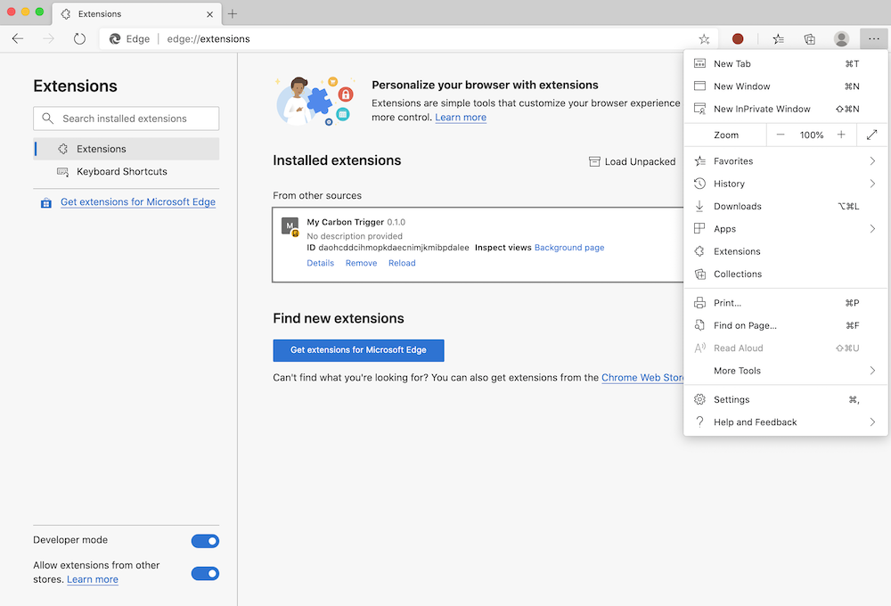

# カーボントリガーブラウザ拡張機能： 完成したコード

tmrow の C02 シグナル API を使用して電力使用量を追跡するために、あなたの地域の電力使用量がどれだけ多いかをブラウザ上でリマインダーとして表示できるようにブラウザ拡張機能を構築します。この拡張機能をアドホックに使用することで、この情報に基づいてあなたの活動を判断することができます。


## はじめに

[npm](https://npmjs.com) がインストールされている必要があります。このコードのコピーをコンピュータ上のフォルダにダウンロードしてください。

必要なパッケージをすべてインストールします。

```
npm install
```

webpack から拡張機能をビルドします。

```
npm run build
```

Edge にインストールするには、ブラウザの右上にある「3つのドット」メニューから「拡張機能」パネルを見つけます。そこから「Load Unpacked」を選択して、新しい拡張機能をロードします。プロンプトで「dist」フォルダを開くと、拡張機能が読み込まれます。使用するには、CO2 シグナル API の API キー ([get one here via email](https://www.co2signal.com/) - このページのボックスにメールを入力してください) と、[Electricity Map](https://www.electricitymap.org/map) に対応する [code for your region](http://api.electricitymap.org/v3/zones) が必要です (ボストンでは、例えば、'US-NEISO' を使用しています)。



API キーと地域を拡張インターフェイスに入力すると、ブラウザの拡張バーに表示される色付きのドットが変化し、あなたの地域のエネルギー使用量を反映して、どのようなエネルギーを必要とする活動を行うのが適切なのかを示してくれます。この「ドット」システムのコンセプトは、カリフォルニア州の排出量のための [Energy Lollipop extension](https://energylollipop.com/) が私に与えてくれたものです。

